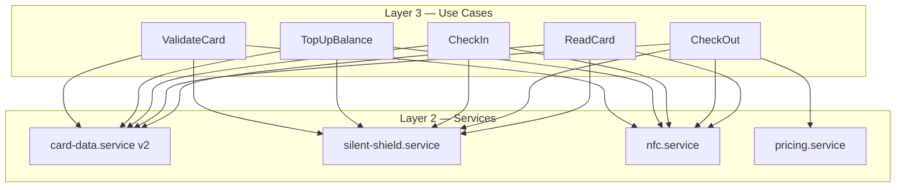

# Design: MBC Slim Storage Architecture

## Data Schema

### CardDataV2 (NFC Payload)

```typescript
// Plaintext format stored on NFC card (after decrypt)
interface CardDataV2 {
  v: 2;                    // version identifier
  b: number;               // balance (0 - 999999)
  s: 0 | 1;               // 0=idle, 1=checked-in
  t: string | null;        // ISO 8601 timestamp of check-in (null when s=0)
}

// Zod schema
const CardDataV2Schema = z.object({
  v: z.literal(2),
  b: z.number().int().min(0).max(999999),
  s: z.union([z.literal(0), z.literal(1)]),
  t: z.string().nullable(),
});
```

### Size Analysis

| Field | Example | Bytes |
|-------|---------|-------|
| `{"v":2,` | - | 6 |
| `"b":50000,` | - | 11 |
| `"s":1,` | - | 5 |
| `"t":"2026-05-06T10:00:00.000Z"}` | - | 31 |
| **Total plaintext** | | **~53 bytes** |
| + AES-GCM overhead (IV+tag) | | +28 bytes |
| = Encrypted | | ~81 bytes |
| + Base64 encoding (+33%) | | ~108 bytes |
| + NDEF text record overhead | | ~12 bytes |
| **Total on NFC** | | **~120 bytes** ✅ |

Margin: 504 - 120 = **384 bytes free** — sangat aman.

## Layer Changes

### Layer 1: Core — Models

**Hapus:**
- `MemberIdentity` (name, memberId)
- `TransactionLogEntry[]`
- `CheckInDetail` (benefitTypeId, deviceId, timestamp)
- `BenefitType` dynamic model

**Tambah/Ubah:**
- `CardDataV2` — schema minimal
- `PARKING_CONFIG` — hardcoded constant

```typescript
export const PARKING_CONFIG = {
  id: 'parking',
  displayName: 'Parkir',
  ratePerUnit: 2000,
  unitType: 'per-hour' as const,
  roundingStrategy: 'ceiling' as const,
} as const;
```

### Layer 2: Services

**card-data.service (v2):**
- `serialize(card: CardDataV2): Uint8Array` — JSON.stringify → TextEncoder
- `deserialize(bytes: Uint8Array): CardDataV2` — TextDecoder → JSON.parse → Zod validate
- `createBlank(): CardDataV2` — `{v:2, b:0, s:0, t:null}`
- `applyTopUp(card, amount): CardDataV2`
- `applyCheckIn(card, timestamp): CardDataV2`
- `applyCheckOut(card, fee): CardDataV2`

**Hapus:**
- `benefit-registry.service` (hardcoded)
- `device.service` (no device binding)
- `storage-health.service` (not needed for slim)

**Keep:**
- `silent-shield.service` (encryption)
- `nfc.service` (read, write, readThenWrite)
- `pricing.service` (calculateFee)

### Layer 3: Use Cases

**ValidateCard (new — replaces RegisterMember):**
```
Input: none (just tap)
Flow:
  1. readCard()
  2. try decrypt + deserialize
  3. IF valid → return { status: 'existing', card }
  4. IF invalid → write blank card → return { status: 'new', card: blank }
```

**TopUpBalance (simplified):**
```
Input: { amount: number }
Flow:
  1. readThenWrite(raw => decrypt → add amount → encrypt)
  2. return { previousBalance, newBalance }
```

**CheckIn (simplified):**
```
Input: none
Flow:
  1. readThenWrite(raw => decrypt → validate s===0 → set s=1, t=now → encrypt)
  2. return { checkInTime }
```

**CheckOut (simplified):**
```
Input: none
Flow:
  1. readThenWrite(raw => decrypt → validate s===1 → calc fee → deduct → set s=0 → encrypt)
  2. return { fee, duration, remainingBalance }
```

**ReadCard (simplified):**
```
Input: none
Flow:
  1. readCard() → decrypt → deserialize
  2. return card data
```

### Layer 4: Controllers

**StationController (redesigned):**
- State: `phase: 'tap' | 'topup' | 'balance'`
- `onTapCard()` → ValidateCard → route to topup or balance
- `onTopUp(amount)` → TopUpBalance

**GateController (simplified):**
- No benefit type selector (hardcoded parking)
- No simulation mode
- `onCheckIn()` → CheckIn

**TerminalController (simplified):**
- No manual calculation (optional, keep if useful)
- `onCheckOut()` → CheckOut

**ScoutController (unchanged):**
- `onReadCard()` → ReadCard

### Layer 5: Presentation

**Station page:**
```
Phase 1 (tap): "Tap kartu untuk validasi" → NfcTapPrompt
Phase 2 (topup): Amount input + "Top-Up" button → tap kartu
Phase 3 (balance): Show balance + "Top-Up lagi" button
```

**Gate page:**
- Simplified: just "Check-In" button + NfcTapPrompt
- No benefit type selector
- No simulation toggle

**Terminal page:**
- Simplified: just "Check-Out" button + NfcTapPrompt
- Show fee breakdown after success

**Scout page:**
- Unchanged: "Baca Kartu" button + card info display

## Dependency Graph (Simplified)



## Migration Strategy

1. Kartu format v1 (lama) → decrypt gagal → otomatis overwrite dengan v2 blank
2. Tidak perlu data migration — semua kartu lama di-reset
3. Backward compatibility: jika `v !== 2`, treat as invalid
