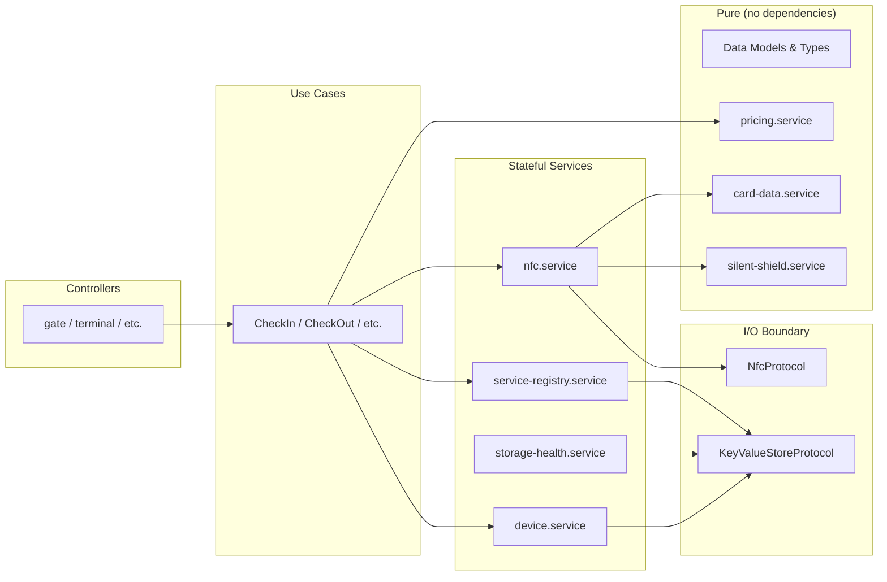
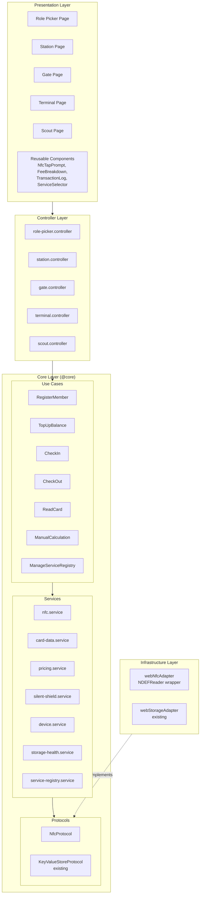
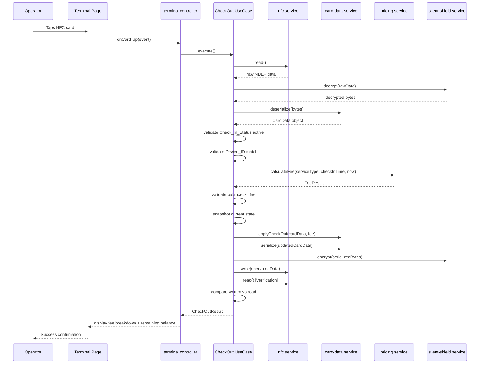
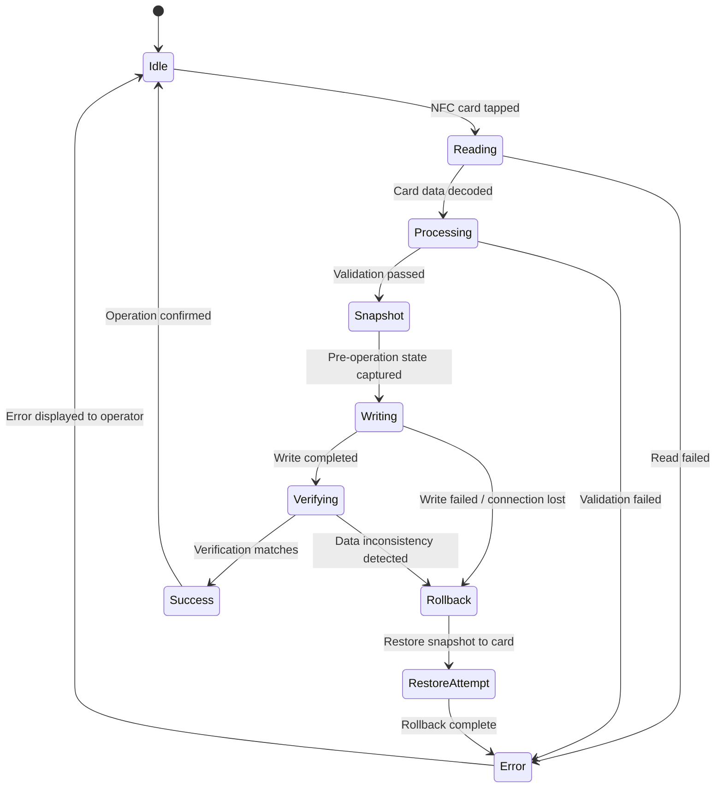
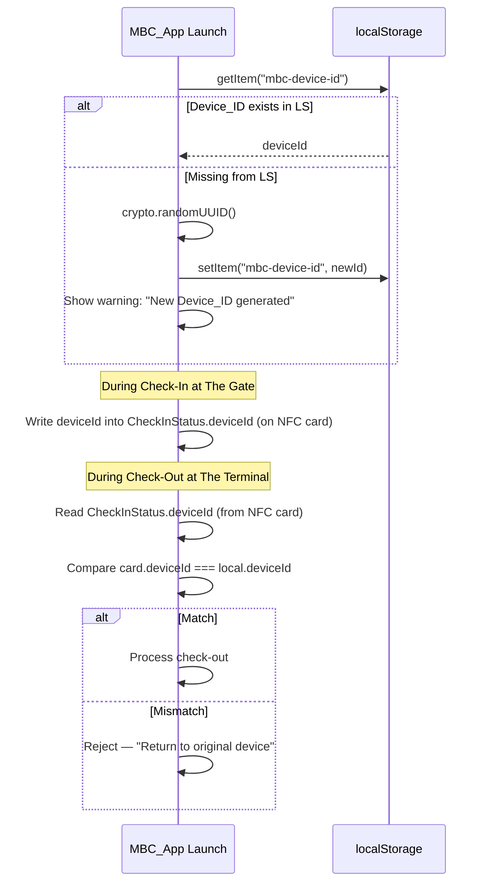

# Design Document: Membership Benefit Card (MBC)

## Overview

The Membership Benefit Card (MBC) is a frontend-only Progressive Web Application that uses NFC cards as the sole data store for cooperative member identity, balance, visit status, and transaction history. There is no backend — all operations happen between the browser and the physical NFC card via the [Web NFC API](https://developer.mozilla.org/en-US/docs/Web/API/NDEFReader).

The application operates in four switchable role modes within a single installed PWA:

| Mode | Role | Operations |
|------|------|------------|
| **The Station** | Admin | Member registration, balance top-up, service type configuration |
| **The Gate** | Gate operator | Check-in recording with service type selection, simulation mode |
| **The Terminal** | Terminal operator | Check-out processing, fee calculation & deduction, manual fallback |
| **The Scout** | Member | Read-only card information display |

The system supports an extensible service type architecture where different business scenarios (parking, bike rental, gym sessions, restaurant visits, VIP access) are configured through a Service Registry with pluggable pricing strategies (per-hour, per-visit, flat-fee).

### Key Design Decisions

1. **Web NFC API (`NDEFReader`)** — The only NFC interface available in browsers (Chrome Android 89+). All card data is encoded as a single NDEF text record containing a compact serialized payload.
2. **Offline-first PWA** — Service Worker caches all assets after initial install. Zero network calls during card operations.
3. **Atomic writes with verification** — Every NFC write captures a pre-operation snapshot, writes all changes as a unit, reads back for verification, and rolls back on any inconsistency.
4. **Device binding** — A unique `Device_ID` generated on first launch ties each check-in session to a specific physical device, preventing cross-device check-out.
5. **Silent Shield encryption** — Card data is encrypted/obfuscated before writing so third-party NFC readers cannot read member data in plain text. Uses AES-256-GCM via the existing `crypto-browserify` polyfill.
6. **localStorage persistence** — Device_ID and Service Registry are persisted in localStorage with graceful error handling for unavailability and quota limits.
7. **NFC capability gating** — On launch, the app detects Web NFC support and permission status. Unsupported browsers see a compatibility notice; supported browsers without permission see a permission prompt. Role modes that require NFC (Station, Gate, Terminal) are disabled until NFC is confirmed available.

### Technology Stack

- **React 19** + **TypeScript** + **Vite** (existing project stack)
- **TanStack Router** with file-based routing and auto code-splitting
- **Awilix** for dependency injection (Clean Architecture)
- **SCSS Modules** + **Tailwind CSS 4** for styling
- **Zod** for schema validation (card data, form inputs, service type config)
- **Web NFC API** (`NDEFReader`) for card read/write
- **crypto-browserify** (already polyfilled) for AES-256-GCM encryption
- **Vitest** + **React Testing Library** for testing
- **fast-check** for property-based testing

---

## Architectural Principles

### 1. Start with Bricks (Bottom-Up Construction)

The implementation follows a strict bottom-up build order: **pure functions first, then services, then use cases, then controllers, then UI**. Each "brick" is independently testable and has zero dependencies on layers above it.

```
Build Order (each layer only depends on layers below it):

  Layer 0 — Data Models & Schemas (pure types, zero dependencies)
  ├── CardData, MemberIdentity, CheckInStatus, TransactionLogEntry
  ├── ServiceType, PricingStrategy
  ├── Zod validation schemas (CardDataSchema, ServiceTypeFormSchema, etc.)
  └── RoleMode, NfcStatus, FeeResult types

  Layer 1 — Pure Logic Bricks (stateless functions, no I/O)
  ├── pricing.service — calculateFee(strategy, checkIn, checkOut) → FeeResult
  ├── card-data.service — serialize/deserialize/applyMutation (pure transforms)
  └── silent-shield.service — encrypt/decrypt (pure byte transforms)

  Layer 2 — I/O Adapters (protocol implementations, isolated side effects)
  ├── webNfcAdapter — wraps NDEFReader behind NfcProtocol
  └── webStorageAdapter — wraps localStorage behind KeyValueStoreProtocol (existing)

  Layer 3 — Stateful Services (compose Layer 1 + Layer 2 via DI)
  ├── nfc.service — read/write/verify using NfcProtocol + card-data + silent-shield
  ├── device.service — Device_ID lifecycle using KeyValueStoreProtocol
  ├── storage-health.service — localStorage availability and error detection
  └── service-registry.service — CRUD using KeyValueStoreProtocol

  Layer 4 — Use Cases (orchestrate Layer 3 services, single responsibility)
  ├── RegisterMember, TopUpBalance, CheckIn, CheckOut
  ├── ReadCard, ManualCalculation, ManageServiceRegistry
  └── Each use case is a single function: execute(input) → result

  Layer 5 — Controllers (compose use cases + React hooks, return view interface)
  └── station, gate, terminal, scout, role-picker controllers

  Layer 6 — Presentation (thin UI, resolves controller from DI, zero logic)
  ├── Pages — resolve controller, render components
  └── Components — receive props, render UI, emit events
```

**Why this matters:** Every brick at Layer 0-1 can be tested with pure unit tests and property-based tests without mocking. Layer 2 adapters are the only place where browser APIs are touched. This makes the core logic portable and the test suite fast.

### 2. High Cohesion (Single Responsibility per Module)

Each module does exactly one thing. No module mixes concerns.

| Module | Single Responsibility | Does NOT do |
|--------|----------------------|-------------|
| `pricing.service` | Calculate fee from strategy + timestamps | NFC I/O, card mutation, UI state |
| `card-data.service` | Serialize/deserialize/mutate CardData objects | Encryption, NFC I/O, storage |
| `silent-shield.service` | Encrypt/decrypt byte arrays | Card schema knowledge, NFC I/O |
| `nfc.service` | Read/write/verify NFC tags | Fee calculation, card schema, storage |
| `device.service` | Manage Device_ID lifecycle | NFC operations, pricing, UI |
| `storage-health.service` | Detect storage availability and errors | Business logic, card data, NFC |
| `service-registry.service` | CRUD service type configs | Pricing calculation, NFC, UI |
| `NfcTapPrompt` component | Render tap animation + status | Fee calculation, card parsing |
| `FeeBreakdown` component | Render fee details from props | NFC operations, data fetching |
| `ServiceTypeSelector` component | Render service type list from props | Storage, registry management |

**Cohesion test:** If you can't describe what a module does in one sentence without "and", it needs to be split.

### 3. Loose Coupling (Zero Tight Dependencies)

All inter-module communication happens through **interfaces (protocols)** and **dependency injection**. No module imports another module's implementation directly.

#### Coupling Rules

```
✅ ALLOWED — Depend on interfaces (protocols)
   nfc.service depends on NfcProtocol (interface)
   device.service depends on KeyValueStoreProtocol (interface)

✅ ALLOWED — Depend on pure data types
   pricing.service depends on PricingStrategy type (pure data)
   card-data.service depends on CardData type (pure data)

✅ ALLOWED — Receive dependencies via DI constructor
   const CheckOut = ({ nfcService, cardDataService, pricingService, ... }: AwilixRegistry) => ...

❌ FORBIDDEN — Direct import of implementation
   import { webNfcAdapter } from '@src/infrastructure/nfc/webNfcAdapter'  // NEVER in @core
   import { PricingService } from '@core/services/pricing.service'        // NEVER in another service

❌ FORBIDDEN — Service knows about UI
   pricing.service imports React hooks or components

❌ FORBIDDEN — Component contains business logic
   FeeBreakdown calculates fees internally instead of receiving FeeResult as props
```

#### Dependency Graph (no cycles, no cross-layer imports)



**Key guarantee:** You can swap `webNfcAdapter` with a mock adapter for testing, or replace `webStorageAdapter` with an in-memory adapter, without changing any service or use case code. The DI container handles all wiring.

### 4. Component Composition Pattern

UI components follow a strict **props-in, events-out** pattern. No component fetches data or calls services directly.

```typescript
// ✅ GOOD — Component receives data as props, emits events
interface FeeBreakdownProps {
  feeResult: FeeResult;
  serviceTypeName: string;
}
const FeeBreakdown: FC<FeeBreakdownProps> = ({ feeResult, serviceTypeName }) => (
  <div>...</div>
);

// ✅ GOOD — Controller composes data and passes to page
const TerminalController = ({ checkOutUseCase, ... }: AwilixRegistry) => ({
  lastResult: checkOutResult,  // data for FeeBreakdown
  onCardTap: () => { ... },    // event handler
});

// ❌ BAD — Component calls service directly
const FeeBreakdown: FC = () => {
  const fee = pricingService.calculateFee(...); // NEVER
};
```

**Composability:** Small components compose into larger ones without knowing about each other:

```
MbcTerminal (page)
├── NfcTapPrompt          (tap animation — knows nothing about fees)
├── FeeBreakdown          (fee display — knows nothing about NFC)
├── BalanceDisplay         (balance — knows nothing about check-out)
├── TransactionLogList     (history — knows nothing about pricing)
└── ManualCalcForm         (fallback — knows nothing about NFC)
```

Each component is a self-contained brick. The page (via controller) is the only place where these bricks are assembled together.

---

## Architecture

The MBC feature follows the project's established Clean Architecture pattern with dependencies flowing inward. The new MBC modules integrate into the existing layer structure.



### Data Flow — Check-Out Example



---

## Components and Interfaces

### Protocols (New)

```typescript
// src/@core/protocols/nfc/index.ts
export interface NfcProtocol {
  /** Check if Web NFC is supported and permission granted */
  isSupported(): boolean;
  /** Request NFC permission from the user */
  requestPermission(): Promise<NfcPermissionResult>;
  /** Start scanning for NFC tags. Returns an abort controller to stop. */
  startScan(onRead: (data: Uint8Array) => void, onError: (err: NfcError) => void): NfcScanSession;
  /** Write data to the next tapped NFC tag */
  write(data: Uint8Array): Promise<void>;
}

export interface NfcScanSession {
  abort(): void;
}

export type NfcPermissionResult = 'granted' | 'denied' | 'unsupported';

export interface NfcError {
  type: 'permission_denied' | 'hardware_unavailable' | 'read_failed' | 'write_failed' | 'connection_lost';
  message: string;
}
```

### Services (New)

#### NFC Service

```typescript
// src/@core/services/nfc.service.ts
export interface NfcServiceInterface {
  isAvailable(): boolean;
  requestPermission(): Promise<NfcPermissionResult>;
  readCard(): Promise<Uint8Array>;
  writeCard(data: Uint8Array): Promise<void>;
  writeAndVerify(data: Uint8Array): Promise<WriteVerifyResult>;
}

export interface WriteVerifyResult {
  success: boolean;
  error?: string;
}
```

#### Card Data Service

Handles serialization, deserialization, and schema validation of NFC card data.

```typescript
// src/@core/services/card-data.service.ts
export interface CardDataServiceInterface {
  serialize(card: CardData): Uint8Array;
  deserialize(raw: Uint8Array): CardData;
  validate(card: CardData): ValidationResult;
  applyRegistration(card: CardData, member: MemberIdentity): CardData;
  applyTopUp(card: CardData, amount: number): CardData;
  applyCheckIn(card: CardData, serviceTypeId: string, deviceId: string, timestamp: string): CardData;
  applyCheckOut(card: CardData, fee: number, activityType: string, serviceTypeId: string, exitTimestamp: string): CardData;
  appendTransactionLog(card: CardData, entry: TransactionLogEntry): CardData;
}
```

#### Silent Shield Service

```typescript
// src/@core/services/silent-shield.service.ts
export interface SilentShieldServiceInterface {
  encrypt(data: Uint8Array): Uint8Array;
  decrypt(data: Uint8Array): Uint8Array;
}
```

#### Pricing Service

```typescript
// src/@core/services/pricing.service.ts
export interface PricingServiceInterface {
  calculateFee(strategy: PricingStrategy, checkInTime: string, checkOutTime: string): FeeResult;
}

export interface FeeResult {
  fee: number;
  usageUnits: number;
  unitLabel: string;
  ratePerUnit: number;
  roundingApplied: string;
}
```

#### Device Service

```typescript
// src/@core/services/device.service.ts
export interface DeviceServiceInterface {
  getDeviceId(): Promise<string>;
  ensureDeviceId(): Promise<{ deviceId: string; wasRegenerated: boolean }>;
}
```

#### Storage Health Service

```typescript
// src/@core/services/storage-health.service.ts
export interface StorageHealthServiceInterface {
  /** Check if localStorage is available and writable */
  isAvailable(): Promise<boolean>;
  /** Attempt a write and detect quota exceeded errors */
  checkWriteCapacity(): Promise<{ canWrite: boolean; error?: StorageError }>;
}

export interface StorageError {
  type: 'unavailable' | 'quota_exceeded' | 'read_failed' | 'write_failed';
  message: string;
}
```

#### Service Registry Service

```typescript
// src/@core/services/service-registry.service.ts
export interface ServiceRegistryServiceInterface {
  getAll(): Promise<ServiceType[]>;
  getById(id: string): Promise<ServiceType | undefined>;
  add(serviceType: ServiceType): Promise<void>;
  update(id: string, updates: Partial<ServiceType>): Promise<void>;
  remove(id: string): Promise<void>;
  initializeDefaults(): Promise<void>;
}
```

### Controllers (New)

All controllers follow the existing pattern: pure functions receiving dependencies via `AwilixRegistry`, returning a typed interface.

```typescript
// src/controllers/mbc/role-picker.controller.ts
export interface RolePickerControllerInterface {
  roles: RoleOption[];
  onSelectRole: (role: RoleMode) => void;
  activeRole: RoleMode | null;
}

// src/controllers/mbc/station.controller.ts
export interface StationControllerInterface {
  // Registration
  registrationForm: UseFormReturn;
  onRegister: (data: RegistrationFormData) => void;
  // Top-up
  topUpForm: UseFormReturn;
  onTopUp: (data: TopUpFormData) => void;
  // Service config
  serviceTypes: ServiceType[];
  onAddServiceType: (data: ServiceTypeFormData) => void;
  onEditServiceType: (id: string, data: Partial<ServiceTypeFormData>) => void;
  onRemoveServiceType: (id: string) => void;
  // NFC state
  nfcStatus: NfcStatus;
  lastResult: OperationResult | null;
  isProcessing: boolean;
}

// src/controllers/mbc/gate.controller.ts
export interface GateControllerInterface {
  selectedServiceType: ServiceType | null;
  serviceTypes: ServiceType[];
  onSelectServiceType: (id: string) => void;
  simulationMode: boolean;
  onToggleSimulation: () => void;
  simulationTimestamp: string | null;
  onSetSimulationTimestamp: (ts: string) => void;
  nfcStatus: NfcStatus;
  lastResult: CheckInResult | null;
  isProcessing: boolean;
}

// src/controllers/mbc/terminal.controller.ts
export interface TerminalControllerInterface {
  nfcStatus: NfcStatus;
  lastResult: CheckOutResult | null;
  isProcessing: boolean;
  // Manual calculation
  isManualMode: boolean;
  onToggleManualMode: () => void;
  manualForm: UseFormReturn;
  onManualCalculate: (data: ManualCalcFormData) => void;
  manualResult: FeeResult | null;
  serviceTypes: ServiceType[];
}

// src/controllers/mbc/scout.controller.ts
export interface ScoutControllerInterface {
  nfcStatus: NfcStatus;
  cardData: CardData | null;
  isReading: boolean;
}
```

### Presentation Components (New)

| Component | Location | Purpose |
|-----------|----------|---------|
| `NfcTapPrompt` | `@components/mbc/NfcTapPrompt/` | Animated tap prompt with status feedback |
| `FeeBreakdown` | `@components/mbc/FeeBreakdown/` | Displays fee calculation details |
| `TransactionLogList` | `@components/mbc/TransactionLogList/` | Renders rolling 5-entry transaction history |
| `ServiceTypeSelector` | `@components/mbc/ServiceTypeSelector/` | Dropdown/list for selecting active service type |
| `ServiceTypeForm` | `@components/mbc/ServiceTypeForm/` | Form for adding/editing service type config |
| `CardInfoDisplay` | `@components/mbc/CardInfoDisplay/` | Member identity, balance, status display |
| `SimulationBanner` | `@components/mbc/SimulationBanner/` | Visual indicator when simulation mode is active |
| `ManualCalcForm` | `@components/mbc/ManualCalcForm/` | Manual fee calculation input form |
| `RoleCard` | `@components/mbc/RoleCard/` | Role selection card with icon and description |
| `BalanceDisplay` | `@components/mbc/BalanceDisplay/` | Formatted IDR balance with before/after states |

### Pages (New)

| Page | Route | Description |
|------|-------|-------------|
| `MbcRolePicker` | `/mbc` | Role selection landing page |
| `MbcStation` | `/mbc/station` | Registration, top-up, service config tabs |
| `MbcGate` | `/mbc/gate` | Check-in interface with service type selector |
| `MbcTerminal` | `/mbc/terminal` | Check-out interface with manual fallback |
| `MbcScout` | `/mbc/scout` | Read-only card viewer |

### DI Registration

New modules integrate into the existing Awilix container structure:

```typescript
// New registry files:
// src/infrastructure/di/registry/mbcServiceContainer.ts
// src/infrastructure/di/registry/mbcControllerContainer.ts
// src/infrastructure/di/registry/mbcProtocolContainer.ts

// Added to container.ts AwilixRegistry type union
```

---

## Data Models

### NFC Card Data Schema

```typescript
/** Complete data structure stored on the NFC card */
export interface CardData {
  /** Schema version for forward compatibility */
  version: number;
  /** Member identity */
  member: MemberIdentity;
  /** Current balance in IDR (integer, no decimals) */
  balance: number;
  /** Active check-in status, null if not checked in */
  checkIn: CheckInStatus | null;
  /** Rolling transaction log, max 5 entries (newest last) */
  transactions: TransactionLogEntry[];
}

export interface MemberIdentity {
  /** Member name */
  name: string;
  /** Member ID / registration number */
  memberId: string;
}

export interface CheckInStatus {
  /** ISO 8601 timestamp of check-in */
  timestamp: string;
  /** Service type identifier from Service Registry */
  serviceTypeId: string;
  /** Device_ID of the check-in device */
  deviceId: string;
}

export interface TransactionLogEntry {
  /** Amount in IDR (positive for top-up, negative for deduction) */
  amount: number;
  /** ISO 8601 timestamp */
  timestamp: string;
  /** Activity type identifier (e.g., "top-up", "parking-fee") */
  activityType: string;
  /** Service type identifier */
  serviceTypeId: string;
}
```

### Service Type Configuration

```typescript
export interface ServiceType {
  /** Unique identifier (e.g., "parking", "bike-rental") */
  id: string;
  /** Display name (e.g., "Parkir", "Sewa Sepeda") */
  displayName: string;
  /** Activity type label for transaction logs */
  activityType: string;
  /** Pricing configuration */
  pricing: PricingStrategy;
}

export interface PricingStrategy {
  /** Rate per unit in IDR */
  ratePerUnit: number;
  /** Unit type */
  unitType: 'per-hour' | 'per-visit' | 'flat-fee';
  /** Rounding strategy for duration-based calculations */
  roundingStrategy: 'ceiling' | 'floor' | 'nearest';
}

/** Default parking service type */
export const DEFAULT_PARKING_SERVICE: ServiceType = {
  id: 'parking',
  displayName: 'Parkir',
  activityType: 'parking-fee',
  pricing: {
    ratePerUnit: 2000,
    unitType: 'per-hour',
    roundingStrategy: 'ceiling',
  },
};
```

### Role Mode

```typescript
export type RoleMode = 'station' | 'gate' | 'terminal' | 'scout';
```

### NFC Status

```typescript
export type NfcStatus =
  | 'idle'
  | 'scanning'
  | 'reading'
  | 'writing'
  | 'verifying'
  | 'success'
  | 'error';
```

### Operation Results

```typescript
export interface CheckInResult {
  memberName: string;
  entryTime: string;
  serviceTypeName: string;
}

export interface CheckOutResult {
  serviceTypeName: string;
  entryTime: string;
  exitTime: string;
  duration: string;
  fee: number;
  remainingBalance: number;
  feeBreakdown: FeeResult;
}

export interface OperationResult {
  type: 'registration' | 'top-up';
  memberName: string;
  previousBalance?: number;
  amount?: number;
  newBalance: number;
}
```

### Serialization Format

Card data is serialized as a compact JSON string, then UTF-8 encoded to `Uint8Array`, then encrypted via Silent Shield before writing to the NFC tag as a single NDEF text record. The JSON format is chosen over binary for debuggability while still fitting within typical NFC tag memory (NTAG215: 504 bytes user memory, NTAG216: 888 bytes).

```typescript
// Zod schema for card data validation
export const CardDataSchema = z.object({
  version: z.number().int().positive(),
  member: z.object({
    name: z.string().min(1).max(50),
    memberId: z.string().min(1).max(20),
  }),
  balance: z.number().int().nonnegative(),
  checkIn: z.object({
    timestamp: z.string().datetime(),
    serviceTypeId: z.string().min(1),
    deviceId: z.string().min(1),
  }).nullable(),
  transactions: z.array(z.object({
    amount: z.number().int(),
    timestamp: z.string().datetime(),
    activityType: z.string().min(1),
    serviceTypeId: z.string().min(1),
  })).max(5),
});
```

### Validation Schemas (Zod)

```typescript
// Service type form validation
export const ServiceTypeFormSchema = z.object({
  id: z.string().min(1).max(30).regex(/^[a-z0-9-]+$/),
  displayName: z.string().min(1).max(50),
  activityType: z.string().min(1).max(30).regex(/^[a-z0-9-]+$/),
  pricing: z.object({
    ratePerUnit: z.number().int().positive(),
    unitType: z.enum(['per-hour', 'per-visit', 'flat-fee']),
    roundingStrategy: z.enum(['ceiling', 'floor', 'nearest']),
  }),
});

// Registration form validation
export const RegistrationFormSchema = z.object({
  name: z.string().min(1).max(50),
  memberId: z.string().min(1).max(20),
});

// Top-up form validation
export const TopUpFormSchema = z.object({
  amount: z.number().int().positive(),
});

// Manual calculation form validation
export const ManualCalcFormSchema = z.object({
  checkInTimestamp: z.string().datetime(),
  serviceTypeId: z.string().min(1),
});
```

---

## Atomic Write Flow

The atomic write mechanism ensures transaction integrity — no double deductions, no partial writes, no phantom transactions.

### Write-Lock State Machine



### Implementation Strategy

```typescript
// Atomic write pipeline used by all write operations
export interface AtomicWritePipeline {
  /**
   * Execute a card mutation atomically:
   * 1. Read current card state
   * 2. Decrypt + deserialize
   * 3. Capture snapshot
   * 4. Apply mutation function
   * 5. Serialize + encrypt
   * 6. Write to card
   * 7. Read back for verification
   * 8. Compare written vs read
   * 9. On mismatch: rollback with snapshot
   */
  execute(
    mutation: (card: CardData) => CardData,
    validate?: (before: CardData, after: CardData) => ValidationResult
  ): Promise<AtomicWriteResult>;
}

export interface AtomicWriteResult {
  success: boolean;
  before: CardData;
  after: CardData | null;
  error?: AtomicWriteError;
}

export type AtomicWriteError =
  | { type: 'read_failed'; message: string }
  | { type: 'validation_failed'; message: string }
  | { type: 'write_failed'; message: string }
  | { type: 'verification_failed'; message: string; rolledBack: boolean }
  | { type: 'rollback_failed'; message: string };
```

### Double-Tap Prevention

The write-lock prevents concurrent operations on the same card:

1. When a card tap is detected, the controller sets `isProcessing = true`
2. While `isProcessing` is true, all subsequent NFC tap events are ignored
3. `isProcessing` is reset to `false` only after the full atomic pipeline completes (success or failure)
4. The UI disables the tap prompt and shows a processing indicator during the lock

---

## Device Binding Flow

### Device_ID Lifecycle



---

## Storage Architecture

### localStorage Strategy

```
┌─────────────────────────────────────────┐
│         KeyValueStoreProtocol            │
│  ┌─────────────────────────────────────┐ │
│  │         localStorage                │ │
│  │                                     │ │
│  │ • mbc-config:device-id             │ │
│  │ • mbc-config:service-registry      │ │
│  └─────────────────────────────────────┘ │
└─────────────────────────────────────────┘
```

### Error Handling on App Launch

1. Check if localStorage is available (`isAvailable()`)
2. If unavailable → display informative message, app runs in degraded mode
3. If available → read Device_ID and Service Registry
4. Validate Service Registry data integrity with Zod schema
5. If data missing or corrupted → re-initialize with defaults + show warning
6. On write failure (quota exceeded) → display clear error message to operator

---

## PWA & Service Worker Design

### Web App Manifest

```json
{
  "name": "Membership Benefit Card",
  "short_name": "MBC",
  "start_url": "/mbc",
  "display": "standalone",
  "background_color": "#ffffff",
  "theme_color": "#dc2626",
  "icons": [
    { "src": "/android-chrome-192x192.png", "sizes": "192x192", "type": "image/png" },
    { "src": "/android-chrome-512x512.png", "sizes": "512x512", "type": "image/png" }
  ]
}
```

### Service Worker Strategy

- **Precache**: All application assets (JS, CSS, HTML, fonts, images) during install
- **Cache-first**: Serve from cache, fall back to network only for initial install
- **No runtime API caching**: The app makes zero network calls during card operations
- Use `vite-plugin-pwa` (Workbox) for Service Worker generation

---

## Silent Shield Encryption Design

### Algorithm

- **AES-256-GCM** via `crypto-browserify` (already polyfilled in the project via `vite-plugin-node-polyfills`)
- **Key derivation**: PBKDF2 with a hardcoded application salt and passphrase (since there's no server to manage keys, the encryption is primarily obfuscation against casual NFC readers)
- **IV**: Random 12 bytes generated per write, prepended to ciphertext

### Encryption Flow

```
CardData → JSON.stringify → UTF-8 encode → AES-256-GCM encrypt → [IV (12B) | ciphertext | authTag (16B)] → NDEF text record
```

### Decryption Flow

```
NDEF text record → extract IV (12B) + ciphertext + authTag (16B) → AES-256-GCM decrypt → UTF-8 decode → JSON.parse → CardData
```

### Key Management

```typescript
// Hardcoded in the app — this is obfuscation, not security-grade encryption
// The goal is to prevent casual NFC reader apps from reading plain text
const SILENT_SHIELD_CONFIG = {
  algorithm: 'aes-256-gcm',
  passphrase: 'mbc-silent-shield-v1', // app-level secret
  salt: 'mbc-cooperative-2024',
  iterations: 100000,
  keyLength: 32, // 256 bits
  ivLength: 12,
  tagLength: 16,
};
```

---

## File Structure (New Files)

```
src/
├── @core/
│   ├── protocols/
│   │   └── nfc/index.ts                          # NfcProtocol interface
│   ├── services/
│   │   ├── nfc.service.ts                         # NFC read/write/verify
│   │   ├── card-data.service.ts                   # Serialize/deserialize/mutate card data
│   │   ├── silent-shield.service.ts               # AES-256-GCM encrypt/decrypt
│   │   ├── pricing.service.ts                     # Fee calculation engine
│   │   ├── device.service.ts                      # Device_ID management
│   │   ├── storage-health.service.ts              # localStorage availability and error detection
│   │   ├── service-registry.service.ts            # Service type CRUD
│   │   └── __tests__/
│   │       ├── nfc.service.test.ts
│   │       ├── card-data.service.test.ts
│   │       ├── silent-shield.service.test.ts
│   │       ├── pricing.service.test.ts
│   │       ├── device.service.test.ts
│   │       ├── storage-health.service.test.ts
│   │       └── service-registry.service.test.ts
│   └── use_case/
│       ├── mbc/
│       │   ├── RegisterMember.ts
│       │   ├── TopUpBalance.ts
│       │   ├── CheckIn.ts
│       │   ├── CheckOut.ts
│       │   ├── ReadCard.ts
│       │   ├── ManualCalculation.ts
│       │   ├── ManageServiceRegistry.ts
│       │   └── __tests__/
│       │       ├── RegisterMember.test.ts
│       │       ├── TopUpBalance.test.ts
│       │       ├── CheckIn.test.ts
│       │       ├── CheckOut.test.ts
│       │       ├── ReadCard.test.ts
│       │       ├── ManualCalculation.test.ts
│       │       └── ManageServiceRegistry.test.ts
├── infrastructure/
│   ├── di/
│   │   └── registry/
│   │       ├── mbcServiceContainer.ts             # MBC service registrations
│   │       ├── mbcControllerContainer.ts          # MBC controller registrations
│   │       └── mbcProtocolContainer.ts            # MBC protocol registrations
│   ├── nfc/
│   │   └── webNfcAdapter.ts                       # NDEFReader implementation
│   └── storage/
│       └── webStorageAdapter.ts                   # localStorage implementation (existing)
├── controllers/
│   └── mbc/
│       ├── role-picker.controller.ts
│       ├── station.controller.ts
│       ├── gate.controller.ts
│       ├── terminal.controller.ts
│       ├── scout.controller.ts
│       └── __tests__/
│           ├── role-picker.controller.test.ts
│           ├── station.controller.test.ts
│           ├── gate.controller.test.ts
│           ├── terminal.controller.test.ts
│           └── scout.controller.test.ts
├── presentation/
│   ├── components/
│   │   └── mbc/
│   │       ├── NfcTapPrompt/
│   │       │   ├── index.tsx
│   │       │   └── nfc-tap-prompt.module.scss
│   │       ├── FeeBreakdown/
│   │       │   ├── index.tsx
│   │       │   └── fee-breakdown.module.scss
│   │       ├── TransactionLogList/
│   │       │   ├── index.tsx
│   │       │   └── transaction-log-list.module.scss
│   │       ├── ServiceTypeSelector/
│   │       │   ├── index.tsx
│   │       │   └── service-type-selector.module.scss
│   │       ├── ServiceTypeForm/
│   │       │   ├── index.tsx
│   │       │   └── service-type-form.module.scss
│   │       ├── CardInfoDisplay/
│   │       │   ├── index.tsx
│   │       │   └── card-info-display.module.scss
│   │       ├── SimulationBanner/
│   │       │   ├── index.tsx
│   │       │   └── simulation-banner.module.scss
│   │       ├── ManualCalcForm/
│   │       │   ├── index.tsx
│   │       │   └── manual-calc-form.module.scss
│   │       ├── RoleCard/
│   │       │   ├── index.tsx
│   │       │   └── role-card.module.scss
│   │       ├── BalanceDisplay/
│   │       │   ├── index.tsx
│   │       │   └── balance-display.module.scss
│   │       └── __tests__/
│   │           └── mbc/
│   │               ├── NfcTapPrompt.test.tsx
│   │               ├── FeeBreakdown.test.tsx
│   │               ├── TransactionLogList.test.tsx
│   │               ├── ServiceTypeSelector.test.tsx
│   │               ├── CardInfoDisplay.test.tsx
│   │               ├── RoleCard.test.tsx
│   │               └── BalanceDisplay.test.tsx
│   └── pages/
│       └── (mbc)/
│           ├── MbcRolePicker/
│           │   ├── index.tsx
│           │   └── mbc-role-picker.module.scss
│           ├── MbcStation/
│           │   ├── index.tsx
│           │   └── mbc-station.module.scss
│           ├── MbcGate/
│           │   ├── index.tsx
│           │   └── mbc-gate.module.scss
│           ├── MbcTerminal/
│           │   ├── index.tsx
│           │   └── mbc-terminal.module.scss
│           └── MbcScout/
│               ├── index.tsx
│               └── mbc-scout.module.scss
├── routes/
│   └── mbc/
│       ├── index.tsx                              # /mbc → MbcRolePicker
│       ├── station.tsx                            # /mbc/station → MbcStation
│       ├── gate.tsx                               # /mbc/gate → MbcGate
│       ├── terminal.tsx                           # /mbc/terminal → MbcTerminal
│       └── scout.tsx                              # /mbc/scout → MbcScout
└── utils/
    ├── constants/
    │   └── mbc-keys.ts                            # MBC-specific storage keys, config keys
    └── helpers/
        └── mbc.helper.ts                          # MBC utility functions (IDR formatting, duration formatting)
```

---

## Correctness Properties

These properties define the formal correctness guarantees that the system must uphold. Each property will be validated through property-based testing using `fast-check`.

### Property 1: Serialization Round-Trip

**Property:** For all valid `CardData` objects, serializing then deserializing produces an equivalent object.

```
∀ card ∈ ValidCardData: deserialize(serialize(card)) ≡ card
```

**Covers:** Requirement 13 (AC 4)

### Property 2: Encryption Round-Trip

**Property:** For all valid byte arrays, encrypting then decrypting produces the original data.

```
∀ data ∈ Uint8Array: decrypt(encrypt(data)) ≡ data
```

**Covers:** Requirement 11 (AC 4)

### Property 3: Balance Conservation (Top-Up)

**Property:** After a top-up of amount `a`, the new balance equals the old balance plus `a`.

```
∀ card ∈ ValidCardData, a ∈ PositiveInt:
  applyTopUp(card, a).balance = card.balance + a
```

**Covers:** Requirement 5 (AC 2)

### Property 4: Balance Conservation (Check-Out)

**Property:** After a check-out with fee `f`, the new balance equals the old balance minus `f`, and the balance is never negative after deduction.

```
∀ card ∈ CheckedInCardData, f ∈ PositiveInt where f ≤ card.balance:
  applyCheckOut(card, f).balance = card.balance - f
  ∧ applyCheckOut(card, f).balance ≥ 0
```

**Covers:** Requirement 8 (AC 6), Requirement 18 (AC 7)

### Property 5: Exactly-Once Deduction

**Property:** Applying check-out twice to the same card state produces the same result as applying it once (idempotency via Check_In_Status guard).

```
∀ card ∈ CheckedInCardData:
  let result1 = applyCheckOut(card, fee)
  applyCheckOut(result1, fee) → rejected (no active Check_In_Status)
```

**Covers:** Requirement 8 (AC 8), Requirement 18 (AC 7)

### Property 6: Check-In Status Exclusivity

**Property:** A card with an active Check_In_Status cannot be checked in again. A card without an active Check_In_Status cannot be checked out.

```
∀ card ∈ CheckedInCardData: applyCheckIn(card, ...) → rejected
∀ card ∈ NotCheckedInCardData: applyCheckOut(card, ...) → rejected
```

**Covers:** Requirement 6 (AC 3), Requirement 8 (AC 8)

### Property 7: Transaction Log Bounded Size

**Property:** The transaction log never exceeds 5 entries after any operation.

```
∀ card ∈ ValidCardData, op ∈ {topUp, checkOut}:
  applyOp(card).transactions.length ≤ 5
```

**Covers:** Requirement 10 (AC 2)

### Property 8: Ceiling Rounding Fare Calculation

**Property:** For per-hour pricing with ceiling rounding, the fee is always `ceil(hours) × rate`, and any duration beyond an exact hour boundary rounds up.

```
∀ duration ∈ PositiveDuration, rate ∈ PositiveInt:
  calculateFee('per-hour', 'ceiling', duration, rate) = Math.ceil(duration / 3600) × rate
```

**Covers:** Requirement 12 (AC 1-3)

### Property 9: Pricing Strategy Consistency

**Property:** For per-visit pricing, the fee is always exactly `rate_per_unit` regardless of duration. For flat-fee, the fee is always exactly `rate_per_unit`.

```
∀ duration ∈ PositiveDuration, rate ∈ PositiveInt:
  calculateFee('per-visit', _, _, rate) = rate
  calculateFee('flat-fee', _, _, rate) = rate
```

**Covers:** Requirement 12 (AC 5-6)

### Property 10: Device Binding Enforcement

**Property:** A check-out operation succeeds only when the device ID on the card matches the current device's ID.

```
∀ card ∈ CheckedInCardData, currentDeviceId ∈ String:
  card.checkIn.deviceId = currentDeviceId → check-out allowed
  card.checkIn.deviceId ≠ currentDeviceId → check-out rejected
```

**Covers:** Requirement 19 (AC 3-4)

---

## Requirements Traceability

| Requirement | Design Components |
|---|---|
| Req 1: Role Mode Switching | RolePickerController, MbcRolePicker page, RoleCard component, TanStack Router `/mbc/*` routes |
| Req 2: NFC Card Reading | NfcProtocol, NfcService, webNfcAdapter |
| Req 3: NFC Card Writing | NfcService.writeAndVerify, AtomicWritePipeline |
| Req 4: Member Registration | RegisterMember use case, StationController, MbcStation page |
| Req 5: Balance Top-Up | TopUpBalance use case, StationController, BalanceDisplay component |
| Req 6: Generic Check-In | CheckIn use case, GateController, MbcGate page, ServiceTypeSelector |
| Req 7: Simulation Mode | GateController.simulationMode, SimulationBanner component |
| Req 8: Generic Check-Out | CheckOut use case, TerminalController, MbcTerminal page, FeeBreakdown |
| Req 9: Card Info Display | ReadCard use case, ScoutController, CardInfoDisplay, TransactionLogList |
| Req 10: Transaction Log | CardDataService.appendTransactionLog, TransactionLogEntry model |
| Req 11: Silent Shield | SilentShieldService, AES-256-GCM encryption/decryption |
| Req 12: Pricing Engine | PricingService.calculateFee, PricingStrategy model, FeeResult |
| Req 13: Schema Serialization | CardDataService.serialize/deserialize, CardDataSchema (Zod), CardData model |
| Req 14: Offline-First PWA | Service Worker (vite-plugin-pwa), web app manifest, cache-first strategy |
| Req 15: Service Config | ManageServiceRegistry use case, ServiceRegistryService, ServiceTypeForm |
| Req 16: Extensible Service Types | ServiceType model, PricingStrategy with per-hour/per-visit/flat-fee |
| Req 17: Service Selection | GateController.onSelectServiceType, ServiceTypeSelector component |
| Req 18: Atomic Integrity | AtomicWritePipeline, write-lock state, snapshot/rollback mechanism |
| Req 19: Device Binding | DeviceService, Device_ID in CheckInStatus, device match validation |
| Req 20: Data Persistence | StorageHealthService, localStorage via KeyValueStoreProtocol, error handling, Zod validation |
| Req 21: Manual Fallback | ManualCalculation use case, TerminalController.manualMode, ManualCalcForm |
| Req 22: NFC Capability Detection | NfcProtocol.isSupported(), RolePickerController NFC gating, NfcCompatibilityNotice component |

