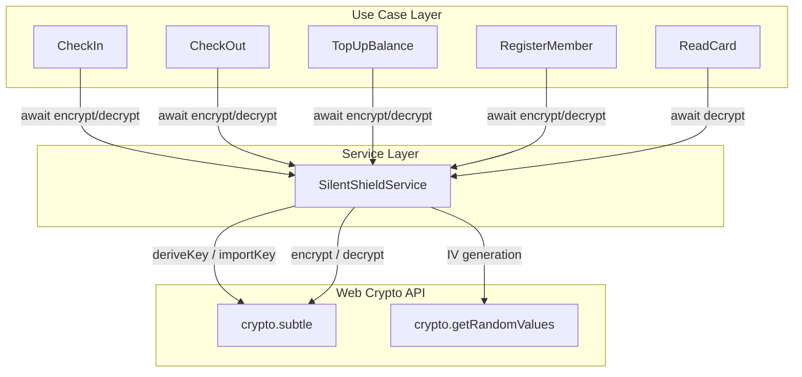
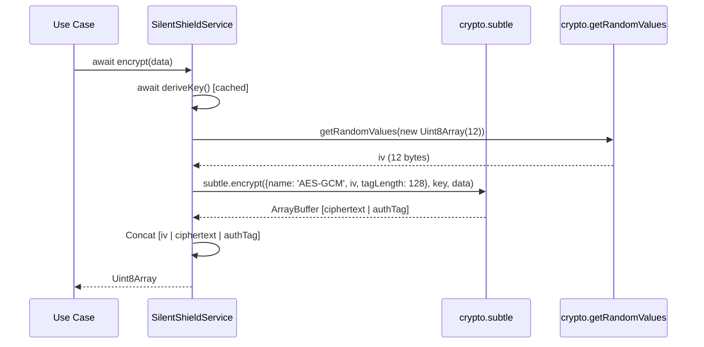
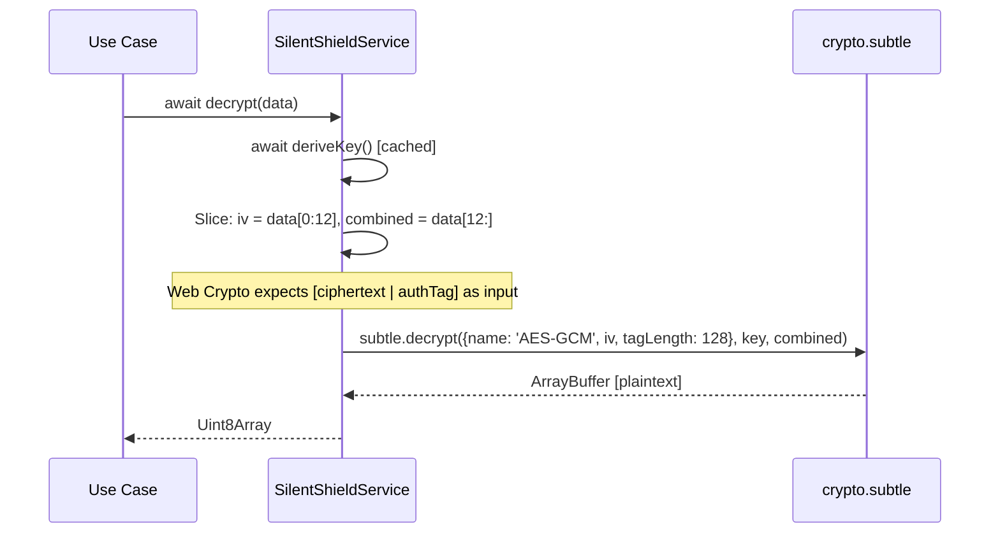

# Design Document: Migrasi Web Crypto API

## Overview

Dokumen ini menjelaskan desain teknis untuk migrasi layanan enkripsi Silent Shield dari polyfill `crypto-browserify` ke Web Crypto API native (`crypto.subtle`). Migrasi ini mempertahankan algoritma AES-256-GCM dengan parameter identik, namun mengubah interface menjadi asynchronous (Promise-based) karena Web Crypto API sepenuhnya berbasis Promise.

### Keputusan Desain Utama

1. **Interface async**: `encrypt` dan `decrypt` mengembalikan `Promise<Uint8Array>` — konsekuensi langsung dari Web Crypto API yang async-only.
2. **Key caching**: `CryptoKey` di-cache setelah derivasi pertama menggunakan lazy initialization pattern dengan Promise deduplication.
3. **Format output tetap**: `[IV (12B) | ciphertext | authTag (16B)]` — Web Crypto API menggabungkan ciphertext dan authTag dalam satu `ArrayBuffer`, sehingga perlu di-slice untuk mempertahankan format yang sama.
4. **Error wrapping**: Semua error dari Web Crypto API di-wrap dalam `Error` dengan pesan deskriptif yang konsisten.
5. **Singleton registration**: Service tetap di-register sebagai transient di Awilix, namun key caching internal memastikan PBKDF2 hanya dijalankan sekali per instance.

### Diagram Arsitektur



## Architecture

### Layer Separation

Migrasi ini hanya menyentuh dua layer:

1. **Service Layer** (`silent-shield.service.ts`): Implementasi internal berubah total dari `crypto-browserify` ke `crypto.subtle`. Interface berubah dari synchronous ke asynchronous.
2. **Use Case Layer** (5 use cases): Menambahkan `await` pada setiap pemanggilan `encrypt()` dan `decrypt()`.

Layer lain (protocols, controllers, presentation) tidak terpengaruh karena use case sudah async.

### Alur Enkripsi (Setelah Migrasi)



### Alur Dekripsi (Setelah Migrasi)



## Components and Interfaces

### SilentShieldServiceInterface (Updated)

```typescript
export interface SilentShieldServiceInterface {
  encrypt(data: Uint8Array): Promise<Uint8Array>;
  decrypt(data: Uint8Array): Promise<Uint8Array>;
}
```

**Perubahan dari sebelumnya**: Return type berubah dari `Uint8Array` menjadi `Promise<Uint8Array>`.

### SilentShieldService (Internal Implementation)

```typescript
export const SilentShieldService = (
  _deps: AwilixRegistry,
): SilentShieldServiceInterface => {
  let cachedKey: CryptoKey | null = null;
  let keyDerivationPromise: Promise<CryptoKey> | null = null;

  const deriveKey = async (): Promise<CryptoKey> => {
    if (cachedKey) return cachedKey;
    if (keyDerivationPromise) return keyDerivationPromise;

    keyDerivationPromise = (async () => {
      const encoder = new TextEncoder();
      const keyMaterial = await crypto.subtle.importKey(
        'raw',
        encoder.encode(MBC_KEYS.SILENT_SHIELD_PASSPHRASE),
        'PBKDF2',
        false,
        ['deriveKey'],
      );

      const derivedKey = await crypto.subtle.deriveKey(
        {
          name: 'PBKDF2',
          salt: encoder.encode(MBC_KEYS.SILENT_SHIELD_SALT),
          iterations: MBC_KEYS.SILENT_SHIELD_ITERATIONS,
          hash: 'SHA-256',
        },
        keyMaterial,
        { name: MBC_KEYS.SILENT_SHIELD_ALGORITHM, length: 256 },
        false,
        ['encrypt', 'decrypt'],
      );

      cachedKey = derivedKey;
      return derivedKey;
    })();

    return keyDerivationPromise;
  };

  const encrypt = async (data: Uint8Array): Promise<Uint8Array> => { /* ... */ };
  const decrypt = async (data: Uint8Array): Promise<Uint8Array> => { /* ... */ };

  return { encrypt, decrypt };
};
```

### Key Design Decisions

| Keputusan | Alasan |
|-----------|--------|
| Promise deduplication pada `deriveKey` | Mencegah race condition jika `encrypt` dan `decrypt` dipanggil bersamaan sebelum key ter-cache |
| `extractable: false` pada CryptoKey | Security best practice — key tidak bisa di-export dari Web Crypto |
| `tagLength: 128` (16 bytes) | Mempertahankan kompatibilitas format output dengan auth tag 16 byte |
| Slice `data[12:]` langsung ke `decrypt` | Web Crypto API menerima `[ciphertext | authTag]` sebagai satu buffer, tidak perlu split manual |

## Data Models

### Format Output Enkripsi (Tidak Berubah)

```
┌──────────┬────────────────────┬──────────────┐
│  IV      │    Ciphertext      │   Auth Tag   │
│ (12 B)   │   (variable)       │   (16 B)     │
└──────────┴────────────────────┴──────────────┘
```

Total output length = 12 + plaintext.length + 16 = plaintext.length + 28

### MBC_KEYS Constants (Updated)

```typescript
export const MBC_KEYS = {
  // ... storage keys unchanged ...

  // Silent Shield config
  SILENT_SHIELD_ALGORITHM: 'AES-GCM',  // Changed from 'aes-256-gcm'
  SILENT_SHIELD_PASSPHRASE: 'mbc-silent-shield-v1',
  SILENT_SHIELD_SALT: 'mbc-cooperative-2024',
  SILENT_SHIELD_ITERATIONS: 100000,
  SILENT_SHIELD_KEY_LENGTH: 32,
  SILENT_SHIELD_IV_LENGTH: 12,
  SILENT_SHIELD_TAG_LENGTH: 16,
} as const;
```

### Web Crypto API Parameter Mapping

| Parameter | crypto-browserify | Web Crypto API |
|-----------|-------------------|----------------|
| Algorithm name | `'aes-256-gcm'` | `'AES-GCM'` |
| Key derivation | `crypto.pbkdf2Sync(...)` | `crypto.subtle.deriveKey(...)` |
| IV generation | `crypto.randomBytes(12)` | `crypto.getRandomValues(new Uint8Array(12))` |
| Encrypt | `createCipheriv` + `update` + `final` + `getAuthTag` | `crypto.subtle.encrypt({name, iv, tagLength}, key, data)` |
| Decrypt | `createDecipheriv` + `setAuthTag` + `update` + `final` | `crypto.subtle.decrypt({name, iv, tagLength}, key, data)` |
| Auth tag handling | Separate: `getAuthTag()` / `setAuthTag()` | Combined: appended to ciphertext output / expected in input |

## Correctness Properties

*A property is a characteristic or behavior that should hold true across all valid executions of a system — essentially, a formal statement about what the system should do. Properties serve as the bridge between human-readable specifications and machine-verifiable correctness guarantees.*

### Property 1: Encryption Round-Trip

*For any* valid byte array `data` (non-empty, length 1–512), `decrypt(await encrypt(data))` SHALL produce a `Uint8Array` that is byte-for-byte identical to the original `data`.

**Validates: Requirements 1.1, 1.2, 7.2**

### Property 2: Non-Deterministic Encryption (IV Uniqueness)

*For any* valid byte array `data`, encrypting the same data twice SHALL produce two different ciphertext outputs (due to random IV generation on each call).

**Validates: Requirements 1.3**

### Property 3: Output Length Invariant

*For any* valid byte array `data` of length `n`, the encrypted output SHALL have exactly `n + 28` bytes (12 bytes IV + n bytes ciphertext + 16 bytes auth tag).

**Validates: Requirements 1.4**

## Error Handling

### Strategi Error Wrapping

Semua error dari Web Crypto API di-wrap dalam `Error` dengan pesan yang konsisten dan informatif:

```typescript
// Encrypt error
try {
  const result = await crypto.subtle.encrypt(params, key, data);
} catch (error: unknown) {
  const message = error instanceof Error ? error.message : 'Unknown error';
  throw new Error(`Encryption failed: ${message}`);
}

// Decrypt error
try {
  const result = await crypto.subtle.decrypt(params, key, combined);
} catch (error: unknown) {
  const message = error instanceof Error ? error.message : 'Unknown error';
  throw new Error(`Decryption failed: ${message}`);
}

// Key derivation error
try {
  const key = await crypto.subtle.deriveKey(params, keyMaterial, keyParams, false, usages);
} catch (error: unknown) {
  const message = error instanceof Error ? error.message : 'Unknown error';
  throw new Error(`Key derivation failed: ${message}`);
}
```

### Error Scenarios

| Scenario | Error Message | Penyebab |
|----------|---------------|----------|
| Data corrupt | `Decryption failed: ...` | Auth tag tidak cocok, data termodifikasi |
| Data terlalu pendek | `Decryption failed: ...` | Input kurang dari 28 byte (minimum IV + authTag) |
| Key derivation gagal | `Key derivation failed: ...` | Environment tidak mendukung Web Crypto |
| Encrypt gagal | `Encryption failed: ...` | Key invalid atau parameter salah |

## Testing Strategy

### Pendekatan Dual Testing

1. **Property-based tests** (fast-check): Memverifikasi correctness properties universal
2. **Unit tests** (vitest): Memverifikasi contoh spesifik, edge cases, dan error handling

### Property-Based Testing Configuration

- Library: `fast-check` (sudah ada di devDependencies)
- Minimum iterations: 100 per property
- Tag format: `Feature: web-crypto-migration, Property {number}: {property_text}`

### Test Structure

```
src/@core/services/__tests__/mbc/
  silent-shield.service.test.ts    ← Property tests + unit tests (updated)

src/@core/use_case/__tests__/mbc/
  CheckIn.test.ts                  ← Mock updated to async
  CheckOut.test.ts                 ← Mock updated to async
  TopUpBalance.test.ts             ← Mock updated to async
  RegisterMember.test.ts           ← Mock updated to async
  ReadCard.test.ts                 ← Mock updated to async
```

### Property Tests (Silent Shield Service)

| Property | Test Description | Iterations |
|----------|-----------------|------------|
| 1 | Round-trip: `decrypt(encrypt(data)) === data` | 100 |
| 2 | Non-determinism: `encrypt(data) !== encrypt(data)` | 100 |
| 3 | Output length: `encrypt(data).length === data.length + 28` | 100 |

### Unit Tests (Silent Shield Service)

| Test | Kategori |
|------|----------|
| Key caching: deriveKey hanya dipanggil sekali | Example |
| Error: decrypt dengan data corrupt → descriptive error | Edge case |
| Error: decrypt dengan data terlalu pendek → descriptive error | Edge case |
| Error: encrypt failure → descriptive error | Edge case |
| Error: key derivation failure → descriptive error | Edge case |

### Use Case Test Updates

Semua use case test memerlukan perubahan minimal pada mock:

```typescript
// Before (synchronous)
const silentShieldService: SilentShieldServiceInterface = {
  encrypt: vi.fn().mockReturnValue(new Uint8Array([99])),
  decrypt: vi.fn().mockReturnValue(new Uint8Array([1])),
};

// After (asynchronous)
const silentShieldService: SilentShieldServiceInterface = {
  encrypt: vi.fn().mockResolvedValue(new Uint8Array([99])),
  decrypt: vi.fn().mockResolvedValue(new Uint8Array([1])),
};
```

### Vitest Environment Note

Vitest berjalan di Node.js yang sudah memiliki `crypto.subtle` secara native (Node 15+). Tidak perlu polyfill tambahan untuk test environment. `crypto.getRandomValues` juga tersedia via `globalThis.crypto`.

### Vite Configuration Cleanup

Setelah migrasi, `nodePolyfills({ include: ['crypto'] })` di `vite.config.ts` dapat dihapus karena Web Crypto API tersedia native di semua browser modern. Plugin `vite-plugin-node-polyfills` mungkin masih diperlukan jika ada polyfill lain yang digunakan — perlu diperiksa apakah ada consumer lain.
