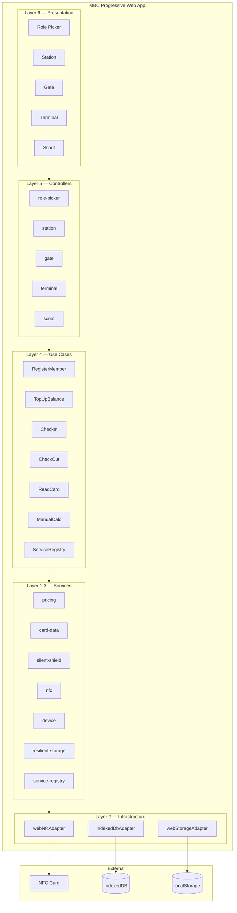

# Membership Benefit Card (MBC) — Project Wiki

> A frontend-only PWA that uses NFC cards as the sole data store for cooperative member identity, balance, visit status, and transaction history. No backend, no database, 100% offline.

## Feature Overview

| Feature | Description | Status |
|---------|-------------|--------|
| [MBC — Membership Benefit Card](membership-benefit-card/01-Architecture/Overview) | NFC-based cooperative membership system with 4 role modes | 🔄 In Progress |

## Architecture at a Glance

## Quick Links

### Architecture
- [System Overview](membership-benefit-card/01-Architecture/Overview)
- [Clean Architecture Layers](membership-benefit-card/01-Architecture/Clean-Architecture)
- [Data Flow](membership-benefit-card/01-Architecture/Data-Flow)
- [Design Decisions](membership-benefit-card/01-Architecture/Design-Decisions)

### Data Models
- [Card Data Schema](membership-benefit-card/02-Data-Models/Card-Data-Schema)
- [Service Type Model](membership-benefit-card/02-Data-Models/Service-Type-Model)
- [NFC Memory Layout](membership-benefit-card/02-Data-Models/NFC-Card-Memory-Layout)
- [Zod Validation Schemas](membership-benefit-card/02-Data-Models/Zod-Validation-Schemas)

### Business Flows
- [Member Registration](membership-benefit-card/03-Business-Flows/Member-Registration)
- [Balance Top-Up](membership-benefit-card/03-Business-Flows/Balance-Top-Up)
- [Check-In](membership-benefit-card/03-Business-Flows/Check-In-Flow)
- [Check-Out](membership-benefit-card/03-Business-Flows/Check-Out-Flow)
- [Manual Calculation](membership-benefit-card/03-Business-Flows/Manual-Calculation)
- [Card Reading (Scout)](membership-benefit-card/03-Business-Flows/Card-Reading-Scout)
- [Service Type Configuration](membership-benefit-card/03-Business-Flows/Service-Type-Configuration)

### Technical Flows
- [Atomic Write Pipeline](membership-benefit-card/04-Technical-Flows/Atomic-Write-Pipeline)
- [Device Binding](membership-benefit-card/04-Technical-Flows/Device-Binding)
- [Silent Shield Encryption](membership-benefit-card/04-Technical-Flows/Silent-Shield-Encryption)
- [NFC Capability Detection](membership-benefit-card/04-Technical-Flows/NFC-Capability-Detection)
- [Resilient Storage](membership-benefit-card/04-Technical-Flows/Resilient-Storage)
- [Pricing Engine](membership-benefit-card/04-Technical-Flows/Pricing-Engine)

### UI & Testing
- [UI Components](membership-benefit-card/05-UI-Components/Role-Picker)
- [Testing Strategy](membership-benefit-card/06-Testing/Testing-Strategy)
- [Correctness Properties](membership-benefit-card/06-Testing/Correctness-Properties)

### Development
- [Getting Started](membership-benefit-card/07-Development/Getting-Started)
- [Phase Progress](membership-benefit-card/07-Development/Phase-Progress)
- [Glossary](membership-benefit-card/08-Glossary/Glossary)
