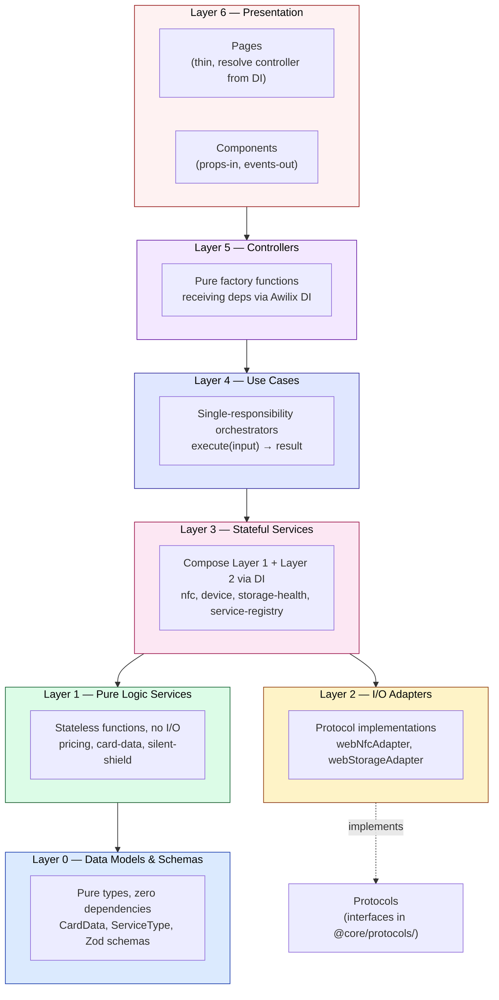
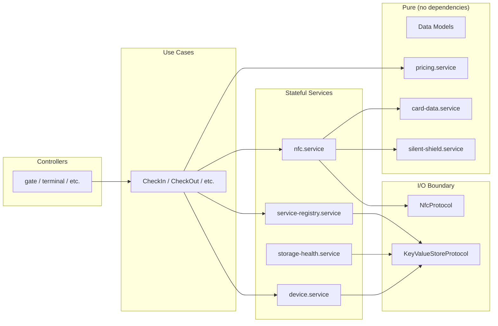

# Clean Architecture

> Covers: Req 2, Req 3, Req 13, Req 14

## Overview

The MBC feature follows strict Clean Architecture with dependencies flowing inward only. Each layer is independently testable and has zero dependencies on layers above it.

## Layer Hierarchy



## Build Order

The implementation follows strict bottom-up construction — **Start with Bricks**:

| Layer | Contents | Dependencies | Testability |
|-------|----------|-------------|-------------|
| **0** | Data models, types, Zod schemas | None | Pure type checks |
| **1** | pricing, card-data, silent-shield services | Layer 0 types only | Pure unit tests, property-based tests |
| **2** | webNfcAdapter, webStorageAdapter | Browser APIs | Integration tests with mocks |
| **3** | nfc, device, storage-health, service-registry | Layer 1 + Layer 2 via DI | Unit tests with mocked protocols |
| **4** | RegisterMember, TopUpBalance, CheckIn, CheckOut, etc. | Layer 3 services | Unit tests with mocked services |
| **5** | station, gate, terminal, scout controllers | Layer 4 use cases | Unit tests with mocked use cases |
| **6** | Pages + Components | Layer 5 controllers via DI | RTL component tests |

## Dependency Rules

```
✅ ALLOWED — Depend on interfaces (protocols)
   nfc.service depends on NfcProtocol (interface)

✅ ALLOWED — Depend on pure data types
   pricing.service depends on PricingStrategy type

✅ ALLOWED — Receive dependencies via DI constructor
   const CheckOut = ({ nfcService, pricingService }: AwilixRegistry) => ...

❌ FORBIDDEN — Direct import of implementation
   import { webNfcAdapter } from '@src/infrastructure/nfc/webNfcAdapter'

❌ FORBIDDEN — Service knows about UI
   pricing.service imports React hooks

❌ FORBIDDEN — Component contains business logic
   FeeBreakdown calculates fees internally
```

## Dependency Graph



## DI Container Structure

All modules are wired via Awilix with typed `AwilixRegistry`:

| Registry File | Registers | Pattern |
|---------------|-----------|---------|
| `mbcProtocolContainer.ts` | `nfcProtocol` | `asFunction` |
| `mbcServiceContainer.ts` | All MBC services (pricing, card-data, silent-shield, nfc, device, storage-health, service-registry) | `asFunction().singleton()` for stateful |
| `mbcUseCaseContainer.ts` | All 7 use cases | `asFunction` |
| `mbcControllerContainer.ts` | All 5 controllers | `asFunction` |

The `AwilixRegistry` type is a union of all container interfaces, providing full type safety across the DI boundary.

## Component Composition Pattern

UI components follow strict **props-in, events-out**:

```
MbcTerminal (page)
├── NfcTapPrompt          (tap animation — knows nothing about fees)
├── FeeBreakdown          (fee display — knows nothing about NFC)
├── BalanceDisplay         (balance — knows nothing about check-out)
├── TransactionLogList     (history — knows nothing about pricing)
└── ManualCalcForm         (fallback — knows nothing about NFC)
```

Each component is a self-contained brick. The page (via controller) is the only place where these bricks are assembled.

## Related Pages

- [Overview](Overview) — System overview and tech stack
- [Data Flow](Data-Flow) — Sequence diagrams showing data through layers
- [Card Data Schema](../02-Data-Models/Card-Data-Schema) — Layer 0 data models
- [Phase Progress](../07-Development/Phase-Progress) — Build order status
