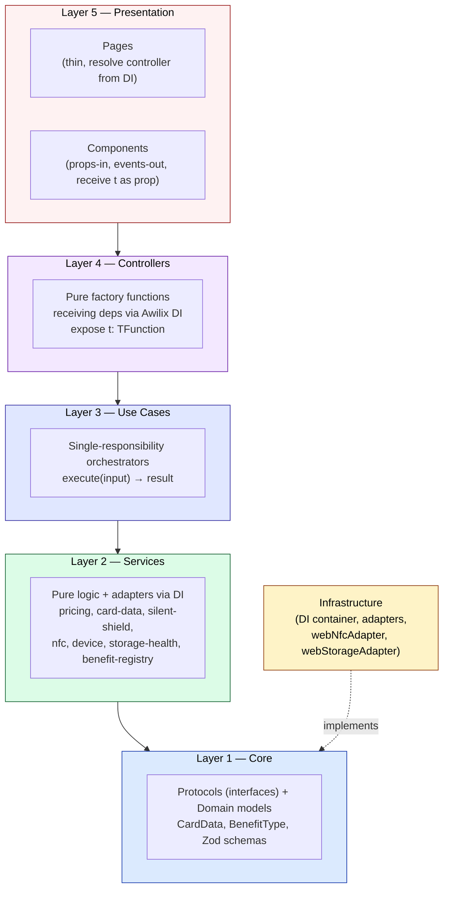
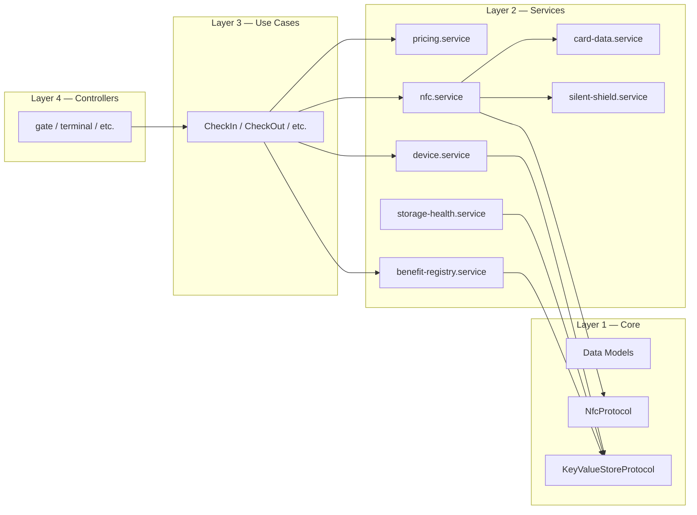

# Clean Architecture

> Covers: Req 2, Req 3, Req 13, Req 14

## Overview

The MBC feature follows strict Clean Architecture with **5 layers**. Dependencies flow inward only. Each layer is independently testable and has zero dependencies on layers above it.

## Layer Hierarchy


```mermaid
graph TB
    subgraph L5["Layer 5 — Presentation"]
        Pages["Pages<br/>(thin, resolve controller from DI)"]
        Components["Components<br/>(props-in, events-out, receive t as prop)"]
    end

    subgraph L4["Layer 4 — Controllers"]
        Controllers["Pure factory functions<br/>receiving deps via Awilix DI<br/>expose t: TFunction"]
    end

    subgraph L3["Layer 3 — Use Cases"]
        UC["Single-responsibility orchestrators<br/>execute(input) → result"]
    end

    subgraph L2["Layer 2 — Services"]
        SS["Pure logic + adapters via DI<br/>pricing, card-data, silent-shield,<br/>nfc, device, storage-health, benefit-registry"]
    end

    subgraph L1["Layer 1 — Core"]
        DM["Protocols (interfaces) + Domain models<br/>CardData, BenefitType, Zod schemas"]
    end

    L5 --> L4
    L4 --> L3
    L3 --> L2
    L2 --> L1

    Infra["Infrastructure<br/>(DI container, adapters,<br/>webNfcAdapter, webStorageAdapter)"]
    Infra -.->|implements| L1

    style L1 fill:#dbeafe,stroke:#1e40af,color:#000
    style L2 fill:#dcfce7,stroke:#166534,color:#000
    style L3 fill:#e0e7ff,stroke:#3730a3,color:#000
    style L4 fill:#f3e8ff,stroke:#6b21a8,color:#000
    style L5 fill:#fef2f2,stroke:#991b1b,color:#000
    style Infra fill:#fef3c7,stroke:#92400e,color:#000
```

## Layer Summary

| Layer | Contents | Location | Dependencies | Testability |
|-------|----------|----------|-------------|-------------|
| **1 — Core** | Protocols (interfaces), domain models, types, Zod schemas | `src/@core/protocols/`, `src/@core/services/mbc/models.ts` | None | Pure type checks |
| **2 — Services** | pricing, card-data, silent-shield (pure logic) + nfc, device, storage-health, benefit-registry (adapters) | `src/@core/services/`, `src/infrastructure/` | Core types + protocols | Unit tests, property-based tests |
| **3 — Use Cases** | RegisterMember, TopUpBalance, CheckIn, CheckOut, ReadCard, ManualCalculation, ManageBenefitRegistry | `src/@core/use_case/mbc/` | Services via DI | Unit tests with mocked services |
| **4 — Controllers** | station, gate, terminal, scout, role-picker | `src/controllers/mbc/` | Use cases + `useTranslation` via DI | Unit tests with mocked use cases |
| **5 — Presentation** | Pages + Components | `src/presentation/` | Controllers via DI | RTL component tests |

**Infrastructure** (DI container, adapters) sits outside the main chain — it implements Core protocols and wires everything together via Awilix.

## Dependency Rules

```
✅ ALLOWED — Depend on interfaces (protocols)
   nfc.service depends on NfcProtocol (interface)

✅ ALLOWED — Depend on pure data types
   pricing.service depends on PricingStrategy type

✅ ALLOWED — Receive dependencies via DI constructor
   const CheckOut = ({ nfcService, pricingService }: AwilixRegistry) => ...

✅ ALLOWED — Controller injects useTranslation, exposes t
   const { t } = useTranslation(); return { ..., t };

❌ FORBIDDEN — Direct import of implementation
   import { webNfcAdapter } from '@src/infrastructure/nfc/webNfcAdapter'

❌ FORBIDDEN — Service knows about UI
   pricing.service imports React hooks

❌ FORBIDDEN — Component contains business logic
   FeeBreakdown calculates fees internally

❌ FORBIDDEN — Component imports useTranslation directly
   Presentation layer must receive t as prop from controller
```

## Dependency Graph


```mermaid
graph LR
    subgraph Core["Layer 1 — Core"]
        Models[Data Models]
        NfcProto[NfcProtocol]
        KvProto[KeyValueStoreProtocol]
    end

    subgraph Services["Layer 2 — Services"]
        Pricing[pricing.service]
        CardData[card-data.service]
        Shield[silent-shield.service]
        NfcSvc[nfc.service]
        DevSvc[device.service]
        HealthSvc[storage-health.service]
        RegSvc[benefit-registry.service]
    end

    subgraph UC["Layer 3 — Use Cases"]
        UseCases[CheckIn / CheckOut / etc.]
    end

    subgraph Ctrl["Layer 4 — Controllers"]
        Controllers[gate / terminal / etc.]
    end

    NfcSvc --> NfcProto
    NfcSvc --> CardData
    NfcSvc --> Shield
    DevSvc --> KvProto
    HealthSvc --> KvProto
    RegSvc --> KvProto
    UseCases --> NfcSvc
    UseCases --> Pricing
    UseCases --> DevSvc
    UseCases --> RegSvc
    Controllers --> UseCases
```

## DI Container Structure

All modules are wired via Awilix with typed `AwilixRegistry`:

| Registry File | Registers | Pattern |
|---------------|-----------|---------|
| `mbcProtocolContainer.ts` | `nfcProtocol` | `asFunction` |
| `mbcServiceContainer.ts` | All MBC services (pricing, card-data, silent-shield, nfc, device, storage-health, benefit-registry) | `asFunction().singleton()` for stateful |
| `mbcUseCaseContainer.ts` | All 7 use cases | `asFunction` |
| `mbcControllerContainer.ts` | All 5 controllers | `asFunction` |
| `libraryContainer.ts` | `zod`, `useTranslation` | `asValue` |

The `AwilixRegistry` type is a union of all container interfaces, providing full type safety across the DI boundary.

## i18n Pattern

Translation follows the layer separation:

1. `useTranslation` is registered in DI container (`libraryContainer.ts`)
2. Controllers inject `useTranslation` via deps, expose `t: TFunction`
3. Pages get `t` from `ctrl.t`, pass to child components as prop
4. Components receive `t: TFunction` as prop — never import `useTranslation` directly

## Component Composition Pattern

UI components follow strict **props-in, events-out**:

```
MbcTerminal (page)
├── NfcCapabilityNotice    (NFC status — receives t prop)
├── NfcTapPrompt           (tap animation — receives t prop)
├── FeeBreakdown           (fee display — receives t prop)
├── BalanceDisplay          (balance — receives t prop)
├── TransactionLogList      (history — receives t prop)
└── ManualCalcForm          (fallback — receives t prop)
```

Each component is a self-contained brick. The page (via controller) is the only place where these bricks are assembled and `t` is distributed.

## Related Pages

- [Overview](Overview) — System overview and tech stack
- [Data Flow](Data-Flow) — Sequence diagrams showing data through layers
- [Card Data Schema](../02-Data-Models/Card-Data-Schema) — Layer 1 data models
- [Phase Progress](../07-Development/Phase-Progress) — Build order status
