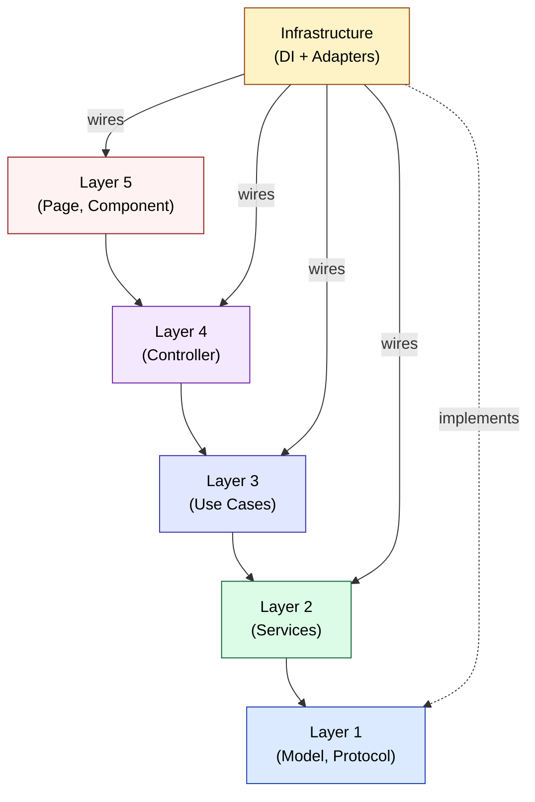
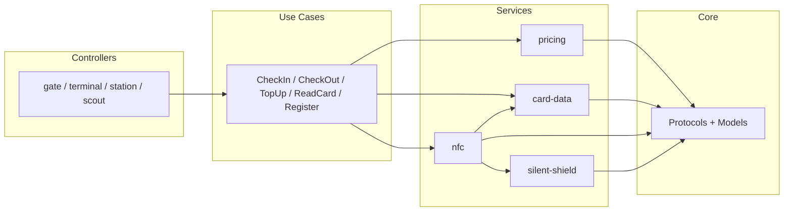

# Clean Architecture

> Covers: Req 2, Req 3, Req 13, Req 14

## Overview

The MBC feature follows strict Clean Architecture with **5 layers**. Dependencies flow inward only.

## Layer Diagram


```mermaid
graph TB
    L5["Layer 5<br/>(Page, Component)"] --> L4["Layer 4<br/>(Controller)"]
    L4 --> L3["Layer 3<br/>(Use Cases)"]
    L3 --> L2["Layer 2<br/>(Services)"]
    L2 --> L1["Layer 1<br/>(Model, Protocol)"]

    Infra["Infrastructure<br/>(DI + Adapters)"]
    Infra -->|wires| L5
    Infra -->|wires| L4
    Infra -->|wires| L3
    Infra -->|wires| L2
    Infra -.->|implements| L1

    style L1 fill:#dbeafe,stroke:#1e40af,color:#000
    style L2 fill:#dcfce7,stroke:#166534,color:#000
    style L3 fill:#e0e7ff,stroke:#3730a3,color:#000
    style L4 fill:#f3e8ff,stroke:#6b21a8,color:#000
    style L5 fill:#fef2f2,stroke:#991b1b,color:#000
    style Infra fill:#fef3c7,stroke:#92400e,color:#000
```

> **Folder `src/@core/`** berisi Layer 1–3 (models, protocols, services, use cases) — semua business logic yang framework-agnostic.
> **Infrastructure** wires semua layer via DI, dan implements interface dari Layer 1.

## Layer Summary

| Layer | What | Folder | Key Rule |
|-------|------|--------|----------|
| **1 Model & Protocol** | Domain types, Zod schemas, interfaces | `src/@core/protocols/`, `src/@core/models/` | Zero dependencies |
| **2 Services** | Pure logic + adapters | `src/@core/services/` | Depends only on Layer 1 |
| **3 Use Cases** | Business orchestration | `src/@core/use_case/mbc/` | Calls services, never UI |
| **4 Controllers** | State + DI bridge (Presenter) | `src/controllers/mbc/` | Exposes `t`, calls use cases |
| **5 Presentation** | Pages + Components (View) | `src/presentation/` | Resolves controller, renders |
| **∞ Infrastructure** | DI container, adapters, config | `src/infrastructure/` | Implements Layer 1 protocols, wires all |

## Dependency Rules (Quick Reference)

| ✅ Allowed | ❌ Forbidden |
|-----------|-------------|
| Depend on protocols (interfaces) | Direct import of implementation |
| Depend on pure data types | Service imports React/UI |
| Receive deps via DI constructor | Component contains business logic |
| Controller exposes `t: TFunction` | Component imports `useTranslation` |

## Dependency Graph


```mermaid
graph LR
    subgraph L4[Controllers]
        C[gate / terminal / station / scout]
    end
    subgraph L3[Use Cases]
        UC[CheckIn / CheckOut / TopUp / ReadCard / Register]
    end
    subgraph L2[Services]
        S1[pricing] & S2[card-data] & S3[nfc] & S4[silent-shield]
    end
    subgraph L1[Core]
        P[Protocols + Models]
    end

    C --> UC --> S1 & S2 & S3
    S3 --> S2 & S4
    S1 & S2 & S3 & S4 --> P
```

## DI Container

| Registry | Registers | Pattern |
|----------|-----------|---------|
| `mbcProtocolContainer` | nfcProtocol | `asFunction` |
| `mbcServiceContainer` | All services | `asFunction().singleton()` |
| `mbcUseCaseContainer` | 7 use cases | `asFunction` |
| `mbcControllerContainer` | 5 controllers | `asFunction` |
| `libraryContainer` | zod, useTranslation | `asValue` |

## i18n Flow

```
DI Container → Controller (injects useTranslation, exposes t) → Page (gets t from ctrl) → Component (receives t as prop)
```

## Related Pages

- [Overview](Overview) — System overview and tech stack
- [Data Flow](Data-Flow) — Sequence diagrams
- [Card Data Schema](../02-Data-Models/Card-Data-Schema) — Layer 1 models
