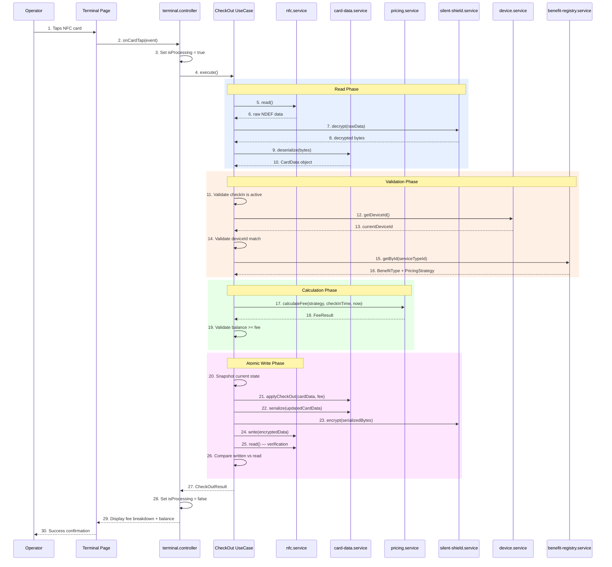
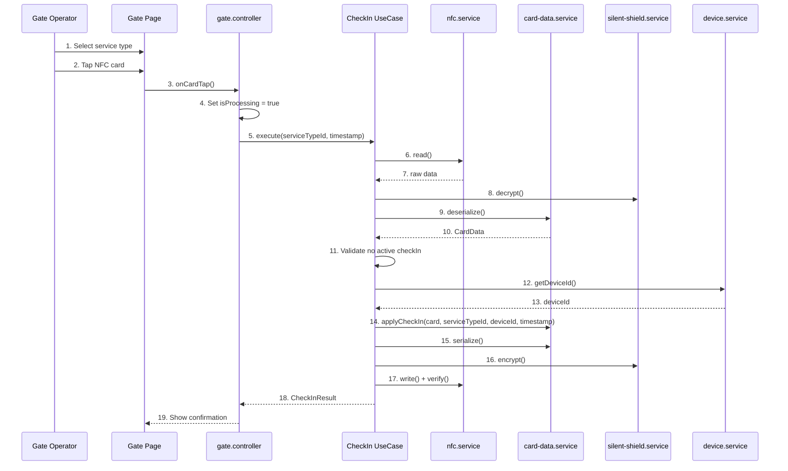
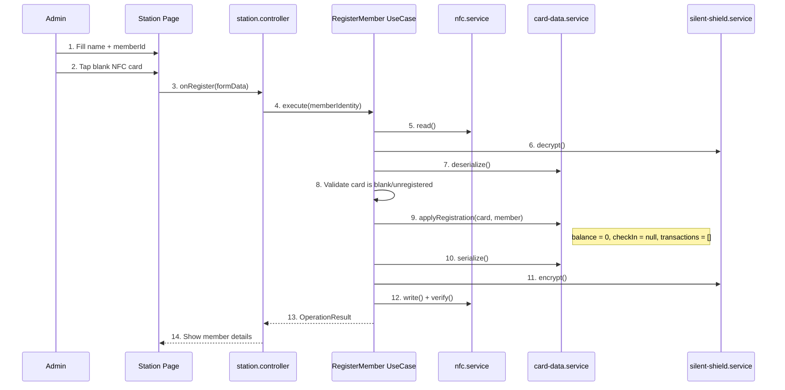
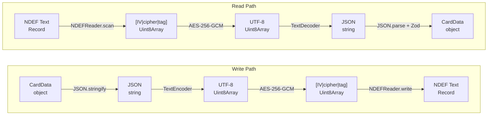

# Data Flow

> Covers: Req 2, Req 3, Req 8, Req 11, Req 13

## Overview

This page documents how data flows through the Clean Architecture layers for each major operation. All flows follow the same pattern: **User → UI → Controller → Use Case → Services → Protocols → Infrastructure**.

## Check-Out Flow (Most Complex)

The check-out flow demonstrates the full data pipeline including device binding validation, fee calculation, and atomic write.

## Check-In Flow

## Registration Flow

## Data Transformation Pipeline

Every NFC read/write follows this transformation chain:

## Related Pages

- [Atomic Write Pipeline](../04-Technical-Flows/Atomic-Write-Pipeline) — Snapshot, write, verify, rollback details
- [Silent Shield Encryption](../04-Technical-Flows/Silent-Shield-Encryption) — AES-256-GCM encrypt/decrypt flow
- [Card Data Schema](../02-Data-Models/Card-Data-Schema) — CardData structure
- [Check-Out Flow](../03-Business-Flows/Check-Out-Flow) — Business rules and error paths
- [Check-In Flow](../03-Business-Flows/Check-In-Flow) — Business rules and simulation mode
