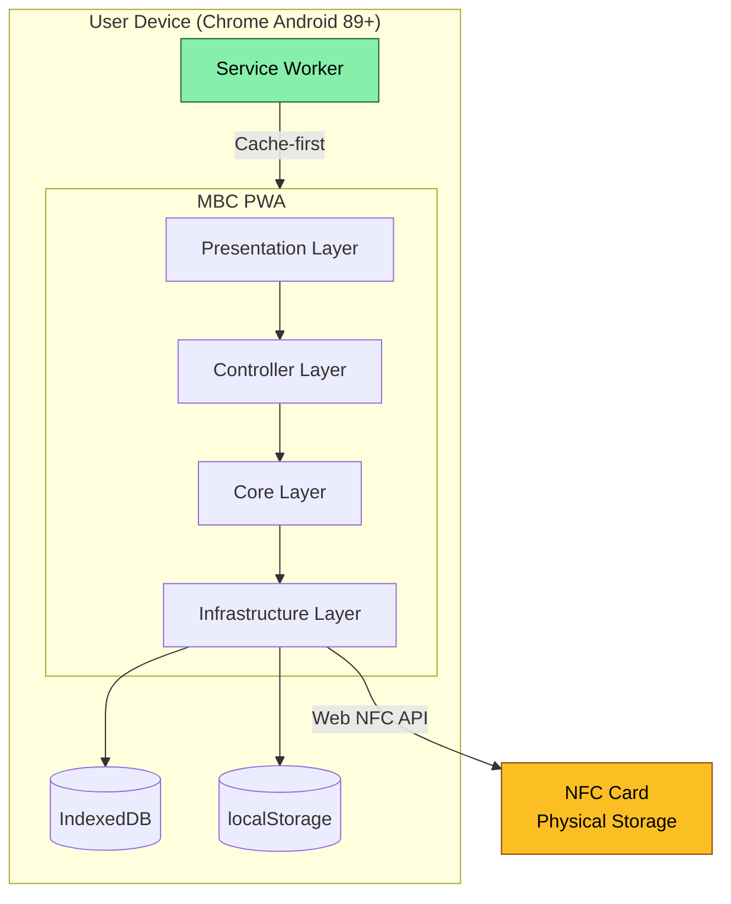

# System Overview

> Covers: Req 1, Req 2, Req 3, Req 14

## Overview

The Membership Benefit Card (MBC) is a frontend-only Progressive Web Application that uses NFC cards as the sole data store for cooperative member identity, balance, visit status, and transaction history. There is no backend — all operations happen between the browser and the physical NFC card via the Web NFC API.

## Four Role Modes

The application operates in four switchable role modes within a single installed PWA:

| Mode | Role | Operations | NFC Required |
|------|------|------------|:---:|
| **The Station** | Admin | Registration, top-up, service config | ✅ |
| **The Gate** | Gate operator | Check-in with service type selection | ✅ |
| **The Terminal** | Terminal operator | Check-out, fee calculation, manual fallback | ✅ |
| **The Scout** | Member | Read-only card information display | ✅ (demo mode if unavailable) |

## Tech Stack

| Layer | Technology |
|-------|-----------|
| Framework | React 19 + TypeScript + Vite |
| Routing | TanStack Router (file-based, auto code-splitting) |
| DI | Awilix (Clean Architecture) |
| Styling | SCSS Modules + Tailwind CSS 4 |
| Validation | Zod |
| NFC | Web NFC API (`NDEFReader`) |
| Encryption | crypto-browserify (AES-256-GCM) |
| Testing | Vitest + React Testing Library + fast-check |
| PWA | vite-plugin-pwa (Service Worker) |

## High-Level Architecture



## Key Characteristics

- **Offline-First** — All operations run without internet after initial install (Req 14)
- **Extensible Service Types** — Parking, bike rental, gym, restaurant, VIP, etc.
- **Configurable Pricing** — Per-hour, per-visit, flat-fee with rounding strategies
- **Atomic Transactions** — No double deduction or partial writes (see [Atomic Write Pipeline](../04-Technical-Flows/Atomic-Write-Pipeline))
- **Device Binding** — Check-out only on the same device as check-in (see [Device Binding](../04-Technical-Flows/Device-Binding))
- **Silent Shield** — AES-256-GCM encryption on card data (see [Silent Shield](../04-Technical-Flows/Silent-Shield-Encryption))

## Project Structure

```
src/
├── @core/                    # Core business logic (framework-agnostic)
│   ├── protocols/            # Interface contracts (NFC, IndexedDB)
│   ├── services/mbc/         # MBC services + data models
│   └── use_case/mbc/         # Application use cases
├── infrastructure/           # External adapters & DI container
├── controllers/mbc/          # Page controllers (logic layer)
├── presentation/             # UI layer
│   ├── components/mbc/       # Reusable components
│   └── pages/(mbc)/          # Page-level components
├── routes/mbc/               # TanStack Router routes
└── utils/                    # Constants, helpers, hooks
```

## Related Pages

- [Clean Architecture](Clean-Architecture) — Layer rules and dependency direction
- [Data Flow](Data-Flow) — How data flows through layers
- [Design Decisions](Design-Decisions) — Why we chose X over Y
- [Phase Progress](../07-Development/Phase-Progress) — Current implementation status
