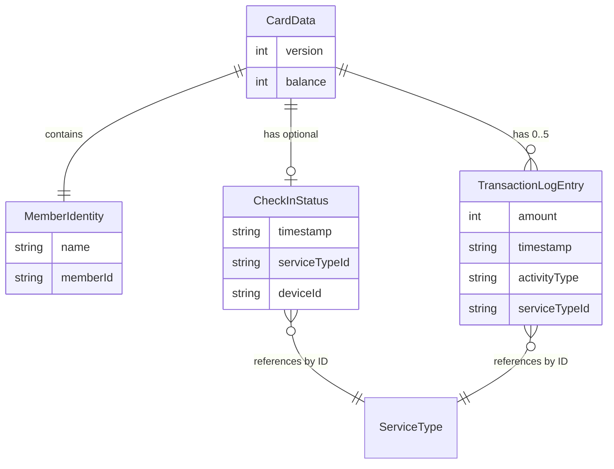

# Card Data Schema

> Covers: Req 9, Req 10, Req 13
> Source: `src/@core/services/mbc/models/card-data.model.ts`

## Overview

`CardData` is the complete data structure stored on every NFC card. It contains member identity, balance, active check-in status, and a rolling transaction log.

## Entity Relationship



## CardData Interface

```typescript
export interface CardData {
  /** Schema version for forward compatibility */
  version: number;
  /** Member identity */
  member: MemberIdentity;
  /** Current balance in IDR (integer, no decimals) */
  balance: number;
  /** Active check-in status, null if not checked in */
  checkIn: CheckInStatus | null;
  /** Rolling transaction log, max 5 entries (newest last) */
  transactions: TransactionLogEntry[];
}
```

## MemberIdentity

```typescript
export interface MemberIdentity {
  /** Member name (1-50 chars) */
  name: string;
  /** Member ID / registration number (1-20 chars) */
  memberId: string;
}
```

## CheckInStatus

Present when a member is currently checked in to a service. Set to `null` when not checked in.

```typescript
export interface CheckInStatus {
  /** ISO 8601 timestamp of check-in */
  timestamp: string;
  /** Service type identifier from Service Registry */
  serviceTypeId: string;
  /** Device_ID of the check-in device (for device binding) */
  deviceId: string;
}
```

See [Device Binding](../04-Technical-Flows/Device-Binding) for how `deviceId` is used.

## TransactionLogEntry

Rolling log of the last 5 transactions. When a 6th entry is added, the oldest is removed.

```typescript
export interface TransactionLogEntry {
  /** Amount in IDR (positive for top-up, negative for deduction) */
  amount: number;
  /** ISO 8601 timestamp */
  timestamp: string;
  /** Activity type identifier (e.g., "top-up", "parking-fee") */
  activityType: string;
  /** Service type identifier */
  serviceTypeId: string;
}
```

## Field Constraints

| Field | Type | Constraint |
|-------|------|-----------|
| `version` | `number` | Positive integer |
| `member.name` | `string` | 1-50 characters |
| `member.memberId` | `string` | 1-20 characters |
| `balance` | `number` | Non-negative integer (IDR) |
| `checkIn` | `object \| null` | Null when not checked in |
| `checkIn.timestamp` | `string` | ISO 8601 datetime |
| `checkIn.serviceTypeId` | `string` | Non-empty |
| `checkIn.deviceId` | `string` | Non-empty |
| `transactions` | `array` | Max 5 entries |
| `transactions[].amount` | `number` | Integer (positive or negative) |
| `transactions[].timestamp` | `string` | ISO 8601 datetime |

Validation is enforced by `CardDataSchema` — see [Zod Validation Schemas](Zod-Validation-Schemas).

## Mutation Functions

The `CardDataService` provides pure mutation functions that return new `CardData` objects (immutable):

| Function | Effect | Req |
|----------|--------|-----|
| `applyRegistration(card, member)` | Sets member, balance=0, clears checkIn and transactions | Req 4 |
| `applyTopUp(card, amount)` | Adds amount to balance, appends "top-up" transaction | Req 5 |
| `applyCheckIn(card, serviceTypeId, deviceId, timestamp)` | Sets checkIn status. **Rejects if already checked in.** | Req 6 |
| `applyCheckOut(card, fee, activityType, serviceTypeId, exitTimestamp)` | Deducts fee, clears checkIn, appends transaction. **Rejects if not checked in.** | Req 8 |
| `appendTransactionLog(card, entry)` | Appends entry, trims to max 5 | Req 10 |

## Related Pages

- [Service Type Model](Service-Type-Model) — ServiceType and PricingStrategy
- [NFC Memory Layout](NFC-Card-Memory-Layout) — How CardData is serialized on the card
- [Zod Validation Schemas](Zod-Validation-Schemas) — Validation rules
- [Correctness Properties](../06-Testing/Correctness-Properties) — Properties 1, 3-7
