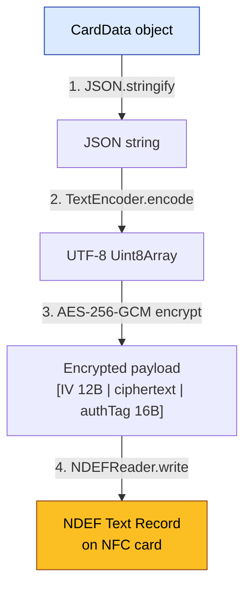
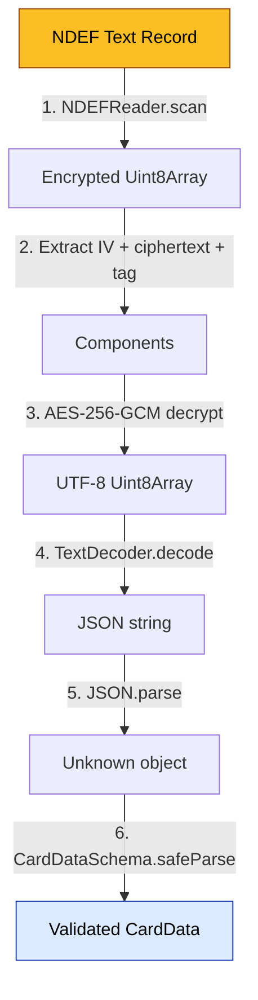

# NFC Card Memory Layout

> Covers: Req 11, Req 13

## Overview

This page documents how [CardData](Card-Data-Schema) is serialized, encrypted, and stored on the physical NFC card. The card stores a single NDEF text record containing the encrypted payload.

## Serialization Pipeline



## Memory Layout on Card

```
┌──────────────────────────────────────────────┐
│              NFC Tag (NTAG215/216)            │
├──────────────────────────────────────────────┤
│  NDEF Message                                │
│  ├── Record 0: NDEF Text Record              │
│  │   ├── Type: "T" (text)                    │
│  │   ├── Language: "en"                      │
│  │   └── Payload:                            │
│  │       ┌──────────────────────────────┐    │
│  │       │ IV (12 bytes)                │    │
│  │       │ Ciphertext (variable)        │    │
│  │       │ Auth Tag (16 bytes)          │    │
│  │       └──────────────────────────────┘    │
│  └── (no other records)                      │
└──────────────────────────────────────────────┘
```

## Encrypted Payload Format

| Offset | Length | Content |
|--------|--------|---------|
| 0 | 12 bytes | Initialization Vector (random per write) |
| 12 | variable | AES-256-GCM ciphertext |
| end - 16 | 16 bytes | GCM Authentication Tag |

The encryption details are documented in [Silent Shield Encryption](../04-Technical-Flows/Silent-Shield-Encryption).

## Memory Budget

| NFC Tag | User Memory | Typical CardData JSON | Encrypted Size |
|---------|-------------|----------------------|----------------|
| NTAG213 | 144 bytes | ❌ Too small | — |
| NTAG215 | 504 bytes | ~300-400 bytes | ~330-430 bytes ✅ |
| NTAG216 | 888 bytes | ~300-400 bytes | ~330-430 bytes ✅ |

### Typical CardData Size Estimate

```json
{
  "version": 1,
  "member": { "name": "Ahmad Fauzi", "memberId": "KOP-2024-001" },
  "balance": 50000,
  "checkIn": { "timestamp": "2024-01-15T10:30:00.000Z", "serviceTypeId": "parking", "deviceId": "a1b2c3d4-e5f6-7890-abcd-ef1234567890" },
  "transactions": [
    { "amount": 50000, "timestamp": "2024-01-15T09:00:00.000Z", "activityType": "top-up", "serviceTypeId": "top-up" },
    { "amount": -4000, "timestamp": "2024-01-14T15:30:00.000Z", "activityType": "parking-fee", "serviceTypeId": "parking" }
  ]
}
```

Approximate sizes:
- JSON string: ~350 bytes (with 2 transactions)
- JSON string: ~550 bytes (with 5 transactions, max)
- Encrypted overhead: +28 bytes (12B IV + 16B auth tag)
- **Total max: ~580 bytes** → fits NTAG216 (888B)

## Deserialization Pipeline



Step 6 uses Zod validation — see [Zod Validation Schemas](Zod-Validation-Schemas). If validation fails, a descriptive error is returned (Req 13.5).

## Related Pages

- [Card Data Schema](Card-Data-Schema) — The CardData structure being serialized
- [Silent Shield Encryption](../04-Technical-Flows/Silent-Shield-Encryption) — AES-256-GCM details
- [Zod Validation Schemas](Zod-Validation-Schemas) — Validation on deserialization
- [Data Flow](../01-Architecture/Data-Flow) — Full read/write sequence diagrams
