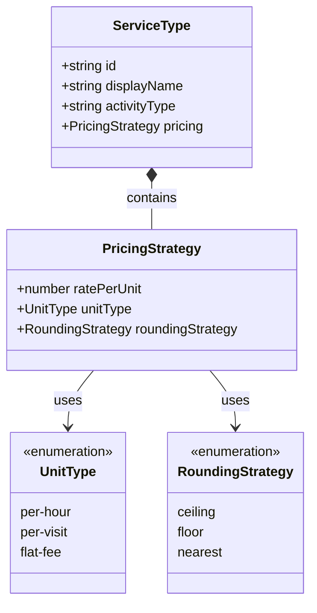

# Service Type Model

> Covers: Req 12, Req 15, Req 16
> Source: `src/@core/services/mbc/models/service-type.model.ts`

## Overview

A `ServiceType` defines a business scenario (parking, bike rental, gym, etc.) with its own pricing rules. Service types are stored in the [Service Registry](../04-Technical-Flows/Resilient-Storage) on the device and referenced by ID on the NFC card.

## Class Diagram



## ServiceType Interface

```typescript
export interface ServiceType {
  /** Unique identifier (e.g., "parking", "bike-rental") */
  id: string;
  /** Display name (e.g., "Parkir", "Sewa Sepeda") */
  displayName: string;
  /** Activity type label for transaction logs */
  activityType: string;
  /** Pricing configuration */
  pricing: PricingStrategy;
}
```

## PricingStrategy Interface

```typescript
export interface PricingStrategy {
  /** Rate per unit in IDR */
  ratePerUnit: number;
  /** Unit type: per-hour, per-visit, or flat-fee */
  unitType: 'per-hour' | 'per-visit' | 'flat-fee';
  /** Rounding strategy for duration-based calculations */
  roundingStrategy: 'ceiling' | 'floor' | 'nearest';
}
```

## Unit Types

| Unit Type | Calculation | Example |
|-----------|-------------|---------|
| `per-hour` | `rounding(hours) × ratePerUnit` | Parking: Rp 2.000/jam |
| `per-visit` | `1 × ratePerUnit` (duration ignored) | Restaurant: Rp 15.000/visit |
| `flat-fee` | `1 × ratePerUnit` (duration ignored) | VIP: Rp 50.000 flat |

## Rounding Strategies

Only applies to `per-hour` unit type:

| Strategy | Behavior | Example (2.3 hours) |
|----------|----------|---------------------|
| `ceiling` | Round up to next integer | 3 hours → Rp 6.000 |
| `floor` | Round down | 2 hours → Rp 4.000 |
| `nearest` | Round to nearest integer | 2 hours → Rp 4.000 |

See [Pricing Engine](../04-Technical-Flows/Pricing-Engine) for the full calculation logic.

## Default Parking Service

Pre-configured default that initializes the Service Registry on first launch:

```typescript
export const DEFAULT_PARKING_SERVICE: ServiceType = {
  id: 'parking',
  displayName: 'Parkir',
  activityType: 'parking-fee',
  pricing: {
    ratePerUnit: 2000,
    unitType: 'per-hour',
    roundingStrategy: 'ceiling',
  },
};
```

## Example Service Types

| ID | Display Name | Activity Type | Rate | Unit | Rounding |
|----|-------------|---------------|------|------|----------|
| `parking` | Parkir | parking-fee | Rp 2.000 | per-hour | ceiling |
| `bike-rental` | Sewa Sepeda | bike-rental | Rp 5.000 | per-hour | ceiling |
| `gym-session` | Gym | gym-session | Rp 25.000 | per-visit | — |
| `restaurant` | Restoran | restaurant-visit | Rp 15.000 | per-visit | — |
| `vip-access` | VIP Lounge | vip-access | Rp 50.000 | flat-fee | — |

## Related Pages

- [Card Data Schema](Card-Data-Schema) — How serviceTypeId is stored on the card
- [Pricing Engine](../04-Technical-Flows/Pricing-Engine) — Fee calculation using PricingStrategy
- [Service Type Configuration](../03-Business-Flows/Service-Type-Configuration) — CRUD operations
- [Zod Validation Schemas](Zod-Validation-Schemas) — ServiceTypeFormSchema
