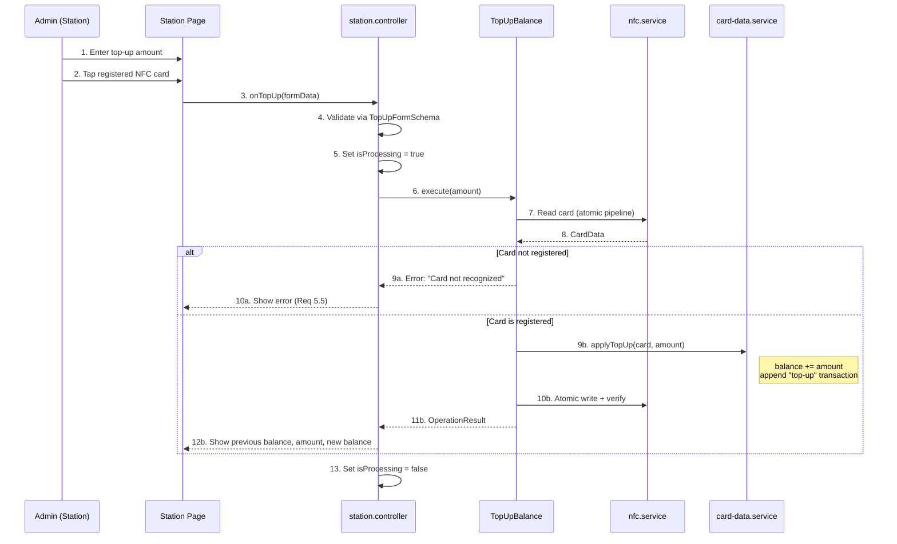

# Balance Top-Up

> Covers: Req 5, Req 10
> Use Case: `TopUpBalance`
> Controller: `station.controller`
> Page: `MbcStation`

## Overview

Top-up adds balance (IDR) to a registered member card and records the transaction in the card's rolling log. Only available in **The Station** mode.

## Flow



## Steps

1. Admin enters the top-up amount in IDR
2. Amount is validated: must be a positive integer (`TopUpFormSchema`)
3. Admin taps a registered NFC card
4. System reads and validates the card
5. If card is not registered → error
6. If registered → adds amount to balance, appends transaction log entry
7. Writes updated card data via [Atomic Write Pipeline](../04-Technical-Flows/Atomic-Write-Pipeline)
8. Displays previous balance, top-up amount, and new balance

## Transaction Log Entry

A top-up creates this entry (see [Card Data Schema](../02-Data-Models/Card-Data-Schema) for the `appendTransactionLog` behavior):

```typescript
{
  amount: 50000,           // positive = credit
  timestamp: "2024-01-15T09:00:00.000Z",
  activityType: "top-up",
  serviceTypeId: "top-up"
}
```

The rolling log is capped at 5 entries — oldest removed when full (Req 10.2).

## Error Paths

| Error | Cause | User Message | Req |
|-------|-------|-------------|-----|
| Card not recognized | No member data on card | "Kartu tidak dikenali" | 5.5 |
| Invalid amount | Zero or negative | Inline validation error | 5.1 |
| NFC write failed | Connection lost | Rollback to previous state | 3.2 |

## Result Type

```typescript
interface OperationResult {
  type: 'top-up';
  memberName: string;
  previousBalance: number;
  amount: number;
  newBalance: number;
}
```

## Related Pages

- [Member Registration](Member-Registration) — Must register before top-up
- [Check-In Flow](Check-In-Flow) — Uses the topped-up balance
- [Atomic Write Pipeline](../04-Technical-Flows/Atomic-Write-Pipeline) — Write integrity
- [Correctness Properties](../06-Testing/Correctness-Properties) — Property 3: Balance Conservation
