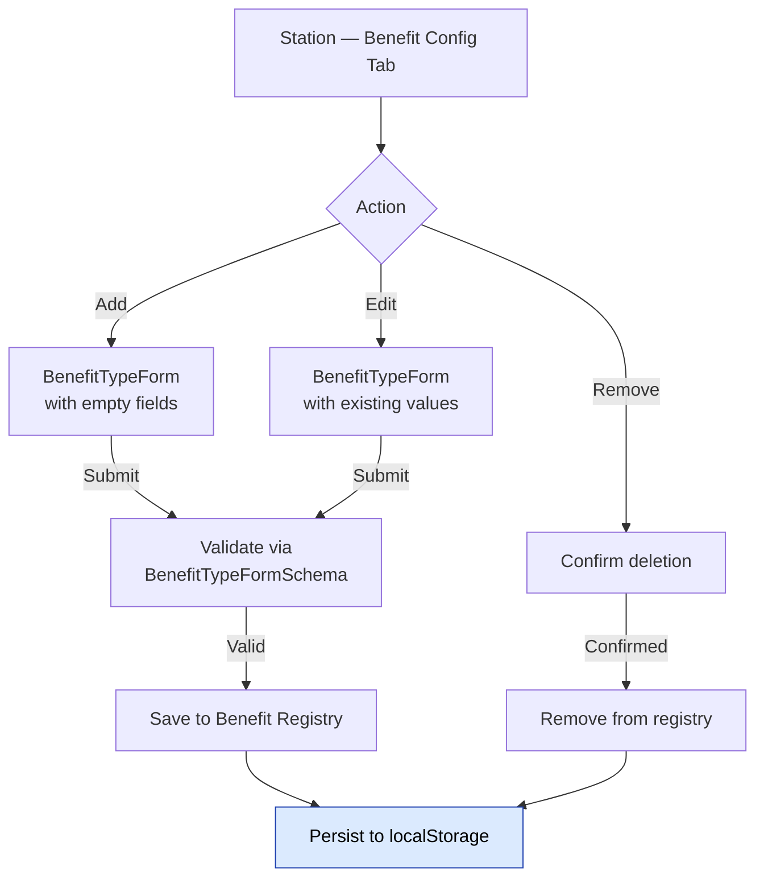
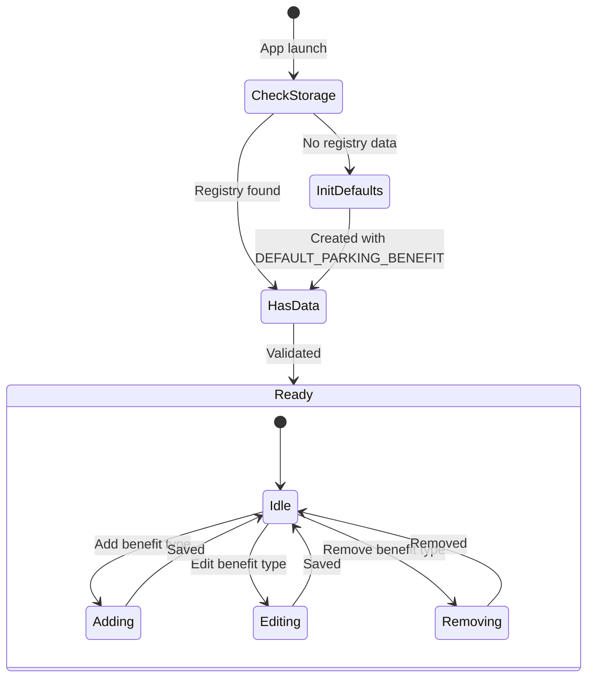

# Benefit Type Configuration

> Covers: Req 15, Req 16, Req 17
> Use Case: `ManageBenefitRegistry`
> Controller: `station.controller`
> Page: `MbcStation`

## Overview

Benefit type configuration allows admins to manage the Benefit Registry — adding, editing, and removing benefit types with their pricing strategies. Only available in **The Station** mode.

## CRUD Operations



## Benefit Registry Lifecycle



## Default Initialization (Req 15.6, Req 15.7)

On first launch (no registry data in storage), the system initializes with:

```typescript
DEFAULT_PARKING_BENEFIT = {
  id: 'parking',
  displayName: 'Parkir',
  activityType: 'parking-fee',
  pricing: {
    ratePerUnit: 2000,
    unitType: 'per-hour',
    roundingStrategy: 'ceiling',
  },
};
```

See [Benefit Type Model](../02-Data-Models/Benefit-Type-Model) for the full model definition.

## Supported Benefit Categories (Req 16)

| Category | Examples | Unit Type |
|----------|----------|-----------|
| Duration-based | Parking, bike rental, gym session | `per-hour` |
| Visit-based | Restaurant, VIP lounge, facility entry | `per-visit` |
| Loyalty/discount | Membership discount, loyalty points | `per-visit` (no fee) |

## Persistence

The Benefit Registry is persisted via [Storage Architecture](../04-Technical-Flows/Storage-Architecture) — localStorage with Zod validation. Data integrity is validated on each app launch (Req 20.5).

## Form Validation

Benefit type forms are validated by `BenefitTypeFormSchema` — see [Zod Validation Schemas](../02-Data-Models/Zod-Validation-Schemas).

| Field | Rule |
|-------|------|
| `id` | 1-30 chars, `^[a-z0-9-]+$` |
| `displayName` | 1-50 chars |
| `activityType` | 1-30 chars, `^[a-z0-9-]+$` |
| `pricing.ratePerUnit` | Positive integer |
| `pricing.unitType` | `per-hour` \| `per-visit` \| `flat-fee` |
| `pricing.roundingStrategy` | `ceiling` \| `floor` \| `nearest` |

## Related Pages

- [Benefit Type Model](../02-Data-Models/Benefit-Type-Model) — Data model and examples
- [Pricing Engine](../04-Technical-Flows/Pricing-Engine) — How pricing strategies are used
- [Check-In Flow](Check-In-Flow) — Benefit type selection at The Gate (Req 17)
- [Storage Architecture](../04-Technical-Flows/Storage-Architecture) — Persistence mechanism
- [Station Interface](../05-UI-Components/Station-Interface) — UI layout
