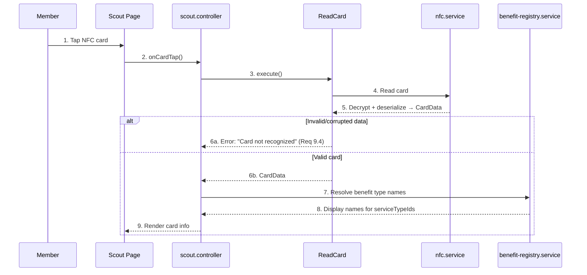

# Card Reading (The Scout)

> Covers: Req 9
> Use Case: `ReadCard`
> Controller: `scout.controller`
> Page: `MbcScout`

## Overview

The Scout is a read-only mode that allows members to view their card contents by tapping. No data is written to the card.

## Flow

## Displayed Information (Req 9.2)

| Section | Data | Source |
|---------|------|--------|
| Member Identity | Name, Member ID | `card.member` |
| Balance | Current balance in IDR | `card.balance` (formatted via `formatIDR`) |
| Check-In Status | Service type name + entry time (if active) | `card.checkIn` + registry lookup |
| Transaction Log | Last 5 transactions | `card.transactions` |

## Transaction Log Display (Req 9.3)

Each transaction entry shows:
- **Amount** — Positive (top-up) or negative (deduction), formatted in IDR
- **Timestamp** — ISO 8601, formatted for display
- **Activity Type** — e.g., "top-up", "parking-fee"
- **Service Type** — Display name resolved from registry

## Error Paths

| Error | Cause | User Message | Req |
|-------|-------|-------------|-----|
| Card not recognized | Invalid/corrupted data | "Kartu tidak dikenali" | 9.4 |
| NFC read failed | Hardware issue | "Gagal membaca kartu" | 2.2 |

## Related Pages

- [Card Data Schema](../02-Data-Models/Card-Data-Schema) — Structure of displayed data
- [Scout Interface](../05-UI-Components/Scout-Interface) — UI layout
- [NFC Capability Detection](../04-Technical-Flows/NFC-Capability-Detection) — Demo mode when NFC unavailable (Req 22.6)
