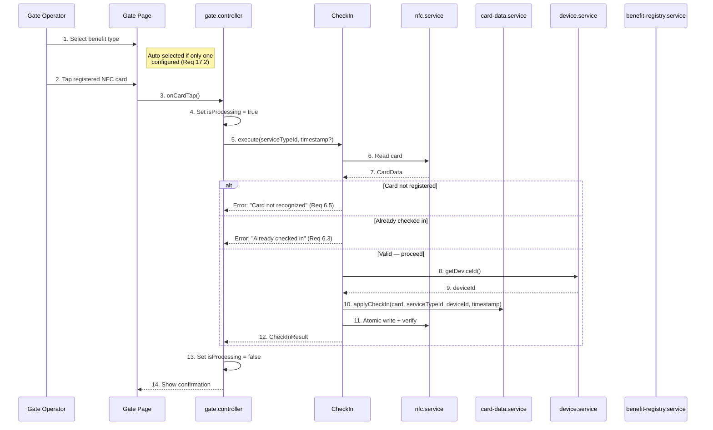
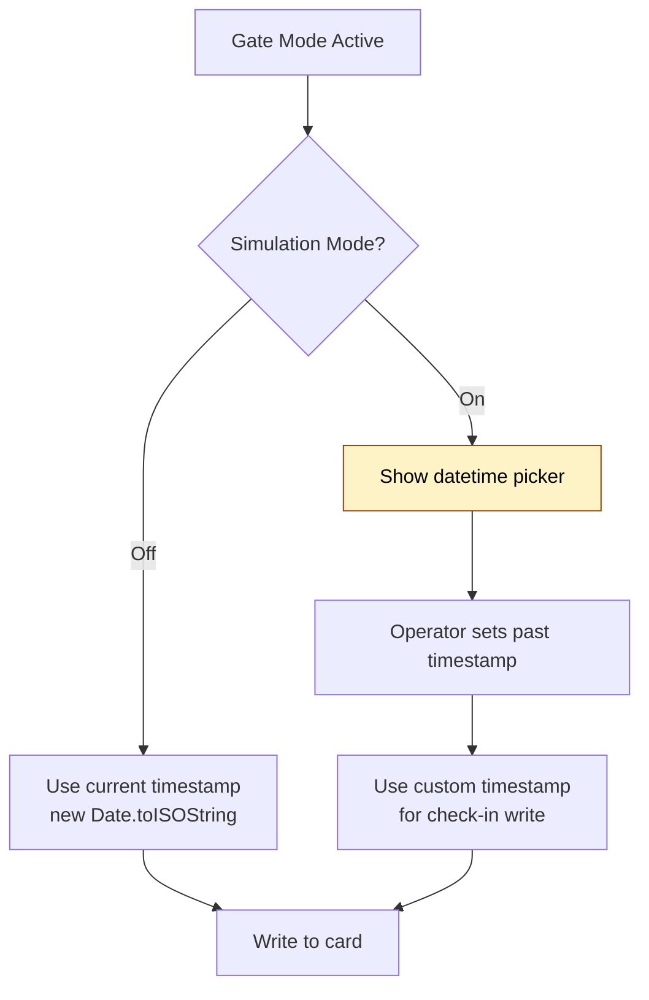

# Check-In Flow

> Covers: Req 6, Req 7, Req 17
> Use Case: `CheckIn`
> Controller: `gate.controller`
> Page: `MbcGate`

## Overview

Check-in records a member's entry timestamp, selected service type, and device ID onto the NFC card. Only available in **The Gate** mode. Supports simulation mode for testing.

## Flow



## Steps

1. Operator selects a benefit type from the [Benefit Registry](Benefit-Type-Configuration)
   - If only one service type exists → auto-selected (Req 17.2)
   - If multiple → operator must select before card taps are accepted (Req 17.3)
   - If registry is empty → message to configure at The Station (Req 17.5)
2. Operator taps a registered NFC card
3. System reads and validates the card
4. System checks that `checkIn` is `null` (no active session)
5. System retrieves the current [Device_ID](../04-Technical-Flows/Device-Binding)
6. System writes: timestamp + serviceTypeId + deviceId → `CheckInStatus`
7. Write is performed via [Atomic Write Pipeline](../04-Technical-Flows/Atomic-Write-Pipeline)
8. Confirmation shows member name, entry time, and service type name

## Simulation Mode (Req 7)



- Toggle enables/disables simulation mode (Req 7.1)
- When enabled: datetime picker allows setting a past timestamp (Req 7.2)
- Custom timestamp is written to the card instead of current time (Req 7.3)
- A [SimulationBanner](../05-UI-Components/Gate-Interface) visually distinguishes simulation from normal mode (Req 7.4)

## Benefit Type Selection Logic

```mermaid
flowchart TD
    A[Load Benefit Registry] --> B{How many<br/>benefit types?}
    B -->|0| C[Show message:<br/>"Configure at Station"]
    B -->|1| D[Auto-select<br/>the only type]
    B -->|2+| E[Show selector<br/>operator must choose]
    D --> F[Ready for card taps]
    E -->|Selected| F
    C --> G[Card taps disabled]
```

The last selected benefit type is persisted so the operator doesn't re-select on each check-in (Req 17.4).

## Double-Tap Prevention

- While `isProcessing = true`, all NFC tap events are ignored (Req 6.8)
- A card with active `CheckInStatus` is rejected with "already checked in" (Req 6.3)
- If the write fails, the check-in is NOT recorded as successful (Req 6.7)

## Error Paths

| Error | Cause | User Message | Req |
|-------|-------|-------------|-----|
| Card not recognized | No member data | "Kartu tidak dikenali" | 6.5 |
| Already checked in | `checkIn !== null` | "Anggota sudah check-in" | 6.3 |
| NFC write failed | Connection lost | "Gagal, tap ulang" | 6.7 |
| No service type selected | Registry empty or none selected | "Pilih benefit type" | 17.5 |

## Result Type

```typescript
interface CheckInResult {
  memberName: string;
  entryTime: string;
  serviceTypeName: string;
}
```

## Related Pages

- [Check-Out Flow](Check-Out-Flow) — The exit counterpart
- [Device Binding](../04-Technical-Flows/Device-Binding) — How deviceId is written and validated
- [Benefit Type Configuration](Benefit-Type-Configuration) — Managing the benefit registry
- [Gate Interface](../05-UI-Components/Gate-Interface) — UI layout
- [Correctness Properties](../06-Testing/Correctness-Properties) — Property 6: Check-In Status Exclusivity
