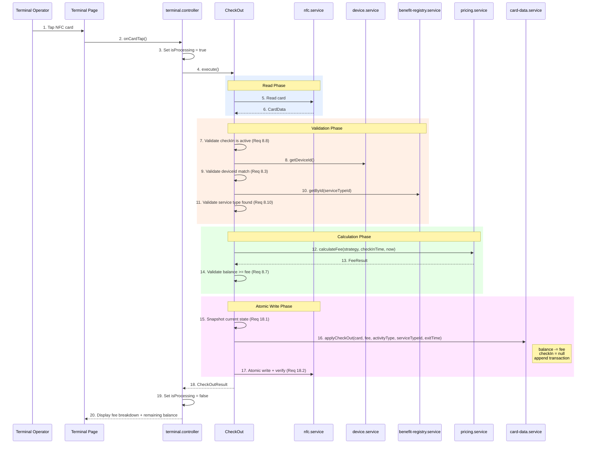
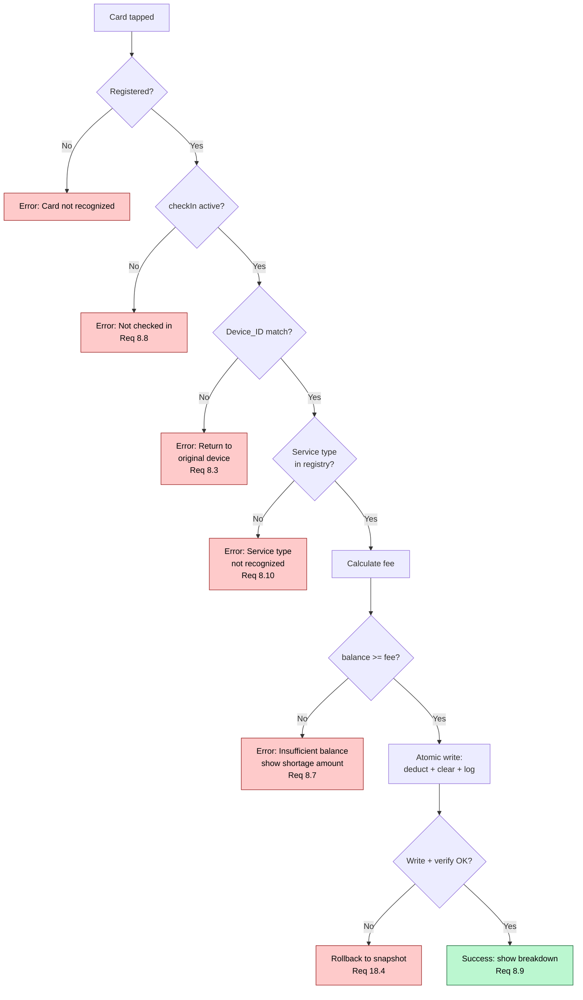

# Check-Out Flow

> Covers: Req 8, Req 18, Req 19
> Use Case: `CheckOut`
> Controller: `terminal.controller`
> Page: `MbcTerminal`

## Overview

Check-out is the most complex business flow. It reads the card, validates device binding, calculates the fee using the service type's pricing strategy, deducts from balance, clears check-in status, and records the transaction — all as a single atomic write. Only available in **The Terminal** mode.

## Flow



## Validation Decision Tree



## Fee Calculation

The fee is calculated by the [Pricing Engine](../04-Technical-Flows/Pricing-Engine) using the service type's `PricingStrategy`. See that page for the full calculation logic.

## Double-Tap Prevention (Req 8.12, Req 18.5, Req 18.7)

1. `isProcessing = true` blocks all subsequent taps during the operation
2. After successful check-out, `checkIn` is cleared → a second tap returns "not checked in"
3. The atomic write ensures balance is deducted **exactly once** per check-in/check-out cycle

## Error Paths

| Error | Cause | User Message | Req |
|-------|-------|-------------|-----|
| Not checked in | `checkIn === null` | "Anggota belum check-in" | 8.8 |
| Device mismatch | `card.deviceId !== local.deviceId` | "Kembali ke device check-in" | 8.3 |
| Service type unknown | serviceTypeId not in registry | "Benefit type tidak dikenali" | 8.10 |
| Insufficient balance | `fee > balance` | "Saldo kurang Rp X, top-up di Station" | 8.7 |
| NFC write failed | Connection lost | Rollback + "Gagal, tap ulang" | 8.11 |
| Verification failed | Written data doesn't match | Rollback to snapshot | 18.6 |

## Result Type

```typescript
interface CheckOutResult {
  serviceTypeName: string;
  entryTime: string;
  exitTime: string;
  duration: string;        // e.g., "2 jam 30 menit"
  fee: number;
  remainingBalance: number;
  feeBreakdown: FeeResult;
}
```

## Related Pages

- [Check-In Flow](Check-In-Flow) — The entry counterpart
- [Pricing Engine](../04-Technical-Flows/Pricing-Engine) — Fee calculation details
- [Atomic Write Pipeline](../04-Technical-Flows/Atomic-Write-Pipeline) — Write integrity mechanism
- [Device Binding](../04-Technical-Flows/Device-Binding) — Device_ID validation
- [Manual Calculation](Manual-Calculation) — Fallback when NFC fails
- [Correctness Properties](../06-Testing/Correctness-Properties) — Properties 4, 5, 6, 10
