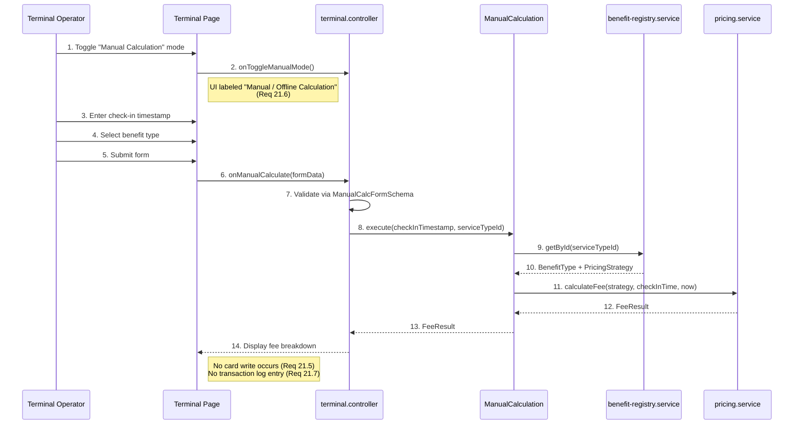

# Manual Fee Calculation

> Covers: Req 21
> Use Case: `ManualCalculation`
> Controller: `terminal.controller`
> Page: `MbcTerminal`

## Overview

Manual calculation is a fallback mode in **The Terminal** when NFC hardware fails during check-out. The operator manually inputs the check-in time and service type to calculate the fee — **no NFC read/write occurs**.

## Flow



## Key Rules

1. **No NFC interaction** — Manual mode does not read or write to any card (Req 21.5)
2. **No transaction log** — Since no card write occurs, no `TransactionLogEntry` is created (Req 21.7)
3. **Clearly labeled** — UI must show "Manual / Offline Calculation" to distinguish from normal check-out (Req 21.6)
4. **Can switch back** — While in manual mode, operator can switch back to normal NFC check-out (Req 21.8)

## Form Inputs

| Field | Type | Validation |
|-------|------|-----------|
| Check-in timestamp | Datetime picker | ISO 8601 datetime, required |
| Service type | Dropdown from registry | Non-empty serviceTypeId |

Validated by `ManualCalcFormSchema` — see [Zod Validation Schemas](../02-Data-Models/Zod-Validation-Schemas).

## Result

The result is a `FeeResult` displayed as a fee breakdown — same format as normal check-out but without balance deduction:

```typescript
interface FeeResult {
  fee: number;
  usageUnits: number;
  unitLabel: string;
  ratePerUnit: number;
  roundingApplied: string;
}
```

## Related Pages

- [Check-Out Flow](Check-Out-Flow) — Normal NFC-based check-out
- [Pricing Engine](../04-Technical-Flows/Pricing-Engine) — Fee calculation logic
- [Terminal Interface](../05-UI-Components/Terminal-Interface) — UI layout with manual mode toggle
