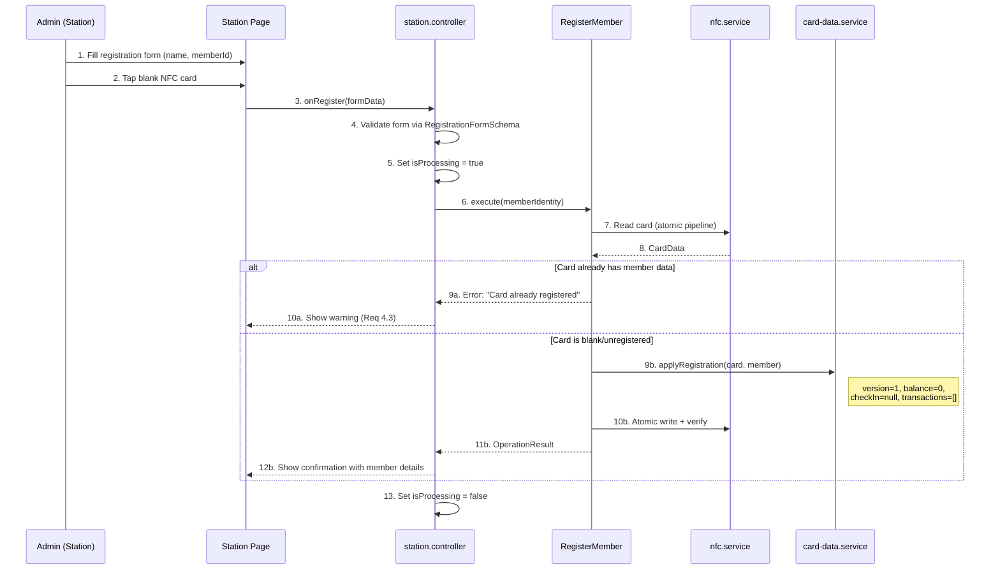

# Member Registration

> Covers: Req 4
> Use Case: `RegisterMember`
> Controller: `station.controller`
> Page: `MbcStation`

## Overview

Registration creates a new member card by writing identity data to a blank NFC card with an initial balance of Rp 0. Only available in **The Station** mode.

## Flow



## Steps

1. Admin enters member name and member ID in the registration form
2. Form is validated against `RegistrationFormSchema` (name: 1-50 chars, memberId: 1-20 chars)
3. Admin taps a blank NFC card against the device
4. System reads the card via the [Atomic Write Pipeline](../04-Technical-Flows/Atomic-Write-Pipeline)
5. System checks if the card already contains member data
6. If blank: writes member identity with balance = Rp 0
7. If already registered: shows warning, no write performed
8. On success: displays confirmation with registered member details

## Error Paths

| Error | Cause | User Message | Req |
|-------|-------|-------------|-----|
| Card already registered | Card has existing member data | "Kartu sudah terdaftar" | 4.3 |
| NFC read failed | Card removed too early | "Gagal membaca kartu, tap ulang" | 2.2 |
| NFC write failed | Connection lost during write | "Gagal menulis kartu" + rollback | 3.2 |
| Invalid form data | Empty name or memberId | Inline validation errors | 4.1 |

## Result Type

```typescript
interface OperationResult {
  type: 'registration';
  memberName: string;
  newBalance: number; // always 0 for registration
}
```

## Related Pages

- [Balance Top-Up](Balance-Top-Up) — Next step after registration
- [Atomic Write Pipeline](../04-Technical-Flows/Atomic-Write-Pipeline) — Write integrity mechanism
- [Card Data Schema](../02-Data-Models/Card-Data-Schema) — `applyRegistration` mutation
- [Station Interface](../05-UI-Components/Station-Interface) — UI layout
