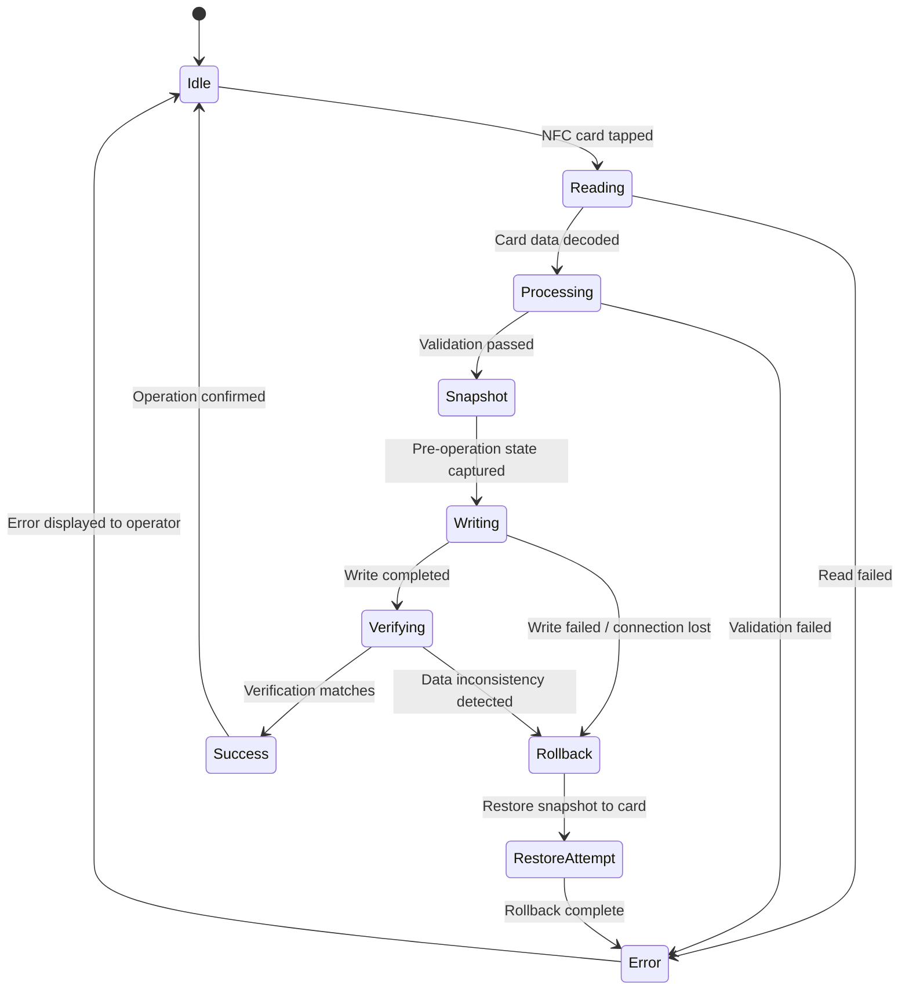
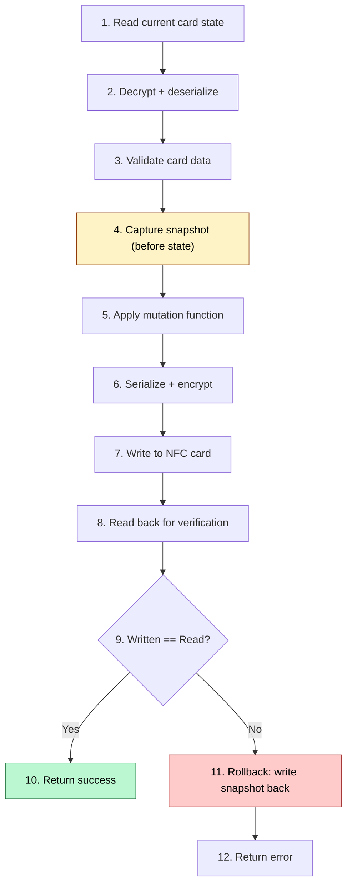
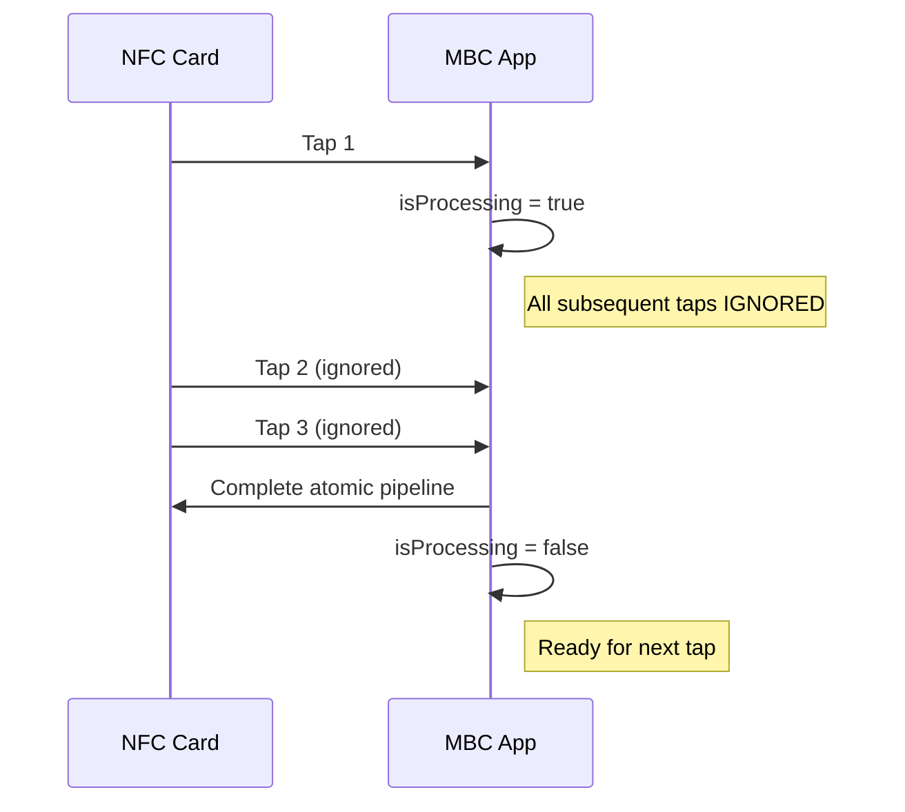

# Atomic Write Pipeline

> Covers: Req 3, Req 18

## Overview

The atomic write pipeline ensures transaction integrity for every NFC write operation. It guarantees: no double deductions, no partial writes, no phantom transactions. Every write captures a snapshot, writes all changes as a unit, verifies by reading back, and rolls back on any inconsistency.

## State Machine



## Pipeline Steps



## Interface

```typescript
export interface AtomicWritePipeline {
  execute(
    mutation: (card: CardData) => CardData,
    validate?: (before: CardData, after: CardData) => ValidationResult
  ): Promise<AtomicWriteResult>;
}

export interface AtomicWriteResult {
  success: boolean;
  before: CardData;       // snapshot
  after: CardData | null; // null on failure
  error?: AtomicWriteError;
}
```

## Error Types

```typescript
export type AtomicWriteError =
  | { type: 'read_failed'; message: string }
  | { type: 'validation_failed'; message: string }
  | { type: 'write_failed'; message: string }
  | { type: 'verification_failed'; message: string; rolledBack: boolean }
  | { type: 'rollback_failed'; message: string };
```

| Error Type | When | Recovery |
|-----------|------|----------|
| `read_failed` | Cannot read NFC card | Ask operator to re-tap |
| `validation_failed` | Card data fails Zod validation | Show error details |
| `write_failed` | NFC connection lost during write | Snapshot preserved, re-tap |
| `verification_failed` | Read-back doesn't match written data | Rollback attempted |
| `rollback_failed` | Cannot restore snapshot | Critical error, manual intervention |

## Write-Lock (Double-Tap Prevention)



The write-lock prevents concurrent operations (Req 18.5):
1. Card tap → `isProcessing = true`
2. All subsequent taps ignored while processing
3. Pipeline completes (success or failure) → `isProcessing = false`
4. UI shows processing indicator during lock

## Guarantees

| Property | Guarantee | Req |
|----------|-----------|-----|
| Atomicity | All changes succeed or all revert | 18.2 |
| No partial writes | Snapshot rollback on any failure | 3.6 |
| Exactly-once deduction | Write-lock + checkIn status guard | 18.7 |
| Verification | Post-write read confirms integrity | 3.4, 3.7 |
| No success on failure | Success only after verification passes | 3.7 |

## Related Pages

- [Data Flow](../01-Architecture/Data-Flow) — Full sequence diagrams
- [Check-Out Flow](../03-Business-Flows/Check-Out-Flow) — Most complex atomic write user
- [Silent Shield Encryption](Silent-Shield-Encryption) — Encrypt/decrypt in the pipeline
- [Correctness Properties](../06-Testing/Correctness-Properties) — Properties 4, 5
