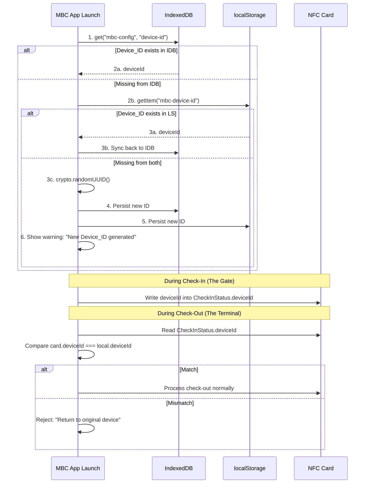
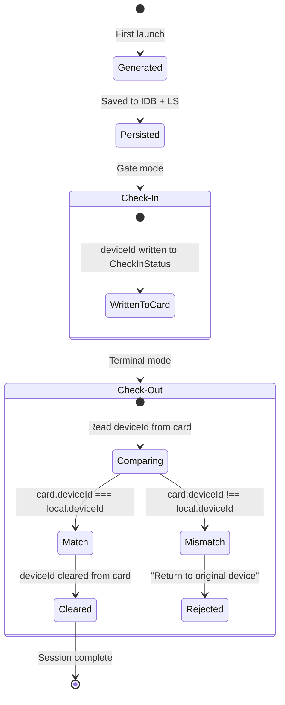

# Device Binding

> Covers: Req 19

## Overview

Device binding ensures that check-out can only be processed on the same physical device that performed the check-in. A unique `Device_ID` is generated on first launch, persisted in dual-layer storage, written to the card during check-in, and validated during check-out.

## Device_ID Lifecycle

## Binding Flow

## Validation Rules

| Scenario | Result | Req |
|----------|--------|-----|
| `card.checkIn.deviceId === currentDeviceId` | Check-out proceeds | 19.3 |
| `card.checkIn.deviceId !== currentDeviceId` | Check-out rejected | 19.4 |
| Check-out success | `deviceId` cleared from card | 19.5 |
| Device_ID missing on launch | New ID generated + warning | 19.7 |

## Regeneration Warning (Req 19.7)

If the Device_ID is missing from both IndexedDB and localStorage on app launch:
- A new UUID is generated via `crypto.randomUUID()`
- The `ensureDeviceId()` method returns `{ deviceId, wasRegenerated: true }`
- The UI displays a prominent warning: previous check-in sessions bound to the old Device_ID cannot be checked out on this device

## Storage

Device_ID is persisted via [Resilient Storage](Resilient-Storage):
- **Primary**: IndexedDB (`mbc-config` store, key: `device-id`)
- **Fallback**: localStorage (key: `mbc-device-id`)

See [MBC Constants](../02-Data-Models/Zod-Validation-Schemas) for storage key definitions.

## Related Pages

- [Check-In Flow](../03-Business-Flows/Check-In-Flow) — Where deviceId is written to card
- [Check-Out Flow](../03-Business-Flows/Check-Out-Flow) — Where deviceId is validated
- [Resilient Storage](Resilient-Storage) — Dual-layer persistence
- [Correctness Properties](../06-Testing/Correctness-Properties) — Property 10: Device Binding Enforcement
