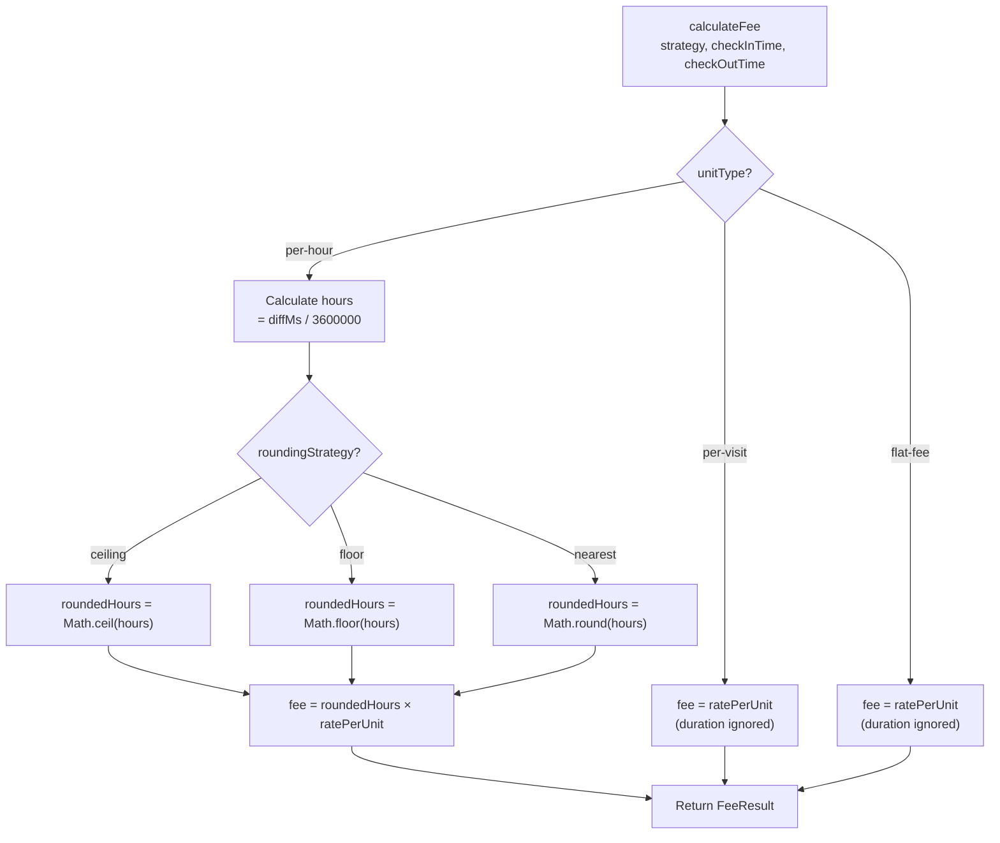

# Pricing Engine

> Covers: Req 12
> Source: `src/@core/services/mbc/pricing.service.ts`

## Overview

The Pricing Engine calculates fees based on a service type's `PricingStrategy`. It supports three unit types (`per-hour`, `per-visit`, `flat-fee`) and three rounding strategies (`ceiling`, `floor`, `nearest`). It is a pure function with no I/O dependencies.

## Calculation Logic



## Formula

```
fee = rounding_strategy(usage_units) × rate_per_unit
```

| Unit Type | usage_units | Rounding Applied |
|-----------|-------------|-----------------|
| `per-hour` | `(checkOutTime - checkInTime) / 3600000` | Yes (ceiling/floor/nearest) |
| `per-visit` | `1` | No |
| `flat-fee` | `1` | No |

## Examples

### Per-Hour with Ceiling Rounding (Default Parking)

Rate: Rp 2.000/jam, rounding: ceiling

| Check-In | Check-Out | Duration | Rounded | Fee |
|----------|-----------|----------|---------|-----|
| 10:00 | 10:30 | 0.5 jam | 1 jam | Rp 2.000 |
| 10:00 | 11:00 | 1.0 jam | 1 jam | Rp 2.000 |
| 10:00 | 11:01 | 1.017 jam | 2 jam | Rp 4.000 |
| 10:00 | 12:30 | 2.5 jam | 3 jam | Rp 6.000 |
| 10:00 | 15:00 | 5.0 jam | 5 jam | Rp 10.000 |

### Per-Visit

Rate: Rp 15.000/kunjungan

| Duration | Fee |
|----------|-----|
| Any | Rp 15.000 |

### Flat-Fee

Rate: Rp 50.000 flat

| Duration | Fee |
|----------|-----|
| Any | Rp 50.000 |

## FeeResult Interface

```typescript
interface FeeResult {
  fee: number;            // Total fee in IDR
  usageUnits: number;     // Rounded hours (per-hour) or 1 (per-visit/flat-fee)
  unitLabel: string;      // "jam" | "kunjungan" | "flat"
  ratePerUnit: number;    // Rate from PricingStrategy
  roundingApplied: string; // "ceiling" | "floor" | "nearest" | "none"
}
```

## Implementation

The `PricingService` is a Layer 1 pure logic service — no DI dependencies beyond types:

```typescript
export const PricingService = (_deps: AwilixRegistry): PricingServiceInterface => {
  const calculateFee = (
    strategy: PricingStrategy,
    checkInTime: string,
    checkOutTime: string,
  ): FeeResult => {
    // per-visit → fee = ratePerUnit, usageUnits = 1
    // flat-fee → fee = ratePerUnit, usageUnits = 1
    // per-hour → fee = rounding(hours) × ratePerUnit
  };
  return { calculateFee };
};
```

## Correctness Properties

- **Property 8**: For per-hour/ceiling: `fee = Math.ceil(hours) × rate`
- **Property 9**: For per-visit and flat-fee: `fee = rate` regardless of duration

See [Correctness Properties](../06-Testing/Correctness-Properties) for formal definitions.

## Related Pages

- [Service Type Model](../02-Data-Models/Service-Type-Model) — PricingStrategy definition
- [Check-Out Flow](../03-Business-Flows/Check-Out-Flow) — Where pricing is used
- [Manual Calculation](../03-Business-Flows/Manual-Calculation) — Pricing without NFC
- [Correctness Properties](../06-Testing/Correctness-Properties) — Properties 8, 9
