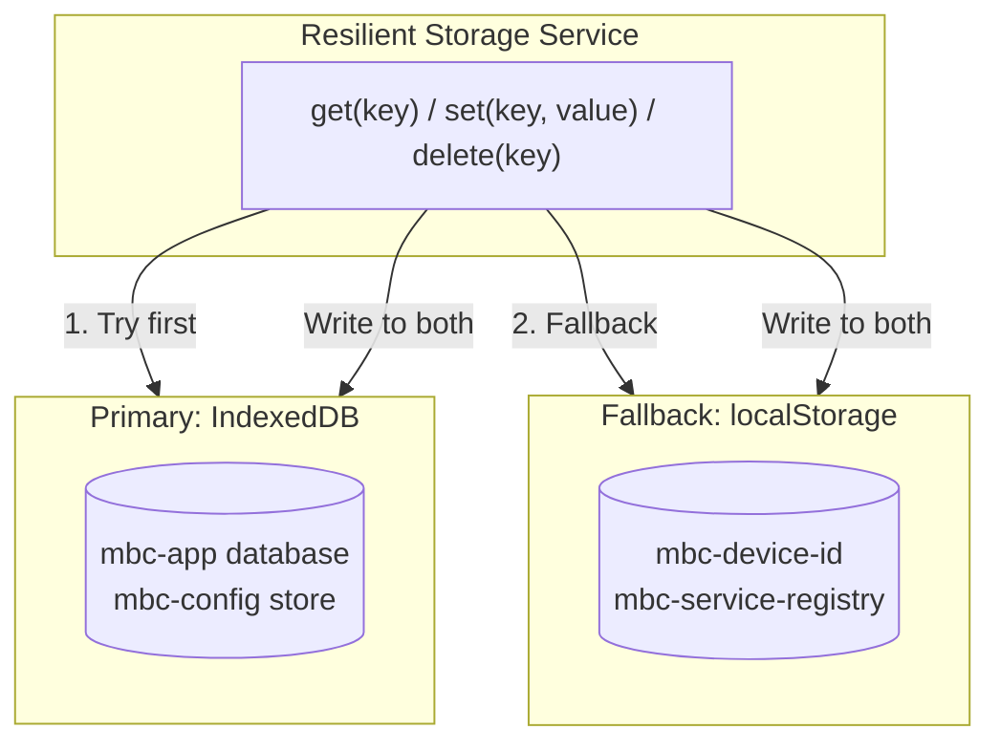
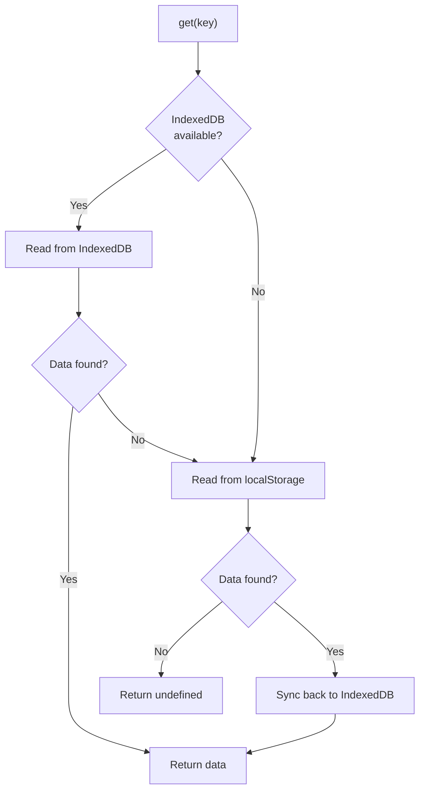
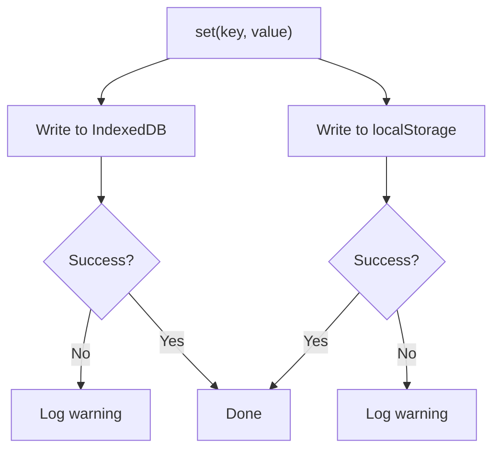

# Resilient Storage

> Covers: Req 20

## Overview

The Resilient Storage Service provides dual-layer persistence using IndexedDB (primary) and localStorage (fallback). It ensures that critical data — Device_ID and Service Registry — survives application restarts and storage disruptions.

## Dual-Layer Architecture



## Read Strategy



## Write Strategy



Writes go to **both** stores simultaneously to maintain redundancy.

## Recovery Logic on App Launch

1. Try reading from IndexedDB
2. If IndexedDB fails → read from localStorage fallback (Req 20.3)
3. If both fail → re-initialize with defaults + show warning (Req 20.6, 20.7)
4. After successful read → sync both stores for consistency
5. Check storage quota → warn if > 80% used (Req 20.4)

## IndexedDB Schema

```typescript
// Database: "mbc-app"
// Version: 1
// Object Store: "mbc-config" (keyPath: "key")
//
// Records:
//   { key: "device-id", value: "a1b2c3d4-..." }
//   { key: "service-registry", value: ServiceType[] }
```

## Stored Data

| Key | Data | Primary | Fallback |
|-----|------|---------|----------|
| `device-id` | UUID string | IndexedDB | localStorage (`mbc-device-id`) |
| `service-registry` | `ServiceType[]` | IndexedDB | localStorage (`mbc-service-registry`) |

## Storage Health Monitoring

```typescript
interface StorageQuotaInfo {
  usedBytes: number;
  totalBytes: number;
  percentUsed: number;
  isLow: boolean;  // true when > 80% used
}
```

The `checkStorageQuota()` method uses `navigator.storage.estimate()` to monitor usage. A warning is displayed when storage is low (Req 20.4).

## Data Integrity Validation (Req 20.5)

On each app launch, the Service Registry data is validated:
- Check for required fields and valid structure
- Use Zod schema validation
- If corrupted → re-initialize with defaults + show warning

## Related Pages

- [Device Binding](Device-Binding) — Device_ID storage and recovery
- [Service Type Configuration](../03-Business-Flows/Service-Type-Configuration) — Service Registry persistence
- [Design Decisions](../01-Architecture/Design-Decisions) — ADR-7: Why dual-layer storage
