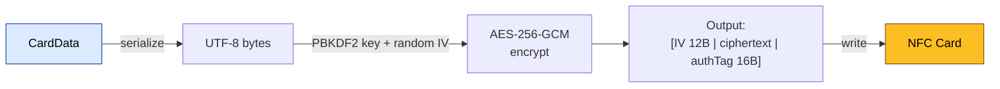
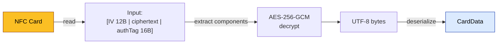

# Silent Shield Encryption

> Covers: Req 11
> Source: `src/@core/services/mbc/silent-shield.service.ts`

## Overview

Silent Shield encrypts card data before writing to the NFC card so third-party NFC reader apps cannot read member data in plain text. It uses AES-256-GCM via `crypto-browserify`. This is **obfuscation, not security-grade encryption** — the key is embedded in client-side code.

## Encryption Flow



## Decryption Flow



## Algorithm Details

| Parameter | Value | Source |
|-----------|-------|--------|
| Algorithm | AES-256-GCM | `MBC_KEYS.SILENT_SHIELD_ALGORITHM` |
| Key derivation | PBKDF2 with SHA-256 | `crypto.pbkdf2Sync()` |
| Passphrase | `mbc-silent-shield-v1` | `MBC_KEYS.SILENT_SHIELD_PASSPHRASE` |
| Salt | `mbc-cooperative-2024` | `MBC_KEYS.SILENT_SHIELD_SALT` |
| Iterations | 100,000 | `MBC_KEYS.SILENT_SHIELD_ITERATIONS` |
| Key length | 32 bytes (256 bits) | `MBC_KEYS.SILENT_SHIELD_KEY_LENGTH` |
| IV length | 12 bytes | `MBC_KEYS.SILENT_SHIELD_IV_LENGTH` |
| Auth tag length | 16 bytes | `MBC_KEYS.SILENT_SHIELD_TAG_LENGTH` |

## Output Format

```
┌────────────┬──────────────────────┬────────────────┐
│  IV (12B)  │  Ciphertext (var)    │  AuthTag (16B) │
└────────────┴──────────────────────┴────────────────┘
```

- **IV**: Random 12 bytes generated per write (ensures unique ciphertext even for identical data)
- **Ciphertext**: AES-256-GCM encrypted data (variable length)
- **AuthTag**: GCM authentication tag (detects tampering)

## Implementation

```typescript
// Encrypt
const encrypt = (data: Uint8Array): Uint8Array => {
  const key = deriveKey();  // PBKDF2
  const iv = crypto.randomBytes(12);
  const cipher = crypto.createCipheriv('aes-256-gcm', key, iv);
  const encrypted = Buffer.concat([cipher.update(data), cipher.final()]);
  const authTag = cipher.getAuthTag();
  return new Uint8Array(Buffer.concat([iv, encrypted, authTag]));
};

// Decrypt
const decrypt = (data: Uint8Array): Uint8Array => {
  const key = deriveKey();
  const iv = data.subarray(0, 12);
  const authTag = data.subarray(data.length - 16);
  const ciphertext = data.subarray(12, data.length - 16);
  const decipher = crypto.createDecipheriv('aes-256-gcm', key, iv);
  decipher.setAuthTag(authTag);
  return new Uint8Array(Buffer.concat([decipher.update(ciphertext), decipher.final()]));
};
```

## Security Considerations

| Aspect | Status | Note |
|--------|--------|------|
| Confidentiality | ⚠️ Obfuscation-level | Key is in client-side JS |
| Integrity | ✅ Strong | GCM auth tag detects tampering |
| Replay protection | ✅ Per-write IV | Random IV prevents identical ciphertexts |
| Key rotation | ⚠️ Manual | Changing key requires re-writing all cards |

This is intentionally obfuscation, not security-grade encryption. The goal is to prevent casual NFC reader apps from reading plain text — not to protect against determined attackers who can extract the key from the JavaScript source.

## Round-Trip Property

For all valid byte arrays: `decrypt(encrypt(data)) ≡ data`

See [Correctness Properties](../06-Testing/Correctness-Properties) — Property 2.

## Related Pages

- [NFC Memory Layout](../02-Data-Models/NFC-Card-Memory-Layout) — How encrypted data is stored on card
- [Data Flow](../01-Architecture/Data-Flow) — Where encryption fits in the pipeline
- [Design Decisions](../01-Architecture/Design-Decisions) — ADR-4: Why AES-256-GCM
- [Correctness Properties](../06-Testing/Correctness-Properties) — Property 2: Encryption Round-Trip
