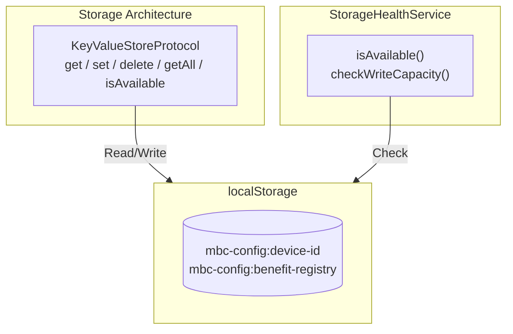
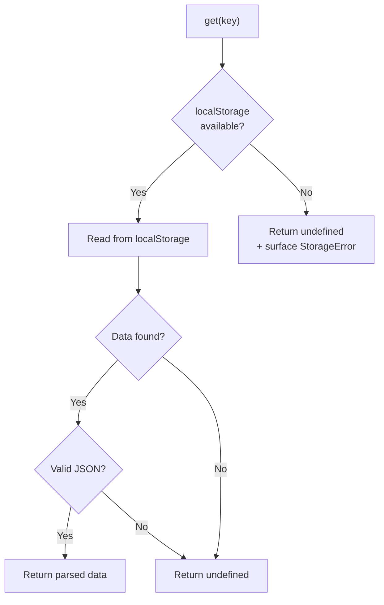
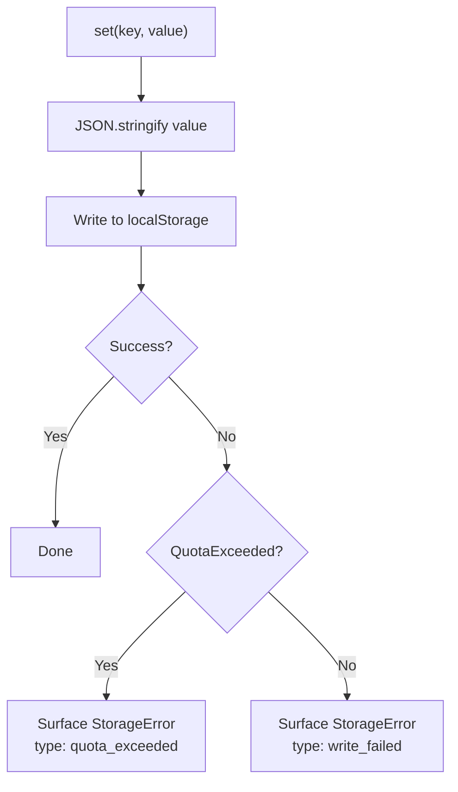
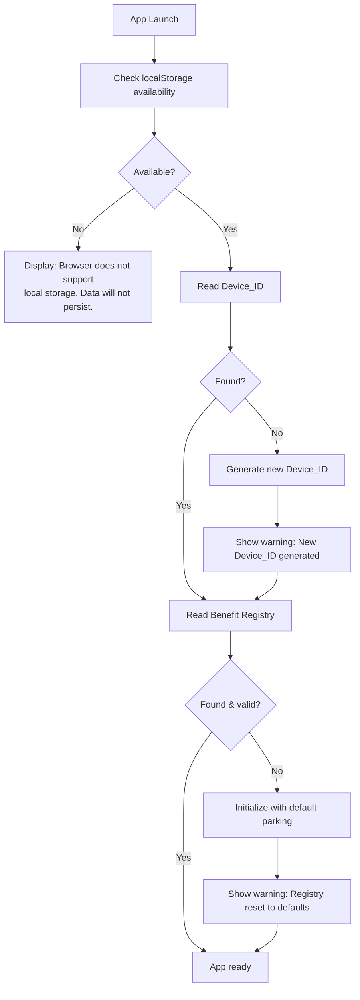

# Storage Architecture

> Covers: Req 20

## Overview

The Storage Architecture provides localStorage-based persistence for critical application data — Device_ID and Benefit Registry. It uses the existing `KeyValueStoreProtocol` interface with `webStorageAdapter` as the implementation, and includes graceful error handling for storage unavailability and quota limits.

## Architecture



## Read Strategy



## Write Strategy



## Error Handling on App Launch



## Stored Data

| Key | Data | localStorage Key |
|-----|------|-----------------|
| `device-id` | UUID string | `mbc-config:device-id` |
| `benefit-registry` | `BenefitType[]` | `mbc-config:benefit-registry` |

## Error Types

```typescript
export interface StorageError {
  type: 'unavailable' | 'quota_exceeded' | 'read_failed' | 'write_failed';
  message: string;
}
```

| Error Type | Trigger | User Message |
|-----------|---------|-------------|
| `unavailable` | localStorage not accessible (private mode, browser restriction) | "Browser tidak mendukung penyimpanan lokal. Data tidak akan tersimpan antar sesi." |
| `quota_exceeded` | localStorage write fails due to full quota | "Kapasitas penyimpanan browser penuh. Silakan hapus data browser untuk melanjutkan." |
| `read_failed` | JSON parse error on stored data | Silent — returns undefined, triggers re-initialization |
| `write_failed` | Other write errors | "Gagal menyimpan data. Silakan coba lagi." |

## Data Integrity Validation (Req 20.5)

On each app launch, the Benefit Registry data is validated:
- Check for required fields and valid structure
- Use Zod schema validation (`BenefitTypeFormSchema`)
- If corrupted → re-initialize with default parking Benefit_Type + show warning

## Related Pages

- [Device Binding](Device-Binding) — Device_ID storage and recovery
- [Benefit Type Configuration](../03-Business-Flows/Benefit-Type-Configuration) — Benefit Registry persistence
- [Design Decisions](../01-Architecture/Design-Decisions) — ADR-7: Why localStorage with error handling
