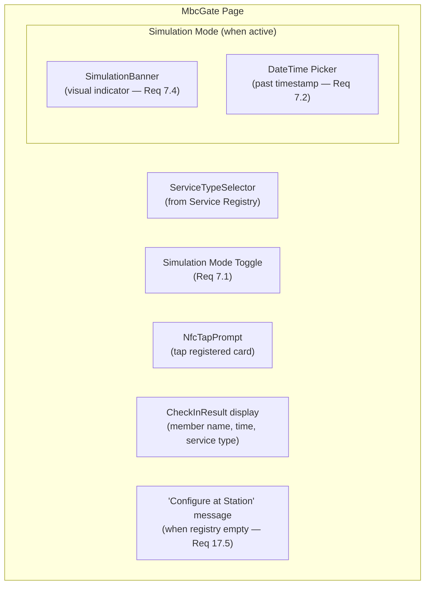

# Gate Interface

> Covers: Req 6, Req 7, Req 17
> Controller: `gate.controller`
> Page: `MbcGate`
> Route: `/mbc/gate`

## Overview

The Gate is the check-in interface. It shows a service type selector, NFC tap prompt, simulation mode toggle, and check-in results.

## Layout



## Components Used

| Component | Purpose |
|-----------|---------|
| `ServiceTypeSelector` | Select active service type for check-in |
| `NfcTapPrompt` | Animated tap prompt with status feedback |
| `SimulationBanner` | Visual indicator when simulation mode is active |

## Controller Interface

```typescript
interface GateControllerInterface {
  selectedServiceType: ServiceType | null;
  serviceTypes: ServiceType[];
  onSelectServiceType: (id: string) => void;
  simulationMode: boolean;
  onToggleSimulation: () => void;
  simulationTimestamp: string | null;
  onSetSimulationTimestamp: (ts: string) => void;
  nfcStatus: NfcStatus;
  lastResult: CheckInResult | null;
  isProcessing: boolean;
}
```

## Service Type Selection Logic

See [Check-In Flow](../03-Business-Flows/Check-In-Flow) for the auto-select and persistence behavior.

## Related Pages

- [Check-In Flow](../03-Business-Flows/Check-In-Flow) — Full check-in business flow
- [Service Type Configuration](../03-Business-Flows/Service-Type-Configuration) — Managing service types
- [Role Picker](Role-Picker) — Navigation to Gate
