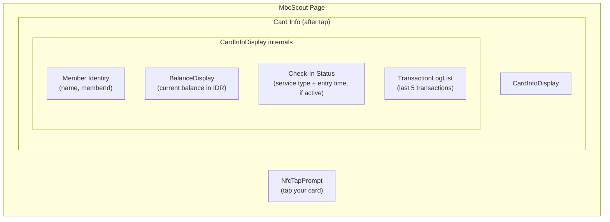

# Scout Interface

> Covers: Req 9, Req 22
> Controller: `scout.controller`
> Page: `MbcScout`
> Route: `/mbc/scout`

## Overview

The Scout is a read-only interface for members to view their card contents. No data is written. When NFC is unavailable, it shows a demo mode with sample data (Req 22.6).

## Layout



## Components Used

| Component | Purpose |
|-----------|---------|
| `NfcTapPrompt` | Tap prompt with status feedback |
| `CardInfoDisplay` | Full card data display (composes BalanceDisplay + TransactionLogList) |

## Controller Interface

```typescript
interface ScoutControllerInterface {
  nfcStatus: NfcStatus;
  cardData: CardData | null;
  isReading: boolean;
}
```

## Demo Mode (Req 22.6)

When NFC is unavailable, The Scout shows sample card data for evaluation purposes. This allows users to see what the interface looks like without NFC hardware.

## Related Pages

- [Card Reading (Scout)](../03-Business-Flows/Card-Reading-Scout) — Full read flow
- [Card Data Schema](../02-Data-Models/Card-Data-Schema) — Structure of displayed data
- [NFC Capability Detection](../04-Technical-Flows/NFC-Capability-Detection) — Demo mode trigger
