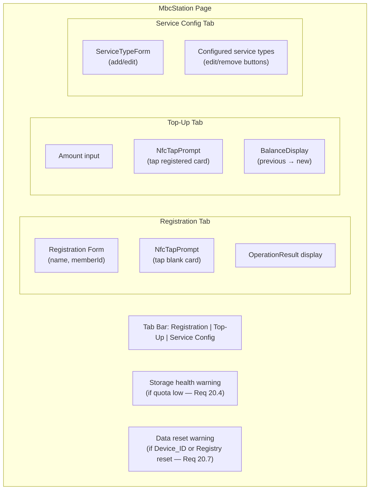

# Station Interface

> Covers: Req 4, Req 5, Req 15, Req 20
> Controller: `station.controller`
> Page: `MbcStation`
> Route: `/mbc/station`

## Overview

The Station is the admin interface with three tabs: Registration, Top-Up, and Service Configuration. It also monitors storage health and displays warnings.

## Layout



## Components Used

| Component | Tab | Purpose |
|-----------|-----|---------|
| `NfcTapPrompt` | Registration, Top-Up | Animated tap prompt with status |
| `BalanceDisplay` | Top-Up | Shows previous/new balance |
| `ServiceTypeForm` | Service Config | Add/edit service type form |

## Controller Interface

```typescript
interface StationControllerInterface {
  // Registration
  registrationForm: UseFormReturn;
  onRegister: (data: RegistrationFormData) => void;
  // Top-up
  topUpForm: UseFormReturn;
  onTopUp: (data: TopUpFormData) => void;
  // Service config
  serviceTypes: ServiceType[];
  onAddServiceType: (data: ServiceTypeFormData) => void;
  onEditServiceType: (id: string, data: Partial<ServiceTypeFormData>) => void;
  onRemoveServiceType: (id: string) => void;
  // NFC state
  nfcStatus: NfcStatus;
  lastResult: OperationResult | null;
  isProcessing: boolean;
}
```

## Related Pages

- [Member Registration](../03-Business-Flows/Member-Registration) — Registration flow details
- [Balance Top-Up](../03-Business-Flows/Balance-Top-Up) — Top-up flow details
- [Service Type Configuration](../03-Business-Flows/Service-Type-Configuration) — Config flow details
- [Storage Architecture](../04-Technical-Flows/Storage-Architecture) — Storage health monitoring
