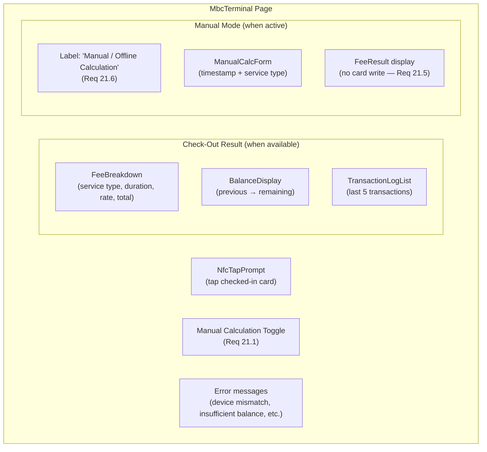

# Terminal Interface

> Covers: Req 8, Req 21
> Controller: `terminal.controller`
> Page: `MbcTerminal`
> Route: `/mbc/terminal`

## Overview

The Terminal is the check-out interface. It processes NFC card taps for fee calculation and balance deduction, and provides a manual calculation fallback when NFC fails.

## Layout



## Components Used

| Component | Purpose |
|-----------|---------|
| `NfcTapPrompt` | Animated tap prompt with status |
| `FeeBreakdown` | Fee calculation details |
| `BalanceDisplay` | Before/after balance display |
| `TransactionLogList` | Rolling transaction history |
| `ManualCalcForm` | Manual fee calculation form |

## Controller Interface

```typescript
interface TerminalControllerInterface {
  nfcStatus: NfcStatus;
  lastResult: CheckOutResult | null;
  isProcessing: boolean;
  // Manual calculation
  isManualMode: boolean;
  onToggleManualMode: () => void;
  manualForm: UseFormReturn;
  onManualCalculate: (data: ManualCalcFormData) => void;
  manualResult: FeeResult | null;
  serviceTypes: ServiceType[];
}
```

## Related Pages

- [Check-Out Flow](../03-Business-Flows/Check-Out-Flow) — Full check-out business flow
- [Manual Calculation](../03-Business-Flows/Manual-Calculation) — Manual fallback flow
- [Pricing Engine](../04-Technical-Flows/Pricing-Engine) — Fee calculation logic
- [Device Binding](../04-Technical-Flows/Device-Binding) — Device mismatch errors
