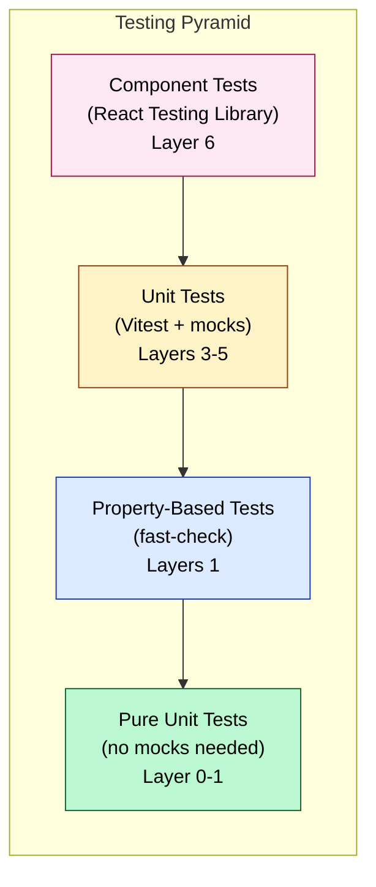

# Testing Strategy

> Covers: All requirements (testing approach)

## Overview

The MBC feature uses a three-tier testing strategy: unit tests, property-based tests, and component tests. The bottom-up build order ensures each layer is fully tested before the next layer is built on top.

## Testing Pyramid



## Test Types by Layer

| Layer | Test Type | Framework | Mocking |
|-------|-----------|-----------|---------|
| **0** — Models | Type checks | TypeScript compiler | None |
| **1** — Pure services | Property-based + unit | Vitest + fast-check | None (pure functions) |
| **2** — I/O adapters | Integration | Vitest | Browser API mocks |
| **3** — Stateful services | Unit | Vitest | Mock protocols via partial `AwilixRegistry` |
| **4** — Use cases | Unit | Vitest | Mock services |
| **5** — Controllers | Unit | Vitest | Mock use cases + services |
| **6** — Components | Component | RTL | Mock controllers |

## Property-Based Testing

Property-based tests use `fast-check` to generate random inputs and verify universal properties. These are the strongest tests — they prove correctness for all valid inputs, not just specific examples.

10 formal properties are defined in [Correctness Properties](Correctness-Properties).

## Test File Locations

```
src/@core/services/__tests__/mbc/
├── pricing.service.test.ts          # Properties 8, 9
├── card-data.service.test.ts        # Properties 1, 3, 4, 5, 6, 7
└── silent-shield.service.test.ts    # Property 2

src/@core/use_case/__tests__/mbc/
├── RegisterMember.test.ts
├── TopUpBalance.test.ts
├── CheckIn.test.ts
├── CheckOut.test.ts                 # Property 10
├── ReadCard.test.ts
├── ManualCalculation.test.ts
└── ManageServiceRegistry.test.ts

src/controllers/__tests__/mbc/
├── role-picker.controller.test.ts
├── station.controller.test.ts
├── gate.controller.test.ts
├── terminal.controller.test.ts
└── scout.controller.test.ts

src/presentation/components/__tests__/mbc/
├── NfcTapPrompt.test.tsx
├── FeeBreakdown.test.tsx
├── TransactionLogList.test.tsx
├── ServiceTypeSelector.test.tsx
├── CardInfoDisplay.test.tsx
├── RoleCard.test.tsx
└── BalanceDisplay.test.tsx
```

## Coverage Requirements

- Minimum threshold: **85%** for branches, functions, lines, and statements
- V8 provider with `text`, `json`, `html`, `lcov`, `cobertura` reporters
- Run: `npm run test:coverage`

## Testing Conventions

- Use `vi.clearAllMocks()` in `beforeEach`
- Mock dependencies via partial `AwilixRegistry` objects
- Use `getByRole` and `getByText` over `getByTestId` (RTL best practices)
- Test both success and error paths
- Include snapshot tests for visual regression

## Related Pages

- [Correctness Properties](Correctness-Properties) — 10 formal properties
- [Test Coverage Matrix](Test-Coverage-Matrix) — Requirement → test mapping
- [Phase Progress](../07-Development/Phase-Progress) — Which tests are implemented
