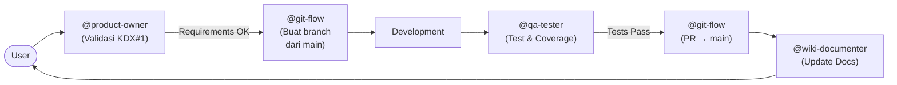
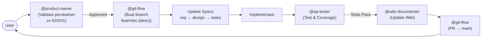

# Agents and Hooks

> Last updated: April 30, 2026
> Covers: Development workflow automation

## Overview

Proyek MBC menggunakan 4 Kiro agents dan beberapa hooks untuk mengotomasi workflow — mulai dari product analysis, quality assurance, git operations, hingga documentation generation.

## Agents

| Agent | Trigger | Function |
|-------|---------|----------|
| **@product-owner** | Auto on business/feature keywords | PO analysis: acceptance criteria, edge cases, validasi terhadap KDX#1 |
| **@qa-tester** | Manual via chat or auto via hooks | Run tests, check coverage, validate specs |
| **@git-flow** | Auto on git keywords (`release`, `commit`, `branch`, `fase`) | Branching, commit, push, PR creation, merge, milestone closing |
| **@wiki-documenter** | Manual via chat | Generate/update wiki documentation |

## Agent Details

### @product-owner
- **Peran:** Mendefinisikan requirements, menulis user stories, mereview fitur dari perspektif pengguna
- **Sumber kebenaran:** Selalu cross-reference dengan `referensi/KDX#1 - Membership Benefit Card (MBC).pdf`
- **Output:** Validasi KDX#1 (Sesuai/Menyimpang/Melanggar) untuk setiap keputusan produk

### @git-flow
- **Peran:** Mengelola seluruh operasi git dengan strategi Feature Branching
- **Strategi:** Semua branch dari `main`, merge via PR dengan squash merge — tidak ada integration branch
- **Commands:** `mulai fase X`, `fix {desc}`, `buat fitur {desc}`, `commit`, `release`, `adjustment flow`, `rollback`, `status`
- **Detail lengkap:** Lihat [Git Flow](Git-Flow)

### @qa-tester
- **Peran:** Menjalankan test, memeriksa coverage, memvalidasi specs terhadap implementasi
- **Framework:** Vitest + React Testing Library
- **Detail lengkap:** Lihat [Testing Strategy](../06-Testing/Testing-Strategy)

### @wiki-documenter
- **Peran:** Generate dan update seluruh wiki documentation
- **Workflow:**
  1. Baca spec files: `requirements.md`, `design.md`, `tasks.md`
  2. Baca source code untuk detail implementasi aktual
  3. Baca steering files untuk konvensi arsitektur
  4. Generate semua halaman di `docs/wiki/`
  5. Re-runnable — selalu overwrite dengan konten terbaru dari specs

## Hooks

| Hook | Event | Action | Description |
|------|-------|--------|-------------|
| Git Flow Manager | `promptSubmit` | `askAgent` | Auto-trigger @git-flow saat keyword git terdeteksi |
| Create Feature Branch | `userTriggered` | `askAgent` | Buat branch baru dengan format `[feat]:<nama-fitur>` |
| Product Owner Review | `promptSubmit` | `askAgent` | Auto PO analysis untuk business requests |
| QA: Run Tests After Task | `postTaskExecution` | `runCommand` | Auto run vitest setelah task completion |
| QA: Run Edited Test File | `fileEdited (*.test.*)` | `runCommand` | Auto run test file yang diedit |
| QA: Check Test Coverage | `fileEdited (source files)` | `askAgent` | Cek apakah test ada untuk file yang diubah |
| QA: Test Reminder | `fileCreated (MBC source)` | `askAgent` | Reminder buat test file untuk source baru |
| QA: Full Coverage Report | `userTriggered` | `runCommand` | Full test suite + coverage analysis |
| QA: Validate Specs vs Tests | `userTriggered` | `askAgent` | Map 22 requirements ke test coverage |
| Wiki: Generate Full | `userTriggered` | `askAgent` | Generate ulang seluruh wiki documentation |
| Wiki: Update on Task | `postTaskExecution` | `askAgent` | Update wiki setelah task selesai |

## Agent Coordination Flow

### Development Flow

### Spec Adjustment Flow

## Related Pages

- [Getting Started](Getting-Started) — Setup dan perintah dasar
- [Git Flow](Git-Flow) — Branch strategy, commit convention, dan release process
- [Testing Strategy](../06-Testing/Testing-Strategy) — QA approach dan test patterns
