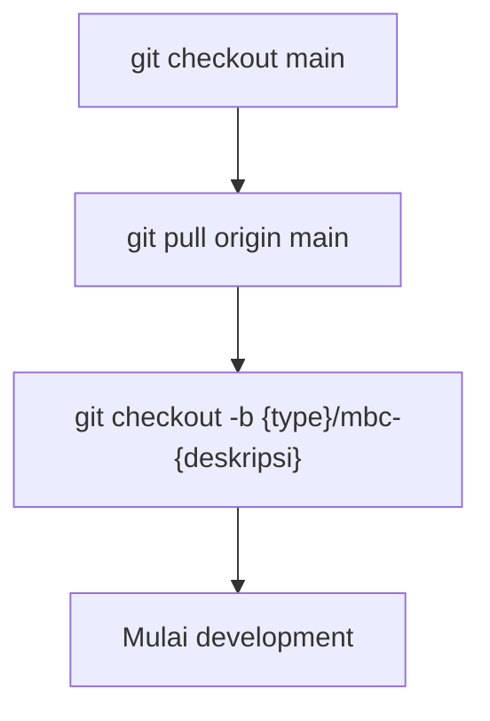
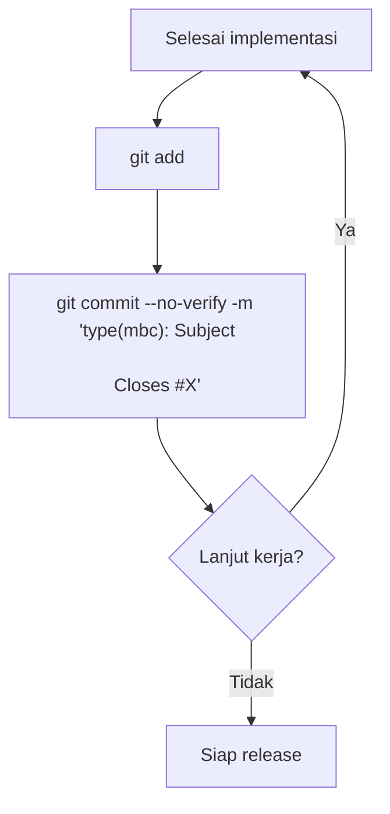
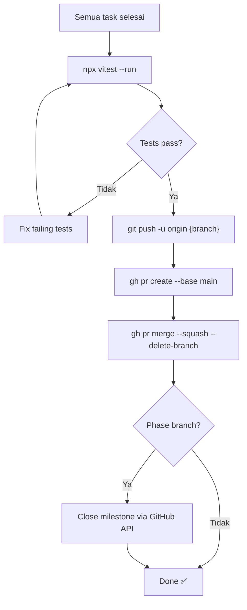
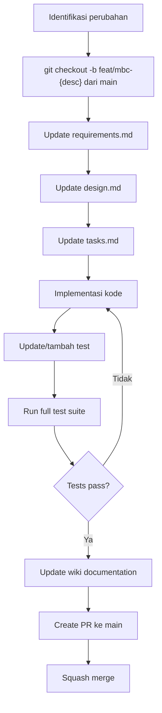

# Git Flow

> Last updated: April 30, 2026
> Covers: Development workflow, branch strategy, commit convention, release process

## Overview

Proyek MBC menggunakan **Feature Branching** — strategi git yang sederhana dan widely-adopted. Semua branch dibuat langsung dari `main` dan di-merge kembali via Pull Request dengan squash merge. Tidak ada integration branch atau branch perantara.

## Branch Strategy

### Struktur

```
main (production-ready, protected)
 ├── feat/mbc-{deskripsi}        ← fitur baru / phase work
 ├── fix/mbc-{deskripsi}         ← bug fixes
 ├── test/mbc-{deskripsi}        ← tambah/update test
 ├── refactor/mbc-{deskripsi}    ← restructuring kode
 ├── chore/mbc-{deskripsi}       ← config, tooling, dependencies
 └── docs/mbc-{deskripsi}        ← update dokumentasi
```

### Visualisasi Git Graph

```mermaid
gitgraph
    commit id: "initial"
    branch "feat/mbc-phase-2-pure-services"
    commit id: "pricing.service"
    commit id: "card-data.service"
    commit id: "silent-shield.service"
    checkout main
    merge "feat/mbc-phase-2-pure-services" id: "squash: Phase 2" type: HIGHLIGHT
    branch "feat/mbc-phase-3-adapters"
    commit id: "adapters & services"
    commit id: "DI wiring"
    checkout main
    merge "feat/mbc-phase-3-adapters" id: "squash: Phase 3" type: HIGHLIGHT
    branch "fix/mbc-balance-overflow"
    commit id: "fix balance bug"
    checkout main
    merge "fix/mbc-balance-overflow" id: "squash: fix" type: HIGHLIGHT
    branch "feat/mbc-phase-4-use-cases"
    commit id: "use cases"
    checkout main
    merge "feat/mbc-phase-4-use-cases" id: "squash: Phase 4" type: HIGHLIGHT
    branch "feat/mbc-phase-5-controllers"
    commit id: "controllers"
    checkout main
    merge "feat/mbc-phase-5-controllers" id: "squash: Phase 5" type: HIGHLIGHT
    branch "feat/mbc-phase-6-presentation"
    commit id: "UI + PWA"
    checkout main
    merge "feat/mbc-phase-6-presentation" id: "squash: Phase 6" type: HIGHLIGHT
```

### Kenapa Feature Branching?

| Aspek | Trunk-Based | Gitflow Klasik | **Feature Branching (kita)** |
|-------|-------------|----------------|------------------------------|
| Branch utama | `main` saja | `main` + `develop` + `release` + `hotfix` | `main` saja |
| Feature branch | Sangat short-lived (< 1 hari) | Long-lived per fitur | Per task/phase, merge saat selesai |
| Merge target | Langsung ke `main` | Ke `develop` → `release` → `main` | Langsung ke `main` |
| Kompleksitas | Rendah (butuh CI/CD matang) | Tinggi | **Rendah** |
| Cocok untuk | Tim besar, CI/CD matang | Produk dengan release cycle formal | **Proyek dengan 1-few developer** |

**Alasan pemilihan:**
1. **Simpel** — Satu aturan: branch dari `main`, merge ke `main`
2. **Tidak perlu integration branch** — Test suite sudah menjadi gatekeeper kualitas
3. **Squash merge** — Menjaga history `main` tetap bersih
4. **Fleksibel** — Sama efektifnya untuk phase work maupun bug fix
5. **Best practice global** — Digunakan secara luas di GitHub, GitLab, dan industri

## Phase-to-Branch Mapping

Development MBC diorganisir dalam 6 fase. Setiap fase punya branch, issues, dan milestone sendiri:

| Phase | Branch | GitHub Issues | Milestone |
|-------|--------|---------------|-----------|
| Phase 1 | (completed, merged to main) | (completed) | Phase 1: Layer 0 — Foundation |
| Phase 2 | `feat/mbc-phase-2-pure-services` | #1 – #6 | Phase 2: Layer 1 — Pure Logic Services |
| Phase 3 | `feat/mbc-phase-3-adapters-services` | #7 – #14 | Phase 3: Layer 2-3 — Adapters & Stateful Services |
| Phase 4 | `feat/mbc-phase-4-use-cases` | #15 – #22 | Phase 4: Layer 4 — Use Cases |
| Phase 5 | `feat/mbc-phase-5-controllers` | #23, #24 | Phase 5: Layer 5 — Controllers |
| Phase 6 | `feat/mbc-phase-6-presentation-pwa` | #25 – #29 | Phase 6: Layer 6 — Presentation & PWA |

## Workflow

### 1. Membuat Branch Baru



```bash
git checkout main
git pull origin main
git checkout -b feat/mbc-phase-2-pure-services
```

### 2. Commit Selama Development



**Aturan commit:**
- Selalu stage file spesifik — **JANGAN** gunakan `git add .`
- Gunakan `--no-verify` untuk bypass husky hooks saat development
- Referensikan issue number di setiap commit

### 3. Release / Merge ke Main



**Langkah detail:**
1. Pastikan semua test pass: `npx vitest --run`
2. Commit perubahan terakhir jika ada
3. Push branch: `git push -u origin {branch-name}`
4. Buat PR ke main:
   ```bash
   gh pr create \
     --base main \
     --head {branch-name} \
     --title "{type}(mbc): {description}" \
     --body "## Changes\n\n- ...\n\nCloses #X, closes #Y\n\n### Testing\n- All tests pass"
   ```
5. Squash merge + delete branch: `gh pr merge --squash --delete-branch`
6. (Jika phase) Close milestone: `gh api -X PATCH repos/{owner}/{repo}/milestones/{N} -f state=closed`

### 4. Alur Adjustment Flow / Perubahan Spesifikasi

Ketika ada perubahan flow atau spesifikasi:



**Urutan wajib:** Specs → Code → Tests → Wiki → PR

## Commit Convention

Mengikuti [Conventional Commits](https://www.conventionalcommits.org/) yang di-enforce via Husky `commit-msg` hook + commitlint.

### Format

```
type(scope): Subject in sentence case

[optional body]

[optional footer: Closes #X, closes #Y]
```

### Tipe Commit

| Type | Kapan Digunakan | Contoh |
|------|-----------------|--------|
| `feat` | Fitur baru | `feat(mbc): Implement pricing.service with configurable strategies` |
| `fix` | Bug fix | `fix(mbc): Fix balance overflow on top-up exceeding MAX_BALANCE` |
| `test` | Tambah/update test | `test(mbc): Add property tests for card-data serialization round-trip` |
| `docs` | Dokumentasi | `docs(mbc): Generate wiki documentation for Phase 2` |
| `refactor` | Restructuring tanpa ubah behavior | `refactor(mbc): Extract pricing strategy to separate module` |
| `chore` | Build, config, tooling | `chore(mbc): Update vitest config for property tests` |
| `style` | Formatting, whitespace | `style(mbc): Fix import ordering in pricing.service` |

### Scope

Selalu gunakan `mbc` sebagai scope untuk fitur Membership Benefit Card.

### Referensi Issue

Selalu sertakan referensi issue di footer:
```
feat(mbc): Implement pricing.service with configurable strategies

- Per-hour ceiling calculation
- Per-visit flat fee
- Configurable via BenefitType

Closes #1
```

## Aturan & Larangan

### ✅ WAJIB

- Selalu buat PR untuk merge ke `main`
- Selalu run test sebelum buat PR
- Selalu referensikan issue number di commit message (jika applicable)
- Selalu gunakan `--no-verify` untuk commit (hindari interferensi husky)
- Gunakan `--squash` merge untuk semua PR (history bersih)
- Close milestone setelah merge phase branch
- Push dengan `-u` flag untuk setup remote tracking
- Untuk spec adjustment: update specs SEBELUM implementasi kode

### ❌ DILARANG

- Push langsung ke `main` — selalu melalui PR merge
- Gunakan `git add .` — selalu stage file spesifik
- Force push ke shared branch — gunakan `git revert` untuk rollback
- Merge tanpa test pass
- Implementasi perubahan spesifikasi tanpa update specs terlebih dahulu

## Repository Info

| Key | Value |
|-----|-------|
| Remote | `https://github.com/widdestoyud/assesment-s1-2026.git` |
| Owner | `widdestoyud` |
| Repo | `assesment-s1-2026` |
| GitHub Project | #2 (MBC — Membership Benefit Card) |

## Automation

Operasi git flow di-automate melalui Kiro agent dan hooks:
- **@git-flow agent** — Menangani branching, commit, push, PR, dan merge (lihat [Agents & Hooks](Agents-and-Hooks))
- **git-flow-manager hook** — Auto-trigger saat user menyebut keyword git (`release`, `commit`, `branch`, `fase`, dll.)
- **create-feature-branch hook** — Manual trigger untuk buat branch baru

## Related Pages

- [Phase Progress](Phase-Progress) — Status terkini setiap phase
- [Getting Started](Getting-Started) — Setup dan perintah dasar
- [Agents & Hooks](Agents-and-Hooks) — Automasi workflow dengan Kiro agents
- [Clean Architecture](../01-Architecture/Clean-Architecture) — Layer definitions yang mendasari phase structure

## See Also

- [Requirements](../../../../.kiro/specs/membership-benefit-card/requirements.md)
- [Design](../../../../.kiro/specs/membership-benefit-card/design.md)
- [Tasks](../../../../.kiro/specs/membership-benefit-card/tasks.md)
