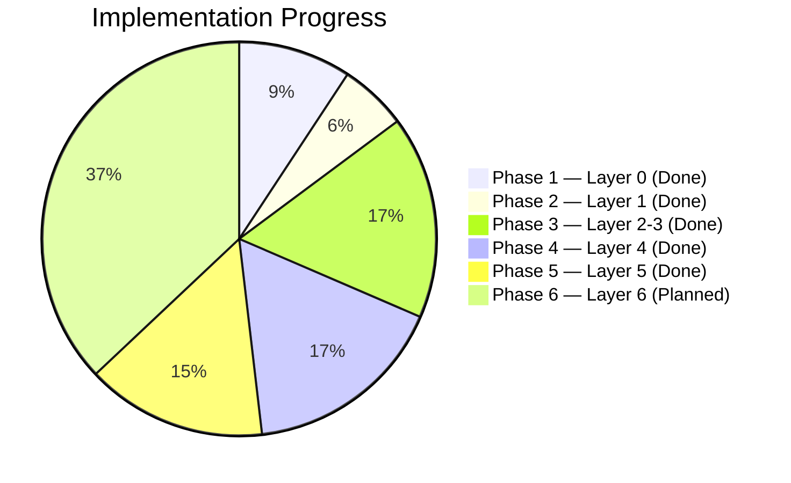
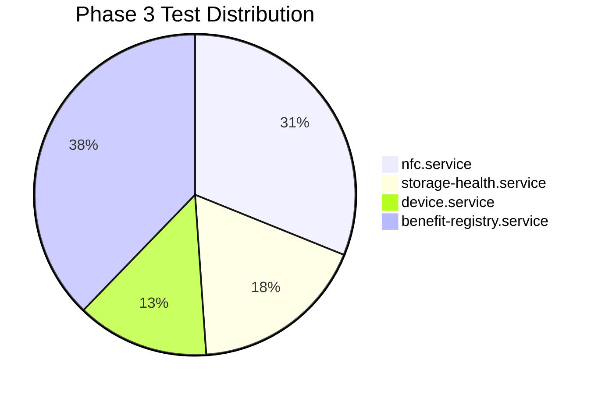
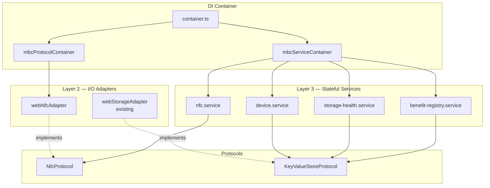

# Phase Progress

> Last updated: April 30, 2026
> Covers: All requirements (implementation tracking)

## Overview

Fitur MBC dibangun dalam 6 fase mengikuti bottom-up build order. Setiap fase membangun satu atau lebih layer arsitektur, dari data models hingga presentation.

## Phase Summary

---

## Phase 1: Layer 0 — Data Models & Protocols ✅ Done

**Milestone:** [Phase 1: Layer 0 - Foundation](https://github.com/widdestoyud/assesment-s1-2026/milestone/1) (Closed)
**Issues:** #31, #32, #33 (All closed)
**Branch:** Merged to `main`

### Ringkasan

Fase 1 membangun fondasi proyek: tipe data, model domain, Zod validation schemas, konstanta, helper utilities, dan protocol interfaces. Semua modul di layer ini adalah pure types tanpa dependency — menjadi "bricks" yang digunakan oleh semua layer di atasnya.

### Tasks

| Task | Status | Description |
|------|--------|-------------|
| 1.1 | ✅ Done | MBC constants dan storage keys |
| 1.2 | ✅ Done | Data model interfaces dan Zod schemas |
| 1.3 | ✅ Done | MBC helper utilities (formatIDR, formatDuration) |
| 2.1 | ✅ Done | NfcProtocol interface |
| 2.2 | ✅ Done | ~~IndexedDbProtocol~~ (Removed — simplified to localStorage-only via KeyValueStoreProtocol) |

### Files Created

| File | Purpose |
|------|---------|
| `src/utils/constants/mbc-keys.ts` | Storage keys, Silent Shield config constants |
| `src/@core/services/mbc/models/card-data.model.ts` | CardData, MemberIdentity, CheckInStatus, TransactionLogEntry |
| `src/@core/services/mbc/models/benefit-type.model.ts` | BenefitType, PricingStrategy, DEFAULT_PARKING_BENEFIT |
| `src/@core/services/mbc/models/common.model.ts` | RoleMode, NfcStatus, NfcError, FeeResult, AtomicWriteResult, dll |
| `src/@core/services/mbc/models/schemas.ts` | Zod schemas: CardDataSchema, BenefitTypeFormSchema, dll |
| `src/@core/services/mbc/models/index.ts` | Barrel export untuk semua models |
| `src/utils/helpers/mbc.helper.ts` | formatIDR, formatDuration, ISO timestamp helpers |
| `src/@core/protocols/nfc/index.ts` | NfcProtocol interface (isSupported, requestPermission, startScan, write) |
| `src/@core/protocols/key-value-store/index.ts` | KeyValueStoreProtocol interface (get, set, delete, getAll, isAvailable) |

### Requirements Covered

Req 1.1, 12.2-3, 13.1, 15.2, 19.1, 19.6, 20.1, 2.1, 2.2, 2.4, 3.1, 8.9, 9.3

### Keputusan Arsitektur

- **IndexedDB dihapus** — Disederhanakan ke localStorage-only via `KeyValueStoreProtocol`. Alasan: data yang perlu di-persist hanya Device_ID dan Service Registry (kecil), tidak perlu IndexedDB.
- **Zod untuk validasi** — Semua data eksternal (NFC card, localStorage) divalidasi dengan Zod schema sebelum digunakan.
- **Barrel exports** — Semua model di-export dari `models/index.ts` untuk clean imports.

---

## Phase 2: Layer 1 — Pure Logic Services ✅ Done

**Milestone:** [Phase 2: Layer 1 - Pure Logic Services](https://github.com/widdestoyud/assesment-s1-2026/milestone/2) (Closed)
**Issues:** #1 – #6 (All closed)
**Branch:** Merged to `main`

### Ringkasan

Fase 2 mengimplementasikan 3 pure logic services yang menjadi inti bisnis MBC. Semua service di layer ini adalah **stateless pure functions** — tidak ada I/O, tidak ada side effects, tidak ada dependency ke browser API. Ini memungkinkan testing yang cepat dan reliable.

### Tasks

| Task | Status | Description |
|------|--------|-------------|
| 3.1 | ✅ Done | pricing.service — kalkulasi tarif per service type |
| 3.2* | ✅ Done | Property tests: Ceiling Rounding (P8) |
| 3.3* | ✅ Done | Property tests: Pricing Consistency (P9) |
| 3.4 | ✅ Done | card-data.service — serialize/deserialize/mutate CardData |
| 3.5* | ✅ Done | Property tests: Serialization Round-Trip (P1) |
| 3.6* | ✅ Done | Property tests: Balance Conservation Top-Up (P3) |
| 3.7* | ✅ Done | Property tests: Balance Conservation Check-Out (P4) |
| 3.8* | ✅ Done | Property tests: Exactly-Once Deduction (P5) |
| 3.9* | ✅ Done | Property tests: Check-In Exclusivity (P6) |
| 3.10* | ✅ Done | Property tests: Transaction Log Bounded (P7) |
| 3.11 | ✅ Done | silent-shield.service — AES-256-GCM encrypt/decrypt |
| 3.12* | ✅ Done | Property tests: Encryption Round-Trip (P2) |

### Files Created

| File | Purpose |
|------|---------|
| `src/@core/services/mbc/pricing.service.ts` | calculateFee(strategy, checkIn, checkOut) → FeeResult |
| `src/@core/services/mbc/card-data.service.ts` | serialize, deserialize, validate, applyRegistration, applyTopUp, applyCheckIn, applyCheckOut, appendTransactionLog |
| `src/@core/services/mbc/silent-shield.service.ts` | encrypt(data) → Uint8Array, decrypt(data) → Uint8Array |
| `src/@core/services/__tests__/mbc/pricing.service.test.ts` | 6 tests (property-based + unit) |
| `src/@core/services/__tests__/mbc/card-data.service.test.ts` | 9 tests (property-based + unit) |
| `src/@core/services/__tests__/mbc/silent-shield.service.test.ts` | 1 test (encryption round-trip) |

### Test Coverage

| Service | Tests | Technique | Properties Validated |
|---------|-------|-----------|---------------------|
| pricing.service | 6 | fast-check property tests | P8 (Ceiling Rounding), P9 (Pricing Consistency) |
| card-data.service | 9 | fast-check property tests | P1 (Round-Trip), P3 (Balance Top-Up), P4 (Balance Check-Out), P5 (Exactly-Once), P6 (Check-In Exclusivity), P7 (Transaction Log Bounded) |
| silent-shield.service | 1 | fast-check property test | P2 (Encryption Round-Trip) |

**Total: 16 tests, all passing**

### Requirements Covered

Req 5.2, 6.2, 6.3, 8.6, 8.8, 10.1, 10.2, 11.1-4, 12.1-7, 13.1-5, 18.7

### Keputusan Arsitektur

- **Factory function pattern** — Semua service menggunakan factory function `(deps: AwilixRegistry) => Interface`, bukan class. Ini memudahkan DI dan testing.
- **Immutability** — Semua mutation functions (applyTopUp, applyCheckIn, dll) mengembalikan objek baru, tidak pernah mutate input.
- **crypto-browserify** — Digunakan untuk AES-256-GCM karena sudah ada sebagai polyfill di proyek. Key derivation via PBKDF2 dengan 100.000 iterasi.
- **Transaction log bounded** — Max 5 entries, oldest removed first (FIFO).

---

## Phase 3: Layer 2-3 — I/O Adapters & Stateful Services ✅ Done

**Milestone:** [Phase 3: Layer 2-3 - Adapters & Stateful Services](https://github.com/widdestoyud/assesment-s1-2026/milestone/3)
**Issues:** #7 – #14
**Branch:** `feat/mbc-phase-3-adapters-services`

### Ringkasan

Fase 3 membangun layer I/O (adapter untuk browser API) dan stateful services yang mengkomposisi pure logic dari Layer 1 dengan I/O adapters via dependency injection. Fase ini juga menyelesaikan DI wiring — mendaftarkan semua MBC protocols dan services ke Awilix container.

### Tasks

| Task | Status | Description |
|------|--------|-------------|
| 5.1 | ✅ Done | webNfcAdapter — NDEFReader wrapper implementing NfcProtocol |
| 6.1 | ✅ Done | nfc.service — readCard, writeCard, writeAndVerify |
| 6.2 | ✅ Done | storage-health.service — isAvailable, checkWriteCapacity |
| 6.3 | ✅ Done | device.service — getDeviceId, ensureDeviceId |
| 6.4 | ✅ Done | benefit-registry.service — CRUD + initializeDefaults |
| 6.5* | ✅ Done | Unit tests untuk semua stateful services |
| 7.1 | ✅ Done | MBC protocol DI container (nfcProtocol) |
| 7.2 | ✅ Done | MBC service DI container (7 services) |
| 7.3 | ✅ Done | Wire MBC containers ke root Awilix container |

### Files Created

**Layer 2 — I/O Adapter:**

| File | Purpose |
|------|---------|
| `src/infrastructure/nfc/webNfcAdapter.ts` | Wraps browser NDEFReader API behind NfcProtocol interface. Handles scan, write, permission request. Encodes data as base64 NDEF text records. |
| `types/web-nfc.d.ts` | TypeScript type declarations untuk Web NFC API (NDEFReader, NDEFMessage, NDEFRecord, dll) |

**Layer 3 — Stateful Services:**

| File | Purpose |
|------|---------|
| `src/@core/services/mbc/nfc.service.ts` | High-level NFC operations: readCard (one-shot scan → resolve), writeCard, writeAndVerify (write → read-back → compare) |
| `src/@core/services/mbc/storage-health.service.ts` | Deteksi ketersediaan localStorage, test write capacity, deteksi QuotaExceededError |
| `src/@core/services/mbc/device.service.ts` | Device_ID lifecycle: get from storage, generate via crypto.randomUUID() if missing, persist, flag wasRegenerated |
| `src/@core/services/mbc/benefit-registry.service.ts` | CRUD untuk Benefit Type configurations. Validasi dengan Zod, filter corrupted entries, initialize defaults (parking) |

**DI Wiring:**

| File | Purpose |
|------|---------|
| `src/infrastructure/di/registry/mbcProtocolContainer.ts` | Register `nfcProtocol` → `webNfcAdapter` |
| `src/infrastructure/di/registry/mbcServiceContainer.ts` | Register 7 MBC services (3 stateless + 4 singleton) |
| `src/infrastructure/di/container.ts` (modified) | Wire MBC containers, update AwilixRegistry type |

**Tests:**

| File | Tests | Scenarios Covered |
|------|-------|-------------------|
| `src/@core/services/__tests__/mbc/nfc.service.test.ts` | 14 | isAvailable (true/false), requestPermission (granted/denied/unsupported), readCard (success/error), writeCard (success/error), writeAndVerify (match/mismatch/write-error/read-error/empty-data) |
| `src/@core/services/__tests__/mbc/storage-health.service.test.ts` | 8 | isAvailable (true/false), checkWriteCapacity (healthy/unavailable/mismatch/quota-exceeded/generic-error/cleanup) |
| `src/@core/services/__tests__/mbc/device.service.test.ts` | 6 | getDeviceId (exists/missing), ensureDeviceId (existing/generate-new/idempotent/storage-error) |
| `src/@core/services/__tests__/mbc/benefit-registry.service.test.ts` | 17 | initializeDefaults (empty/existing), getAll (normal/empty/corrupted-filter), getById (found/not-found), add (valid/duplicate/invalid), update (valid/not-found/preserve-id/invalid-after-update), remove (valid/not-found/last-item) |

### Test Coverage Summary

**Total fase 3: 45 tests baru, semua passing**
**Total kumulatif: 61 tests (16 fase 2 + 45 fase 3)**

### Test Scenarios Detail

#### nfc.service (14 tests)

| Category | Scenario | Type |
|----------|----------|------|
| ✅ Positive | isAvailable returns true when supported | Unit |
| ✅ Positive | requestPermission returns granted | Unit |
| ✅ Positive | readCard resolves with data from first scan | Async |
| ✅ Positive | writeCard delegates to protocol | Unit |
| ✅ Positive | writeAndVerify succeeds when data matches | Async |
| ✅ Positive | writeAndVerify handles empty arrays | Edge |
| ❌ Negative | isAvailable returns false when unsupported | Unit |
| ❌ Negative | requestPermission returns denied | Unit |
| ❌ Negative | requestPermission returns unsupported | Unit |
| ❌ Negative | readCard rejects on NFC error | Async |
| ❌ Negative | writeCard propagates errors | Async |
| ❌ Negative | writeAndVerify fails on data mismatch | Async |
| ❌ Negative | writeAndVerify fails on write error | Async |
| ❌ Negative | writeAndVerify fails on verification read error | Async |

#### storage-health.service (8 tests)

| Category | Scenario | Type |
|----------|----------|------|
| ✅ Positive | isAvailable returns true | Unit |
| ✅ Positive | checkWriteCapacity returns canWrite: true | Unit |
| ✅ Positive | cleanup test key after check | Edge |
| ❌ Negative | isAvailable returns false | Unit |
| ❌ Negative | unavailable error when storage not accessible | Unit |
| ❌ Negative | write_failed when read-back mismatch | Edge |
| ❌ Negative | quota_exceeded on QuotaExceededError | Edge |
| ❌ Negative | write_failed on generic error | Edge |

#### device.service (6 tests)

| Category | Scenario | Type |
|----------|----------|------|
| ✅ Positive | getDeviceId returns stored ID | Unit |
| ✅ Positive | ensureDeviceId returns existing without regeneration | Unit |
| ✅ Positive | ensureDeviceId generates new ID when missing | Unit |
| ✅ Positive | ensureDeviceId is idempotent (wasRegenerated false on second call) | Edge |
| ❌ Negative | getDeviceId returns undefined when not stored | Unit |
| ❌ Negative | ensureDeviceId propagates storage write errors | Edge |

#### benefit-registry.service (17 tests)

| Category | Scenario | Type |
|----------|----------|------|
| ✅ Positive | initializeDefaults creates parking service | Unit |
| ✅ Positive | getAll returns all service types | Unit |
| ✅ Positive | getById returns found service | Unit |
| ✅ Positive | add valid service type | Unit |
| ✅ Positive | update existing service type | Unit |
| ✅ Positive | update preserves original ID | Edge |
| ✅ Positive | remove existing service type | Unit |
| ✅ Positive | remove last item leaves empty registry | Edge |
| ❌ Negative | initializeDefaults skips when registry exists | Unit |
| ❌ Negative | getAll returns empty when no registry | Unit |
| ❌ Negative | getAll filters corrupted entries | Edge |
| ❌ Negative | getById returns undefined when not found | Unit |
| ❌ Negative | add throws on duplicate ID | Unit |
| ❌ Negative | add throws on invalid data | Unit |
| ❌ Negative | update throws when not found | Unit |
| ❌ Negative | update throws on invalid result | Edge |
| ❌ Negative | remove throws when not found | Unit |

### Requirements Covered

| Requirement | Service | Description |
|-------------|---------|-------------|
| Req 2.1, 2.2, 2.4, 3.1 | webNfcAdapter | NFC read/write/permission |
| Req 3.4, 3.7 | nfc.service | Write verification |
| Req 19.1, 19.6, 19.7 | device.service | Device_ID lifecycle |
| Req 15.1-7 | benefit-registry.service | Benefit type CRUD |
| Req 20.2-4, 20.5-6, 20.8 | storage-health.service, benefit-registry.service | Storage error handling |

### Keputusan Arsitektur

- **Base64 encoding untuk NFC** — Card data di-encode sebagai base64 string dalam NDEF text record. Ini memastikan kompatibilitas dengan NDEF format yang hanya mendukung text/URL records.
- **One-shot readCard** — `readCard()` mengembalikan Promise yang resolve pada first scan, lalu abort session. Ini mencegah multiple reads yang tidak diinginkan.
- **Singleton untuk stateful services** — nfc.service, device.service, storage-health.service, dan benefit-registry.service di-register sebagai singleton di DI container karena mereka menyimpan state atau cache.
- **Zod validation pada read** — benefit-registry.service memvalidasi setiap entry saat membaca dari localStorage, dan memfilter entries yang corrupted. Ini mencegah crash akibat data rusak.
- **QuotaExceededError detection** — storage-health.service mendeteksi quota exceeded di Chrome (`QuotaExceededError`), Firefox, dan Safari (legacy code 22).
- **crypto.randomUUID()** — Digunakan untuk generate Device_ID karena tersedia di semua browser modern dan menghasilkan UUID v4 yang cryptographically random.

### Dependency Graph (Phase 3)

---

## Phase 4: Layer 4 — Use Cases ✅ Done

**Milestone:** [Phase 4](https://github.com/widdestoyud/assesment-s1-2026/milestone/4) (Closed) | **PR:** [#37](https://github.com/widdestoyud/assesment-s1-2026/pull/37) | **Detail:** [Laporan Fase 4](../09-Phase-Reports/Phase-4-Report)

| Task | Status | Description |
|------|--------|-------------|
| 9.1 | ✅ Done | RegisterMember use case |
| 9.2 | ✅ Done | TopUpBalance use case |
| 9.3 | ✅ Done | CheckIn use case |
| 9.4 | ✅ Done | CheckOut use case (with snapshot rollback) |
| 9.6 | ✅ Done | ReadCard use case |
| 9.7 | ✅ Done | ManualCalculation use case |
| 9.8 | ✅ Done | ManageBenefitRegistry use case |
| 9.9* | ✅ Done | Unit tests (36 tests) |
| 11.1 | ✅ Done | Use case DI container |

## Phase 5: Layer 5 — Controllers ✅ Done

**Milestone:** [Phase 5](https://github.com/widdestoyud/assesment-s1-2026/milestone/5) (Closed) | **PR:** [#39](https://github.com/widdestoyud/assesment-s1-2026/pull/39) | **Detail:** [Laporan Fase 5](../09-Phase-Reports/Phase-5-Report)

| Task | Status | Description |
|------|--------|-------------|
| 12.1 | ✅ Done | role-picker.controller |
| 12.2 | ✅ Done | station.controller |
| 12.3 | ✅ Done | gate.controller |
| 12.4 | ✅ Done | terminal.controller |
| 12.5 | ✅ Done | scout.controller |
| 12.6 | ✅ Done | Controller DI container |
| 12.7* | ✅ Done | Controller unit tests (22 tests) |

## Phase 6: Layer 6 — Presentation & PWA 📋 Planned

| Task | Status | Description |
|------|--------|-------------|
| 14.1-14.10 | 📋 Planned | 10 reusable components |
| 14.11* | 📋 Planned | Component tests |
| 15.1-15.5 | 📋 Planned | 5 pages |
| 16.1 | 📋 Planned | TanStack Router routes |
| 18.1 | 📋 Planned | PWA setup (vite-plugin-pwa) |
| 18.2 | 📋 Planned | Web app manifest |
| 18.3* | 📋 Planned | Offline integration test |

---

## Completion Summary

| Phase | Layer | Required | Optional | Done | Progress |
|-------|-------|----------|----------|------|----------|
| Phase 1 | Layer 0 | 5 | 0 | 5 | ✅ 100% |
| Phase 2 | Layer 1 | 3 | 9 | 12 | ✅ 100% |
| Phase 3 | Layer 2-3 | 8 | 1 | 9 | ✅ 100% |
| Phase 4 | Layer 4 | 8 | 1 | 9 | ✅ 100% |
| Phase 5 | Layer 5 | 6 | 1 | 7 | ✅ 100% |
| Phase 6 | Layer 6 | 18 | 2 | 0 | 📋 0% |
| **Total** | | **48** | **14** | **42** | **~67%** |

### Test Progression

| Phase | New Tests | Cumulative | Test Files |
|-------|-----------|------------|------------|
| Phase 1 | 0 | 0 | 0 |
| Phase 2 | 16 | 16 | 3 |
| Phase 3 | 45 | 61 | 7 |
| Phase 4 | 36 | 97 | 14 |
| Phase 5 | 22 | 119 | 18 |

## Related Pages

- [Clean Architecture](../01-Architecture/Clean-Architecture) — Layer definitions
- [Test Coverage Matrix](../06-Testing/Test-Coverage-Matrix) — Test status per requirement
- [Getting Started](Getting-Started) — How to run and test
- [Git Flow](Git-Flow) — Branch strategy dan release process
