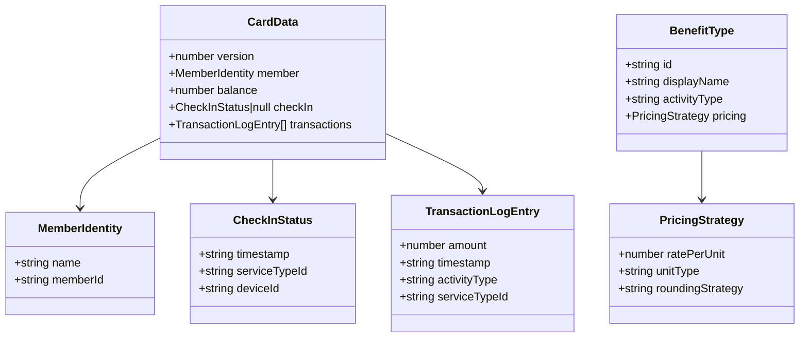

# Laporan Fase 1: Layer 0 — Data Models & Protocols

> Tanggal selesai: April 2026
> Status: ✅ Complete
> Milestone: [Phase 1: Layer 0 - Foundation](https://github.com/widdestoyud/assesment-s1-2026/milestone/1) (Closed)
> Issues: #31, #32, #33 (All closed)

---

## Ringkasan

Fase 1 membangun fondasi seluruh proyek MBC: tipe data domain, validation schemas, konstanta konfigurasi, helper utilities, dan protocol interfaces. Semua modul di layer ini adalah **pure types tanpa runtime dependency** — menjadi "bricks" dasar yang digunakan oleh semua layer di atasnya.

Tidak ada test di fase ini karena seluruh output adalah type definitions dan interfaces yang divalidasi oleh TypeScript compiler.

---

## Scope Pekerjaan

| Task | Deskripsi | Status |
|------|-----------|--------|
| 1.1 | MBC constants dan storage keys | ✅ Done |
| 1.2 | Data model interfaces dan Zod schemas | ✅ Done |
| 1.3 | MBC helper utilities (formatIDR, formatDuration) | ✅ Done |
| 2.1 | NfcProtocol interface | ✅ Done |
| 2.2 | ~~IndexedDbProtocol~~ (Dihapus — disederhanakan ke localStorage) | ✅ Done |

---

## Deliverables

### Files Created

| File | Layer | Fungsi |
|------|-------|--------|
| `src/utils/constants/mbc-keys.ts` | 0 | Storage keys (`MBC_DEVICE_ID`, `MBC_BENEFIT_REGISTRY`), Silent Shield config (algorithm, passphrase, salt, iterations, key/IV/tag lengths) |
| `src/@core/services/mbc/models/card-data.model.ts` | 0 | `CardData`, `MemberIdentity`, `CheckInStatus`, `TransactionLogEntry` interfaces |
| `src/@core/services/mbc/models/benefit-type.model.ts` | 0 | `BenefitType`, `PricingStrategy` interfaces, `DEFAULT_PARKING_BENEFIT` constant |
| `src/@core/services/mbc/models/common.model.ts` | 0 | `RoleMode`, `NfcStatus`, `NfcError`, `FeeResult`, `CheckInResult`, `CheckOutResult`, `OperationResult`, `AtomicWriteResult`, `WriteVerifyResult`, `StorageError`, `NfcCapabilityStatus` |
| `src/@core/services/mbc/models/schemas.ts` | 0 | Zod schemas: `CardDataSchema`, `BenefitTypeFormSchema`, `RegistrationFormSchema`, `TopUpFormSchema`, `ManualCalcFormSchema` |
| `src/@core/services/mbc/models/index.ts` | 0 | Barrel export untuk semua models |
| `src/utils/helpers/mbc.helper.ts` | 0 | `formatIDR()` — format angka ke Rupiah, `formatDuration()` — format durasi ke jam/menit |
| `src/@core/protocols/nfc/index.ts` | 0 | `NfcProtocol` interface: `isSupported()`, `requestPermission()`, `startScan()`, `write()` |
| `src/@core/protocols/key-value-store/index.ts` | 0 | `KeyValueStoreProtocol` interface: `get<T>()`, `set<T>()`, `delete()`, `getAll<T>()`, `isAvailable()` |

### Data Model Overview

---

## Keputusan Arsitektur

| Keputusan | Alasan |
|-----------|--------|
| **IndexedDB dihapus** → localStorage only | Data yang perlu di-persist hanya Device_ID dan Benefit Registry (kecil). IndexedDB overkill untuk use case ini. |
| **Zod untuk semua validasi** | Runtime validation untuk data dari NFC card dan localStorage. Compile-time types saja tidak cukup untuk data eksternal. |
| **Barrel exports via index.ts** | Clean imports: `import { CardData, FeeResult } from '@core/services/mbc/models'` |
| **Constants as const** | Type-safe constant values dengan `as const` untuk compile-time checking |

---

## Requirements Covered

| Requirement | Deskripsi | Modul |
|-------------|-----------|-------|
| Req 1.1 | Role mode types | common.model.ts |
| Req 2.1, 2.2, 2.4, 3.1 | NFC protocol interface | nfc/index.ts |
| Req 8.9, 9.3 | IDR formatting, duration formatting | mbc.helper.ts |
| Req 12.2-3 | Pricing strategy types | benefit-type.model.ts |
| Req 13.1 | Card data schema definition | card-data.model.ts, schemas.ts |
| Req 15.2 | Service type form schema | schemas.ts |
| Req 19.1, 19.6, 20.1 | Storage keys, device ID key | mbc-keys.ts |

---

## Catatan

- Fase ini tidak menghasilkan test karena semua output adalah type definitions. Validasi dilakukan oleh TypeScript compiler (`tsc --noEmit`).
- `KeyValueStoreProtocol` sudah ada sebelumnya di proyek, di-refactor dari `src/@core/protocols/storage/` ke `src/@core/protocols/key-value-store/` untuk konsistensi naming.
