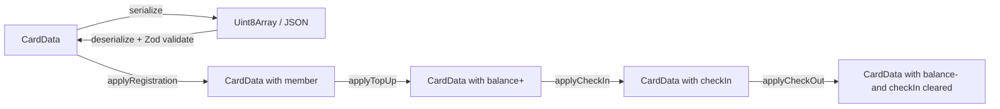

# Laporan Fase 2: Layer 1 — Pure Logic Services

> Tanggal selesai: April 2026
> Status: ✅ Complete
> Milestone: [Phase 2: Layer 1 - Pure Logic Services](https://github.com/widdestoyud/assesment-s1-2026/milestone/2) (Closed)
> Issues: #1 – #6 (All closed)

---

## Ringkasan

Fase 2 mengimplementasikan 3 pure logic services yang menjadi inti bisnis MBC:

1. **pricing.service** — Kalkulasi tarif berdasarkan pricing strategy (per-hour, per-visit, flat-fee)
2. **card-data.service** — Serialisasi, deserialisasi, validasi, dan mutasi data kartu NFC
3. **silent-shield.service** — Enkripsi/dekripsi data kartu dengan AES-256-GCM

Semua service di layer ini adalah **stateless pure functions** — tidak ada I/O, tidak ada side effects, tidak ada dependency ke browser API. Ini memungkinkan testing yang cepat, reliable, dan reproducible.

Fase ini juga menghasilkan **property-based tests** menggunakan fast-check yang memvalidasi 9 correctness properties formal.

---

## Scope Pekerjaan

| Task | Deskripsi | Status |
|------|-----------|--------|
| 3.1 | pricing.service — kalkulasi tarif per service type | ✅ Done |
| 3.2* | Property tests: Ceiling Rounding (P8) | ✅ Done |
| 3.3* | Property tests: Pricing Consistency (P9) | ✅ Done |
| 3.4 | card-data.service — serialize/deserialize/mutate CardData | ✅ Done |
| 3.5* | Property tests: Serialization Round-Trip (P1) | ✅ Done |
| 3.6* | Property tests: Balance Conservation Top-Up (P3) | ✅ Done |
| 3.7* | Property tests: Balance Conservation Check-Out (P4) | ✅ Done |
| 3.8* | Property tests: Exactly-Once Deduction (P5) | ✅ Done |
| 3.9* | Property tests: Check-In Exclusivity (P6) | ✅ Done |
| 3.10* | Property tests: Transaction Log Bounded (P7) | ✅ Done |
| 3.11 | silent-shield.service — AES-256-GCM encrypt/decrypt | ✅ Done |
| 3.12* | Property tests: Encryption Round-Trip (P2) | ✅ Done |

---

## Deliverables

### Source Files

| File | Fungsi | Interface |
|------|--------|-----------|
| `src/@core/services/mbc/pricing.service.ts` | Kalkulasi tarif | `PricingServiceInterface { calculateFee(strategy, checkInTime, checkOutTime): FeeResult }` |
| `src/@core/services/mbc/card-data.service.ts` | Operasi data kartu | `CardDataServiceInterface { serialize, deserialize, validate, applyRegistration, applyTopUp, applyCheckIn, applyCheckOut, appendTransactionLog }` |
| `src/@core/services/mbc/silent-shield.service.ts` | Enkripsi/dekripsi | `SilentShieldServiceInterface { encrypt(data): Uint8Array, decrypt(data): Uint8Array }` |

### Test Files

| File | Tests | Technique |
|------|-------|-----------|
| `src/@core/services/__tests__/mbc/pricing.service.test.ts` | 6 | fast-check property-based |
| `src/@core/services/__tests__/mbc/card-data.service.test.ts` | 9 | fast-check property-based |
| `src/@core/services/__tests__/mbc/silent-shield.service.test.ts` | 1 | fast-check property-based |

**Total: 16 tests, semua passing**

---

## Detail Implementasi

### pricing.service

Menghitung tarif berdasarkan `PricingStrategy` yang dikonfigurasi per `BenefitType`.

| Unit Type | Formula | Contoh |
|-----------|---------|--------|
| `per-hour` | `rounding(hours) × ratePerUnit` | Parkir 2.5 jam × Rp 2.000 = Rp 6.000 (ceiling) |
| `per-visit` | `ratePerUnit` (fixed per kunjungan) | Restoran = Rp 15.000 per visit |
| `flat-fee` | `ratePerUnit` (fixed regardless of duration) | VIP Lounge = Rp 50.000 |

Rounding strategies: `ceiling` (bulatkan ke atas), `floor` (bulatkan ke bawah), `nearest` (bulatkan ke terdekat).

### card-data.service

Mengelola lifecycle data kartu NFC melalui pure mutation functions:



**Invariants yang dijaga:**
- `transactions.length <= 5` (FIFO, oldest removed)
- `applyCheckIn` throws jika sudah checked-in
- `applyCheckOut` throws jika belum checked-in
- Semua mutation mengembalikan objek baru (immutable)

### silent-shield.service

Enkripsi AES-256-GCM untuk melindungi data kartu dari pembacaan oleh NFC reader pihak ketiga.

```
Encrypt: plaintext → [IV (12B) | ciphertext | authTag (16B)]
Decrypt: [IV (12B) | ciphertext | authTag (16B)] → plaintext
```

- Key derivation: PBKDF2 (100.000 iterasi, SHA-256)
- IV: 12 bytes random per operasi write
- Auth tag: 16 bytes untuk integrity verification
- Key di-cache setelah derivasi pertama untuk performa

---

## Correctness Properties (Property-Based Tests)

| # | Property | Formula | Service |
|---|----------|---------|---------|
| P1 | Serialization Round-Trip | `deserialize(serialize(card)) === card` | card-data |
| P2 | Encryption Round-Trip | `decrypt(encrypt(data)) === data` | silent-shield |
| P3 | Balance Conservation (Top-Up) | `applyTopUp(card, a).balance === card.balance + a` | card-data |
| P4 | Balance Conservation (Check-Out) | `applyCheckOut(card, f).balance === card.balance - f` | card-data |
| P5 | Exactly-Once Deduction | `applyCheckOut` on already checked-out card → throws | card-data |
| P6 | Check-In Exclusivity | Checked-in card cannot check-in again | card-data |
| P7 | Transaction Log Bounded | `transactions.length <= 5` after any operation | card-data |
| P8 | Ceiling Rounding | `fee === Math.ceil(hours) × rate` for per-hour ceiling | pricing |
| P9 | Pricing Consistency | Per-visit/flat-fee: `fee === ratePerUnit` regardless of duration | pricing |

Semua property divalidasi dengan **fast-check** menggunakan arbitrary data generators untuk CardData, PricingStrategy, timestamps, dan amounts.

---

## Keputusan Arsitektur

| Keputusan | Alasan |
|-----------|--------|
| **Factory function pattern** | `(deps: AwilixRegistry) => Interface` — bukan class. Memudahkan DI, testing, dan tree-shaking. |
| **Immutability** | Semua mutation functions mengembalikan objek baru. Tidak pernah mutate input parameter. Mencegah side effects. |
| **crypto-browserify** | Sudah ada sebagai polyfill di proyek. Menyediakan AES-256-GCM yang compatible dengan Node.js crypto API. |
| **PBKDF2 key derivation** | 100.000 iterasi untuk brute-force resistance. Key di-cache di closure untuk performa. |
| **JSON serialization** | Dipilih over binary format untuk debuggability. Masih muat dalam NFC tag memory (NTAG215: 504B, NTAG216: 888B). |
| **Transaction log FIFO** | Max 5 entries, oldest removed first. Menjaga ukuran data kartu tetap bounded. |

---

## Requirements Covered

| Requirement | Deskripsi | Service |
|-------------|-----------|---------|
| Req 5.2 | Top-up menambah balance | card-data.service |
| Req 6.2, 6.3 | Check-in recording, double check-in prevention | card-data.service |
| Req 8.6, 8.8 | Fee deduction, double check-out prevention | card-data.service |
| Req 10.1, 10.2 | Transaction log append, max 5 entries | card-data.service |
| Req 11.1-4 | Encrypt/decrypt, round-trip property | silent-shield.service |
| Req 12.1-7 | Fee calculation, pricing strategies, default parking | pricing.service |
| Req 13.1-5 | Card data schema, serialize/deserialize, round-trip | card-data.service |
| Req 18.7 | Exactly-once deduction | card-data.service |
