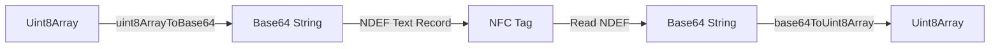
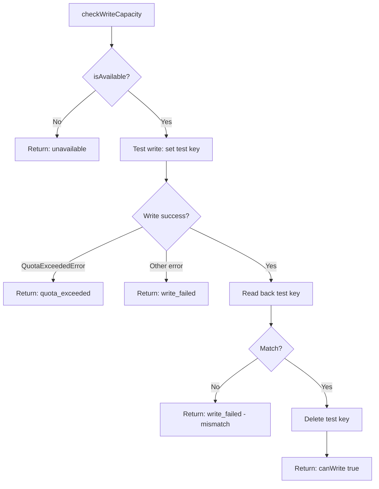
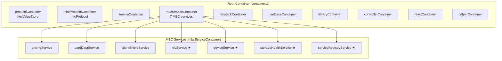
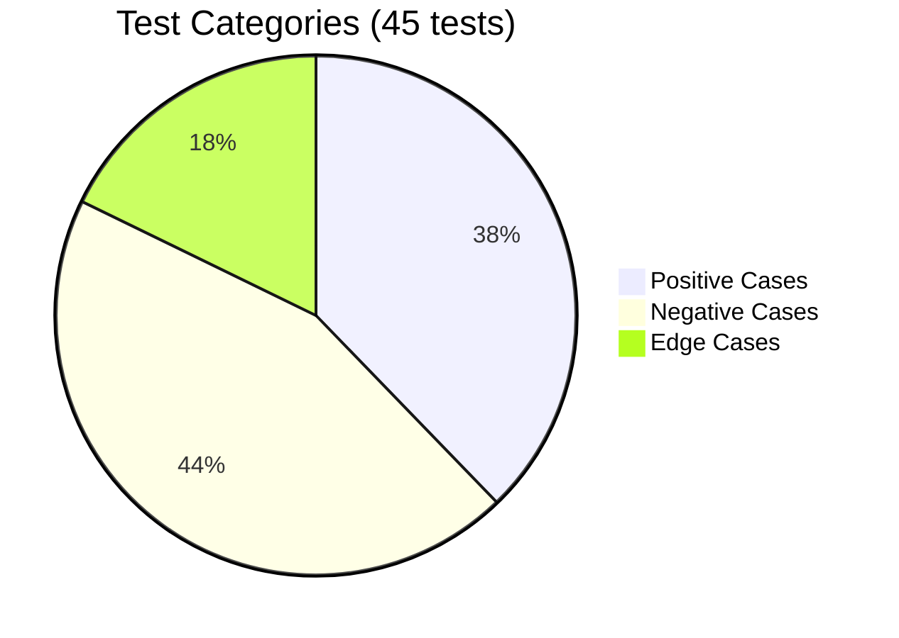
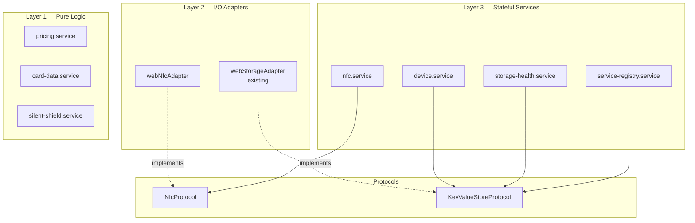

# Laporan Fase 3: Layer 2-3 — I/O Adapters & Stateful Services

> Tanggal selesai: April 30, 2026
> Status: ✅ Complete
> Milestone: [Phase 3: Layer 2-3 - Adapters & Stateful Services](https://github.com/widdestoyud/assesment-s1-2026/milestone/3)
> Issues: #7 – #14
> Branch: `feat/mbc-phase-3-adapters-services`

---

## Ringkasan

Fase 3 membangun dua layer sekaligus:

- **Layer 2 (I/O Adapters)** — Adapter untuk browser API (Web NFC) yang mengimplementasikan protocol interfaces dari Layer 0
- **Layer 3 (Stateful Services)** — Services yang mengkomposisi pure logic dari Layer 1 dengan I/O adapters, mengelola state via dependency injection

Fase ini juga menyelesaikan **DI wiring** — mendaftarkan semua MBC protocols dan services ke Awilix container sehingga siap digunakan oleh use cases di fase 4.

**Highlight:** 45 unit tests baru yang mencakup positive cases, negative cases, dan edge cases untuk setiap service.

---

## Scope Pekerjaan

| Task | Deskripsi | Layer | Status |
|------|-----------|-------|--------|
| 5.1 | webNfcAdapter — NDEFReader wrapper | Layer 2 | ✅ Done |
| 6.1 | nfc.service — readCard, writeCard, writeAndVerify | Layer 3 | ✅ Done |
| 6.2 | storage-health.service — isAvailable, checkWriteCapacity | Layer 3 | ✅ Done |
| 6.3 | device.service — getDeviceId, ensureDeviceId | Layer 3 | ✅ Done |
| 6.4 | service-registry.service — CRUD + initializeDefaults | Layer 3 | ✅ Done |
| 6.5* | Unit tests untuk semua stateful services | Test | ✅ Done |
| 7.1 | MBC protocol DI container | DI | ✅ Done |
| 7.2 | MBC service DI container (7 services) | DI | ✅ Done |
| 7.3 | Wire MBC containers ke root container | DI | ✅ Done |

---

## Deliverables

### Layer 2 — I/O Adapter

| File | Fungsi |
|------|--------|
| `src/infrastructure/nfc/webNfcAdapter.ts` | Wraps browser `NDEFReader` API behind `NfcProtocol` interface. Handles scan, write, permission request. Encodes data sebagai base64 NDEF text records. Maps semua Web NFC error types ke typed `NfcError`. |
| `types/web-nfc.d.ts` | TypeScript type declarations untuk Web NFC API (`NDEFReader`, `NDEFMessage`, `NDEFRecord`, `NDEFReadingEvent`) |

### Layer 3 — Stateful Services

| File | Interface | Dependencies (via DI) |
|------|-----------|----------------------|
| `src/@core/services/mbc/nfc.service.ts` | `NfcServiceInterface` | `nfcProtocol: NfcProtocol` |
| `src/@core/services/mbc/storage-health.service.ts` | `StorageHealthServiceInterface` | `keyValueStore: KeyValueStoreProtocol` |
| `src/@core/services/mbc/device.service.ts` | `DeviceServiceInterface` | `keyValueStore: KeyValueStoreProtocol` |
| `src/@core/services/mbc/service-registry.service.ts` | `ServiceRegistryServiceInterface` | `keyValueStore: KeyValueStoreProtocol` |

### DI Wiring

| File | Fungsi |
|------|--------|
| `src/infrastructure/di/registry/mbcProtocolContainer.ts` | Register `nfcProtocol` → `webNfcAdapter` via `asValue()` |
| `src/infrastructure/di/registry/mbcServiceContainer.ts` | Register 7 MBC services: 3 stateless (`asFunction`) + 4 singleton (`asFunction().singleton()`) |
| `src/infrastructure/di/container.ts` (modified) | Import dan call `registerMbcProtocolModules`, `registerMbcServiceModules`. Update `AwilixRegistry` type union. |

### Test Files

| File | Tests |
|------|-------|
| `src/@core/services/__tests__/mbc/nfc.service.test.ts` | 14 |
| `src/@core/services/__tests__/mbc/storage-health.service.test.ts` | 8 |
| `src/@core/services/__tests__/mbc/device.service.test.ts` | 6 |
| `src/@core/services/__tests__/mbc/service-registry.service.test.ts` | 17 |

**Total fase 3: 45 tests baru**
**Total kumulatif: 61 tests (16 fase 2 + 45 fase 3), 7 test files**

---

## Detail Implementasi

### 5.1 — webNfcAdapter

Adapter yang membungkus browser Web NFC API (`NDEFReader`) di balik `NfcProtocol` interface.

**Encoding strategy:** Card data (Uint8Array) di-encode ke base64 string, lalu ditulis sebagai NDEF text record. Saat membaca, base64 di-decode kembali ke Uint8Array.

**Error mapping:**

| DOMException | NfcError Type |
|-------------|---------------|
| `NotAllowedError` | `permission_denied` |
| `NotSupportedError` | `hardware_unavailable` |
| `NetworkError` | `connection_lost` |
| Other | `read_failed` / `write_failed` |

### 6.1 — nfc.service

High-level NFC operations yang digunakan oleh use cases.

| Method | Behavior |
|--------|----------|
| `isAvailable()` | Delegates ke `nfcProtocol.isSupported()` |
| `requestPermission()` | Delegates ke `nfcProtocol.requestPermission()` |
| `readCard()` | One-shot: start scan → resolve pada first read → abort session |
| `writeCard(data)` | Delegates ke `nfcProtocol.write(data)` |
| `writeAndVerify(data)` | Write → readCard() → byte-level compare → return `WriteVerifyResult` |

**One-shot pattern:** `readCard()` mengembalikan Promise yang resolve pada pembacaan pertama, lalu otomatis abort scan session. Ini mencegah multiple reads yang tidak diinginkan.

### 6.2 — storage-health.service

Mendeteksi ketersediaan dan kapasitas localStorage.

**Cross-browser QuotaExceededError detection:** Mendeteksi `DOMException.name === 'QuotaExceededError'` (Chrome/Firefox/Edge) dan `DOMException.code === 22` (Safari legacy).

### 6.3 — device.service

Mengelola Device_ID lifecycle untuk device binding.

| Method | Behavior |
|--------|----------|
| `getDeviceId()` | Read dari localStorage. Return `undefined` jika tidak ada. |
| `ensureDeviceId()` | Get existing atau generate baru via `crypto.randomUUID()`. Return `{ deviceId, wasRegenerated }`. |

**`wasRegenerated` flag:** Digunakan oleh UI untuk menampilkan warning bahwa check-in sessions dari device ID lama tidak bisa di-checkout di device ini.

### 6.4 — service-registry.service

CRUD untuk konfigurasi Service Type yang di-persist di localStorage.

| Method | Behavior |
|--------|----------|
| `getAll()` | Read registry, validate setiap entry dengan Zod, filter corrupted entries |
| `getById(id)` | Find by ID dari registry |
| `add(serviceType)` | Validate → check duplicate ID → append → persist |
| `update(id, updates)` | Find → merge updates (preserve ID) → validate result → persist |
| `remove(id)` | Find → splice → persist |
| `initializeDefaults()` | Jika registry kosong, seed dengan `DEFAULT_PARKING_SERVICE` |

**Defensive reading:** Setiap entry divalidasi dengan `ServiceTypeFormSchema.safeParse()` saat dibaca. Entries yang corrupted di-filter out tanpa crash.

### 7.1-7.3 — DI Wiring

★ = registered as singleton

**AwilixRegistry type** sekarang mencakup `MbcProtocolContainerInterface` dan `MbcServiceContainerInterface`, sehingga semua MBC services accessible via typed DI.

---

## Test Report

### Ringkasan

| Metric | Value |
|--------|-------|
| Test files baru | 4 |
| Tests baru | 45 |
| Tests kumulatif | 61 |
| Test files kumulatif | 7 |
| Execution time | ~1.3s |
| Status | ✅ All passing |

### Test Scenarios per Service

#### nfc.service — 14 tests

| # | Scenario | Category | Type |
|---|----------|----------|------|
| 1 | isAvailable returns true when supported | ✅ Positive | Unit |
| 2 | isAvailable returns false when unsupported | ❌ Negative | Unit |
| 3 | requestPermission returns granted | ✅ Positive | Unit |
| 4 | requestPermission returns denied | ❌ Negative | Unit |
| 5 | requestPermission returns unsupported | ❌ Negative | Unit |
| 6 | readCard resolves with data from first scan | ✅ Positive | Async |
| 7 | readCard rejects on NFC error | ❌ Negative | Async |
| 8 | writeCard delegates to protocol | ✅ Positive | Unit |
| 9 | writeCard propagates errors | ❌ Negative | Async |
| 10 | writeAndVerify succeeds when data matches | ✅ Positive | Async |
| 11 | writeAndVerify fails on data mismatch | ❌ Negative | Async |
| 12 | writeAndVerify fails on write error | ❌ Negative | Async |
| 13 | writeAndVerify fails on verification read error | ❌ Negative | Async |
| 14 | writeAndVerify handles empty data arrays | 🔶 Edge | Async |

#### storage-health.service — 8 tests

| # | Scenario | Category | Type |
|---|----------|----------|------|
| 1 | isAvailable returns true | ✅ Positive | Unit |
| 2 | isAvailable returns false | ❌ Negative | Unit |
| 3 | checkWriteCapacity returns canWrite: true | ✅ Positive | Unit |
| 4 | unavailable error when storage not accessible | ❌ Negative | Unit |
| 5 | write_failed when read-back mismatch | 🔶 Edge | Unit |
| 6 | quota_exceeded on QuotaExceededError | ❌ Negative | Unit |
| 7 | write_failed on generic error | ❌ Negative | Unit |
| 8 | cleanup test key after successful check | 🔶 Edge | Unit |

#### device.service — 6 tests

| # | Scenario | Category | Type |
|---|----------|----------|------|
| 1 | getDeviceId returns stored ID | ✅ Positive | Unit |
| 2 | getDeviceId returns undefined when not stored | ❌ Negative | Unit |
| 3 | ensureDeviceId returns existing without regeneration | ✅ Positive | Unit |
| 4 | ensureDeviceId generates new ID when missing | ✅ Positive | Unit |
| 5 | ensureDeviceId is idempotent (wasRegenerated false on 2nd call) | 🔶 Edge | Unit |
| 6 | ensureDeviceId propagates storage write errors | ❌ Negative | Unit |

#### service-registry.service — 17 tests

| # | Scenario | Category | Type |
|---|----------|----------|------|
| 1 | initializeDefaults creates parking service when empty | ✅ Positive | Unit |
| 2 | initializeDefaults skips when registry exists | ❌ Negative | Unit |
| 3 | getAll returns all service types | ✅ Positive | Unit |
| 4 | getAll returns empty when no registry | ❌ Negative | Unit |
| 5 | getAll filters corrupted entries | 🔶 Edge | Unit |
| 6 | getById returns found service | ✅ Positive | Unit |
| 7 | getById returns undefined when not found | ❌ Negative | Unit |
| 8 | add valid service type | ✅ Positive | Unit |
| 9 | add throws on duplicate ID | ❌ Negative | Unit |
| 10 | add throws on invalid data | ❌ Negative | Unit |
| 11 | update existing service type | ✅ Positive | Unit |
| 12 | update throws when not found | ❌ Negative | Unit |
| 13 | update preserves original ID | 🔶 Edge | Unit |
| 14 | update throws on invalid result | ❌ Negative | Unit |
| 15 | remove existing service type | ✅ Positive | Unit |
| 16 | remove throws when not found | ❌ Negative | Unit |
| 17 | remove last item leaves empty registry | 🔶 Edge | Unit |

### Test Distribution

---

## Dependency Graph

---

## Keputusan Arsitektur

| Keputusan | Alasan |
|-----------|--------|
| **Base64 encoding untuk NFC** | NDEF text record hanya mendukung string. Base64 encoding memastikan binary data (encrypted card data) bisa disimpan sebagai text. |
| **One-shot readCard pattern** | `readCard()` resolve pada first scan lalu abort. Mencegah multiple reads dan simplify Promise-based API untuk use cases. |
| **Singleton untuk stateful services** | nfc, device, storage-health, service-registry di-register sebagai singleton karena mereka mengelola shared state atau cache. |
| **Zod validation on read** | service-registry memvalidasi setiap entry saat membaca dari localStorage. Corrupted entries di-filter tanpa crash. Defensive programming. |
| **QuotaExceededError cross-browser** | Deteksi via `DOMException.name` (modern) dan `DOMException.code` (Safari legacy). |
| **crypto.randomUUID()** | Tersedia di semua browser modern. Menghasilkan UUID v4 yang cryptographically random untuk Device_ID. |
| **Pick<AwilixRegistry, ...> untuk deps** | Services hanya menerima dependencies yang mereka butuhkan, bukan seluruh registry. Explicit dependency declaration. |

---

## Requirements Covered

| Requirement | Deskripsi | Service |
|-------------|-----------|---------|
| Req 2.1, 2.2, 2.4, 3.1 | NFC read/write/permission | webNfcAdapter, nfc.service |
| Req 3.4, 3.7 | Write verification | nfc.service |
| Req 15.1-7 | Service type CRUD, defaults, persistence | service-registry.service |
| Req 19.1, 19.6, 19.7 | Device_ID lifecycle, regeneration warning | device.service |
| Req 20.2-4 | Storage availability, quota detection | storage-health.service |
| Req 20.5-6 | Service registry validation, re-initialization | service-registry.service |
| Req 20.8 | Graceful storage error handling | device.service, service-registry.service |
