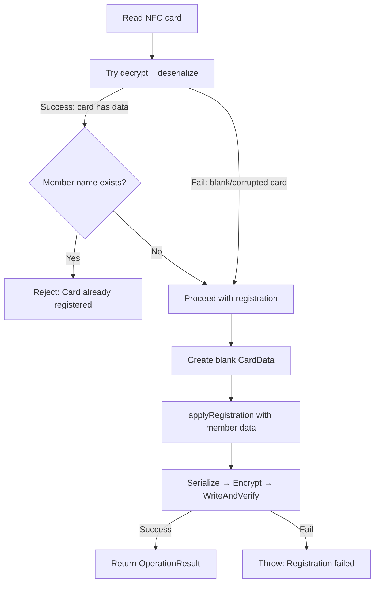
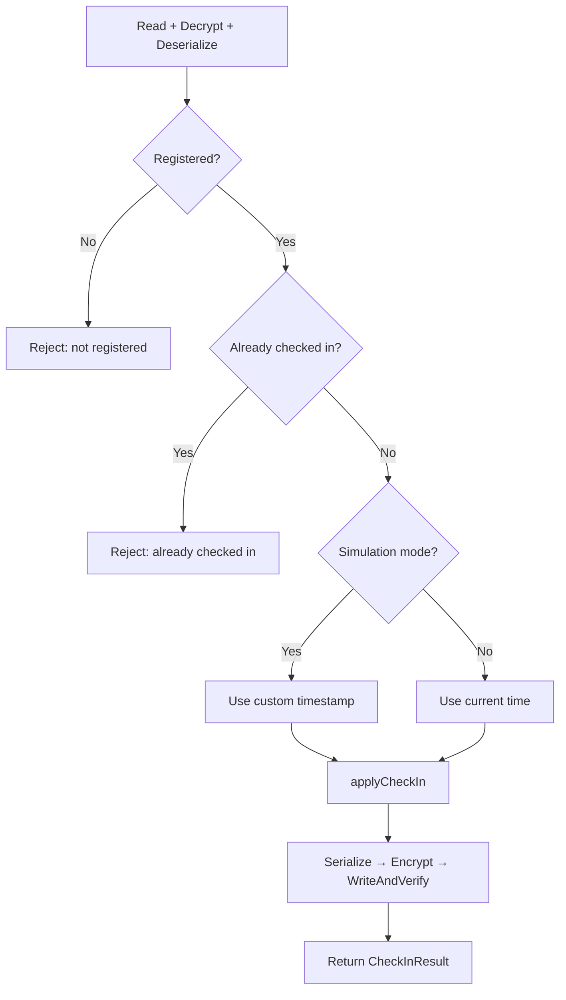
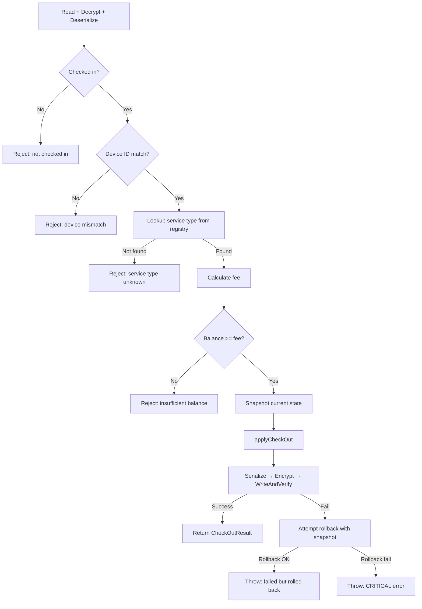
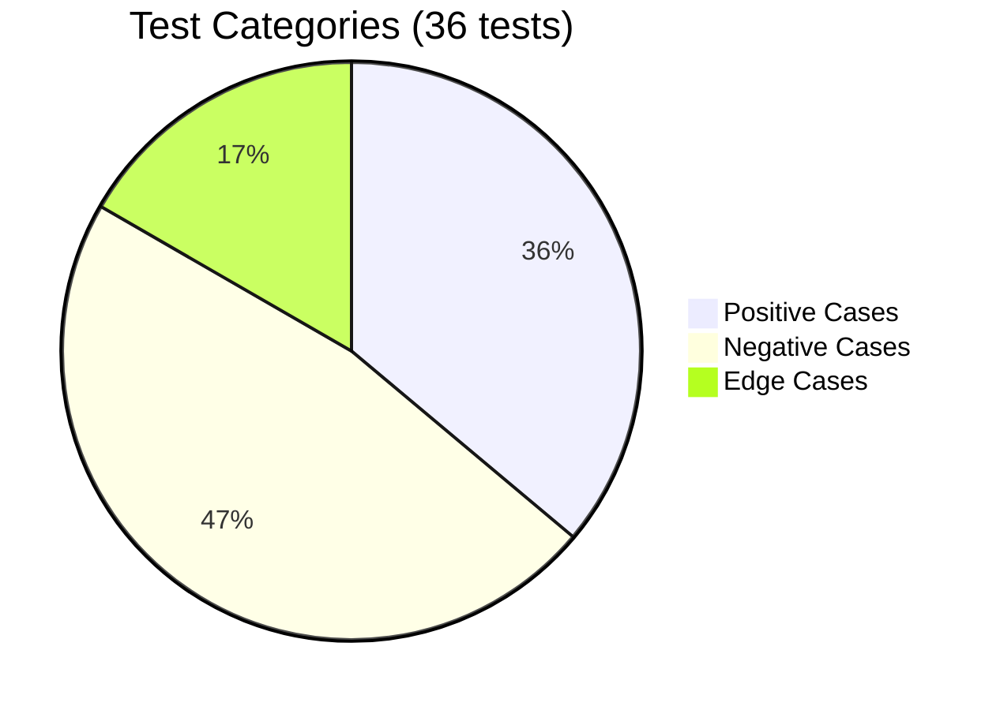
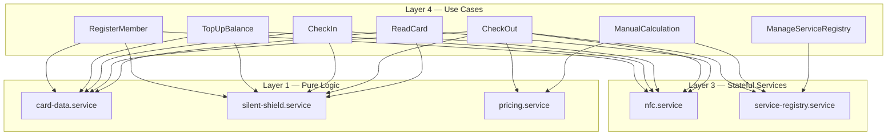

# Laporan Fase 4: Layer 4 — Use Cases

> Tanggal selesai: April 30, 2026
> Status: ✅ Complete
> Milestone: [Phase 4: Layer 4 - Use Cases](https://github.com/widdestoyud/assesment-s1-2026/milestone/4) (Closed)
> Issues: #15 – #22 (All closed)
> Branch: `feat/mbc-phase-4-use-cases` → PR [#37](https://github.com/widdestoyud/assesment-s1-2026/pull/37) (squash merged)

---

## Ringkasan

Fase 4 mengimplementasikan 7 use cases yang meng-orchestrate services dari Layer 1-3 menjadi operasi bisnis lengkap. Setiap use case adalah satu fungsi `execute(input) → result` yang menjalankan alur end-to-end: baca kartu → dekripsi → validasi → mutasi → enkripsi → tulis + verifikasi.

Fase ini juga menyelesaikan DI wiring untuk use cases — mendaftarkan semua 7 use cases ke Awilix container.

**Highlight:** 36 unit tests baru yang mencakup positive, negative, edge cases, dan rollback scenarios. Total kumulatif: 97 tests.

---

## Scope Pekerjaan

| Task | Deskripsi | Status |
|------|-----------|--------|
| 9.1 | RegisterMember — registrasi kartu baru | ✅ Done |
| 9.2 | TopUpBalance — tambah saldo | ✅ Done |
| 9.3 | CheckIn — catat check-in + simulation mode | ✅ Done |
| 9.4 | CheckOut — kalkulasi tarif + potong saldo + rollback | ✅ Done |
| 9.6 | ReadCard — baca isi kartu (read-only) | ✅ Done |
| 9.7 | ManualCalculation — kalkulasi manual tanpa NFC | ✅ Done |
| 9.8 | ManageServiceRegistry — CRUD service types | ✅ Done |
| 9.9* | Unit tests untuk semua use cases | ✅ Done |
| 11.1 | MBC use case DI container | ✅ Done |

---

## Deliverables

### Use Case Files

| File | Dependencies (via DI) | Operasi |
|------|----------------------|---------|
| `src/@core/use_case/mbc/RegisterMember.ts` | nfcService, cardDataService, silentShieldService | Read → decrypt → check blank → register → serialize → encrypt → writeAndVerify |
| `src/@core/use_case/mbc/TopUpBalance.ts` | nfcService, cardDataService, silentShieldService | Read → decrypt → deserialize → validate registered → applyTopUp → serialize → encrypt → writeAndVerify |
| `src/@core/use_case/mbc/CheckIn.ts` | nfcService, cardDataService, silentShieldService | Read → decrypt → deserialize → validate no active check-in → applyCheckIn → serialize → encrypt → writeAndVerify |
| `src/@core/use_case/mbc/CheckOut.ts` | nfcService, cardDataService, silentShieldService, pricingService, serviceRegistryService | Read → decrypt → deserialize → validate check-in → validate device → lookup service → calculate fee → validate balance → snapshot → applyCheckOut → serialize → encrypt → writeAndVerify → rollback on failure |
| `src/@core/use_case/mbc/ReadCard.ts` | nfcService, cardDataService, silentShieldService | Read → decrypt → deserialize → validate → return CardData |
| `src/@core/use_case/mbc/ManualCalculation.ts` | pricingService, serviceRegistryService | Lookup service type → validate timestamp → calculateFee (no NFC) |
| `src/@core/use_case/mbc/ManageServiceRegistry.ts` | serviceRegistryService | Lazy init → delegate CRUD operations |

### DI Wiring

| File | Fungsi |
|------|--------|
| `src/infrastructure/di/registry/mbcUseCaseContainer.ts` | Register 7 use cases. ManageServiceRegistry as singleton (lazy init state). |
| `src/infrastructure/di/container.ts` (modified) | Import `registerMbcUseCaseModules`, add `MbcUseCaseContainerInterface` to `AwilixRegistry` |

### Test Files

| File | Tests |
|------|-------|
| `src/@core/use_case/__tests__/mbc/RegisterMember.test.ts` | 4 |
| `src/@core/use_case/__tests__/mbc/TopUpBalance.test.ts` | 5 |
| `src/@core/use_case/__tests__/mbc/CheckIn.test.ts` | 5 |
| `src/@core/use_case/__tests__/mbc/CheckOut.test.ts` | 7 |
| `src/@core/use_case/__tests__/mbc/ReadCard.test.ts` | 5 |
| `src/@core/use_case/__tests__/mbc/ManualCalculation.test.ts` | 4 |
| `src/@core/use_case/__tests__/mbc/ManageServiceRegistry.test.ts` | 6 |

**Total fase 4: 36 tests baru**
**Total kumulatif: 97 tests (61 fase 1-3 + 36 fase 4), 14 test files**

---

## Detail Implementasi

### RegisterMember

Mendaftarkan kartu NFC baru dengan data member.

### TopUpBalance

Menambah saldo kartu yang sudah terdaftar.

**Validasi:**
- Amount harus positif (> 0)
- Kartu harus sudah terdaftar (member name + memberId tidak kosong)

**Output:** `OperationResult` dengan `previousBalance`, `amount`, `newBalance`

### CheckIn

Mencatat check-in member dengan service type dan device binding.

**Fitur khusus:**
- **Simulation mode** — Menerima optional `simulationTimestamp` untuk testing. Jika tidak ada, gunakan `new Date().toISOString()`.
- **Double tap-in prevention** — Reject jika `checkIn !== null`

### CheckOut (Most Complex)

Proses check-out dengan kalkulasi tarif, validasi device binding, dan snapshot rollback.

**Rollback mechanism:**
1. Sebelum write, snapshot state kartu saat ini (`cardDataService.serialize(cardData)`)
2. Jika `writeAndVerify` gagal, encrypt snapshot dan tulis kembali ke kartu
3. Jika rollback juga gagal → CRITICAL error (kartu mungkin dalam state inconsistent)

### ReadCard

Read-only operation — tidak ada write ke kartu.

**Validasi:** Kartu harus terdaftar (member name + memberId tidak kosong). Jika data corrupted, `deserialize` akan throw error dari Zod validation.

### ManualCalculation

Kalkulasi tarif tanpa NFC — pure calculation.

**Validasi:**
- Service type harus ada di registry
- Timestamp harus valid ISO 8601
- Menggunakan waktu saat ini sebagai check-out time

### ManageServiceRegistry

Thin delegation layer ke `ServiceRegistryService` dengan lazy initialization.

**Lazy init pattern:** `initializeDefaults()` dipanggil sekali pada akses pertama (getAll, add, update, remove). Flag `initialized` mencegah re-initialization pada panggilan berikutnya.

---

## Test Report

### Ringkasan

| Metric | Value |
|--------|-------|
| Test files baru | 7 |
| Tests baru | 36 |
| Tests kumulatif | 97 |
| Test files kumulatif | 14 |
| Execution time | ~2.2s |
| Status | ✅ All passing |

### Test Scenarios per Use Case

#### RegisterMember — 4 tests

| # | Scenario | Category |
|---|----------|----------|
| 1 | Registers blank card successfully | ✅ Positive |
| 2 | Rejects card with existing member data | ❌ Negative |
| 3 | Throws when write verification fails | ❌ Negative |
| 4 | Throws when NFC read fails | ❌ Negative |

#### TopUpBalance — 5 tests

| # | Scenario | Category |
|---|----------|----------|
| 1 | Tops up balance successfully | ✅ Positive |
| 2 | Rejects zero amount | ❌ Negative |
| 3 | Rejects negative amount | ❌ Negative |
| 4 | Rejects unregistered card | ❌ Negative |
| 5 | Throws when write verification fails | ❌ Negative |

#### CheckIn — 5 tests

| # | Scenario | Category |
|---|----------|----------|
| 1 | Checks in successfully | ✅ Positive |
| 2 | Uses simulation timestamp when provided | ✅ Positive |
| 3 | Rejects double check-in | ❌ Negative |
| 4 | Rejects unregistered card | ❌ Negative |
| 5 | Throws when write verification fails | ❌ Negative |

#### CheckOut — 7 tests

| # | Scenario | Category |
|---|----------|----------|
| 1 | Processes check-out successfully | ✅ Positive |
| 2 | Rejects when not checked in | ❌ Negative |
| 3 | Rejects on device ID mismatch | ❌ Negative |
| 4 | Rejects when service type not found | ❌ Negative |
| 5 | Rejects when balance insufficient | ❌ Negative |
| 6 | Attempts rollback when write fails | 🔶 Edge |
| 7 | Reports CRITICAL when rollback also fails | 🔶 Edge |

#### ReadCard — 5 tests

| # | Scenario | Category |
|---|----------|----------|
| 1 | Reads card data successfully | ✅ Positive |
| 2 | Rejects unregistered card | ❌ Negative |
| 3 | Throws when NFC read fails | ❌ Negative |
| 4 | Throws when decryption fails | ❌ Negative |
| 5 | Throws when deserialization fails | ❌ Negative |

#### ManualCalculation — 4 tests

| # | Scenario | Category |
|---|----------|----------|
| 1 | Calculates fee successfully | ✅ Positive |
| 2 | Rejects when service type not found | ❌ Negative |
| 3 | Rejects invalid timestamp format | ❌ Negative |
| 4 | Does not perform any NFC operations | 🔶 Edge |

#### ManageServiceRegistry — 6 tests

| # | Scenario | Category |
|---|----------|----------|
| 1 | Initializes defaults on first getAll | ✅ Positive |
| 2 | Does not re-initialize on subsequent calls | 🔶 Edge |
| 3 | Delegates add to service | ✅ Positive |
| 4 | Delegates update to service | ✅ Positive |
| 5 | Delegates remove to service | ✅ Positive |
| 6 | Explicit initializeDefaults sets flag | 🔶 Edge |

### Test Distribution

---

## Dependency Graph

---

## Keputusan Arsitektur

| Keputusan | Alasan |
|-----------|--------|
| **Snapshot + rollback (CheckOut)** | Sebelum write, simpan state kartu saat ini. Jika write gagal, restore snapshot. Mencegah partial state pada kartu. |
| **Simulation mode via optional param** | CheckIn menerima `simulationTimestamp?` — jika ada, gunakan sebagai timestamp. Tidak perlu mode terpisah. |
| **Blank card detection (RegisterMember)** | Try decrypt+deserialize. Jika gagal → kartu blank (aman untuk register). Jika berhasil dan ada member → reject. |
| **Lazy initialization (ManageServiceRegistry)** | `initializeDefaults()` dipanggil sekali pada akses pertama. Mencegah race condition dan unnecessary writes. |
| **No NFC in ManualCalculation** | Pure calculation — hanya lookup service type dan hitung fee. Sesuai Req 21.5 (no card write). |
| **Pick<AwilixRegistry, ...> untuk deps** | Setiap use case hanya menerima dependencies yang dibutuhkan. Explicit dan testable. |

---

## Requirements Covered

| Requirement | Deskripsi | Use Case |
|-------------|-----------|----------|
| Req 4.1-4 | Member registration | RegisterMember |
| Req 5.1-5 | Balance top-up | TopUpBalance |
| Req 6.1-8, 7.3 | Check-in, double tap prevention, simulation | CheckIn |
| Req 8.1-12 | Check-out, fee calc, device binding, atomic write | CheckOut |
| Req 9.1-4, 2.3 | Card reading, display | ReadCard |
| Req 15.1-7, 16.1-3, 16.5 | Service type management | ManageServiceRegistry |
| Req 18.1-7 | Atomic transaction integrity, rollback | CheckOut |
| Req 19.3-5 | Device binding enforcement | CheckOut |
| Req 21.2-5, 21.7 | Manual fee calculation | ManualCalculation |
